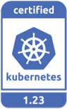
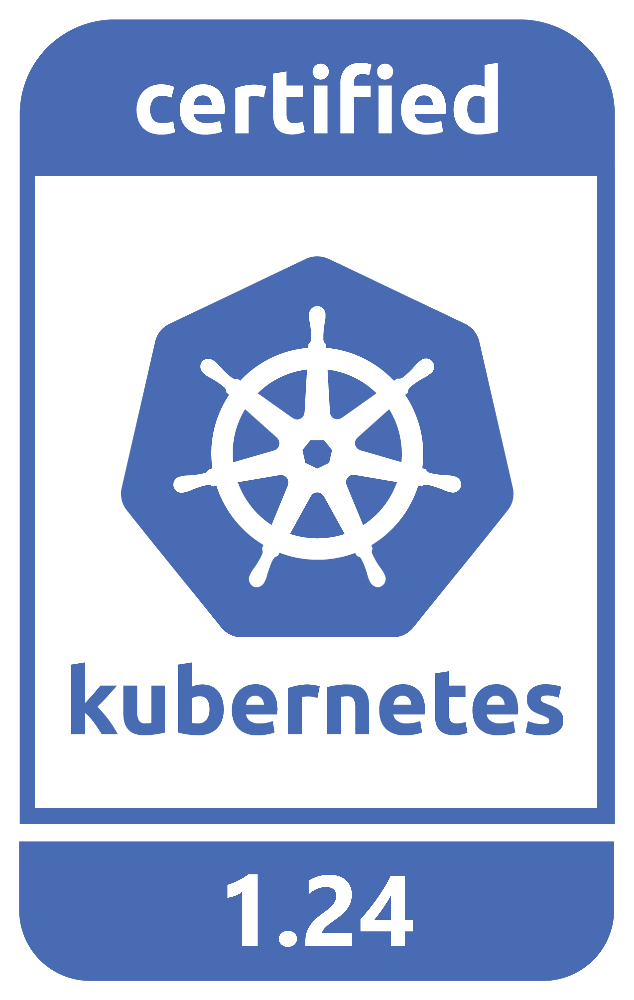
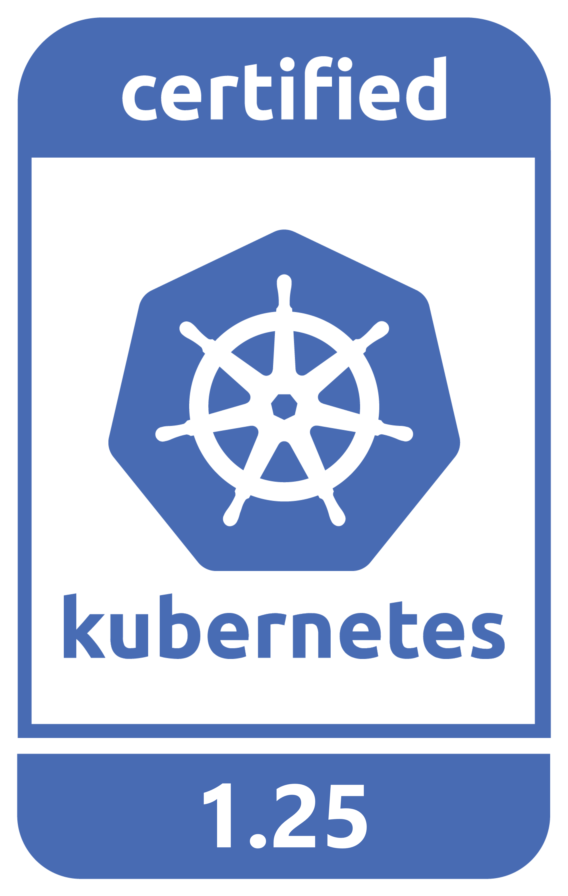
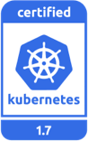
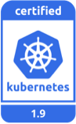
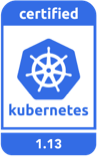
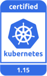
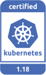
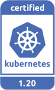

# DaoCloud Enterprise 5.0 Documentation

[中文版](README_zh.md) ｜ English

DaoCloud is a Certified Kubernetes Service Provider (KCSP). DCE has been certified with the following releases:

Current releases:

Legacy releases:

DCE 5.0 website is created with MkDocs. All pages are written in markdown.
We use GitOps to control workflow and versions.

## File Naming Conventions

- **Only contain** English lower cases and hyphens (`-`)
- **Do Not** contain other characters (e.g., Chinese chars, spaces,`*``?` `\` `/ ``:` `#` `%` `~` `{` `}`) except those listed above
- Connect words with hyphens (`-`)
- Keep short：up to 5 English words, avoid repetition, use abbreviations
- Be descriptive: easy to understand and reflect the doc's subject

|No|Yes|Why|
|--|--|--|
|ConfigName|config-name|Use small letters and hyphens|
|创建 秘钥|create-secret|No Chinese words and other macro symbols|
|quick-start-install-online-install|online-install|Keep short|
|c-ws|create-workspace|Be descriptive|
|update_image|update-image|Connect words with hyphens|

## Open a PR

This website uses Pull Request (PR) to modify, translate, and manage all pages.

1. Click `Fork` to create a fork
2. Run `git clone` to clone this fork to your computer
3. Edit one or more pages locally and preview it
4. Run git commands, such as `git add`, `git commit`, and `git push`, to submit your changes
5. Open a PR in this repo
6. Successfully merge after reviewing, thanks.

## Preview locally

This section describes how you can preview your changes before commit.

### With Docker

1. Install and run [Docker](https://www.docker.com/).
2. Run `make serve` and preview your changes.

### With Git repo

See [MkDocs documents to install](https://squidfunk.github.io/mkdocs-material/getting-started/)。

1. Install Poetry and Python 3.9+
   1. Configure Poetry: `poetry config virtualenvs.in-project true`
   2. Enable venv: `poetry env use 3.9`
2. Install dependencies: `poetry install`
3. Run `poetry run mkdocs serve -f mkdocs.yml` in the repo folder locally
4. Preview with http://0.0.0.0:8000/

## Tips about writing

- Indent 4 spaces for bullets
- Provide a space between zh and en chars
- Provide a blank line before and after a para, an image, a heading, or a list
- Do not add any punctuation by the end of a heading
- Care about links to avoid any null or dead link
- Give a consistent experience to explore all pages herein

For more details refer to [DaoCloud Style Guide of Writing](./style.md).

## Acknowledgements

We sincerely thank all the contributors who contribute to DaoCloud website.
Once a PR you opened have been successfully merged, your ID will appear at the bottom of the page as an author.

If any problem, feel free to reach out to us: [support@daocloud.io](mailto:support@daocloud.io?subject=FROM_DOCS_README) or scan the QR code to chat with developers:

## References

- [DaoCloud Style Guide of Writing](./style.md)
- [Contribution Guideline](./CONTRIBUTING.md)

## More

- [Docsite Release v1.0](docs/README.md)
- [Download DCE 5.0](./docs/zh/docs/download/dce5.md)
- [Install DCE 5.0](./docs/zh/docs/install/intro.md)
- [Free Trial](./docs/zh/docs/dce/license0.md)
