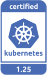
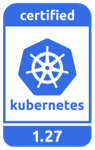
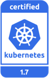
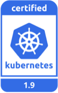
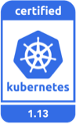

# DaoCloud Enterprise 5.0 Documentation

[中文版](README_zh.md) ｜ English

DaoCloud is a Certified Kubernetes Service Provider (KCSP). DCE has been certified with the following releases:

Current releases maintained by K8s community:

Legacy versions that are no longer maintained by the K8s community but will continue to be maintained by DaoCloud's [KLTS](https://klts.io/):

DCE 5.0 website is created with MkDocs. All pages are written in markdown.
We use GitOps to control workflow and versions.

## Open a PR

This website uses Pull Request (PR) to modify, translate, and manage all pages.

1. Click `Fork` to create a fork
2. Run `git clone` to clone this fork to your computer
3. Edit one or more pages locally and preview it
4. Run git commands, such as `git add`, `git commit`, and `git push`, to submit your changes
5. Open a PR in this repo
6. Successfully merge after reviewing, thanks.

## Preview locally

This section describes how you can preview your changes before commit.

### With Docker

1. Install and run [Docker](https://www.docker.com/).
2. Run `make serve` and preview your changes.

### With Git repo

See [MkDocs documents to install](https://squidfunk.github.io/mkdocs-material/getting-started/)。

1. Install Poetry and Python 3.9+
   1. Configure Poetry: `poetry config virtualenvs.in-project true`
   2. Enable venv: `poetry env use 3.9`
2. Install dependencies: `poetry install`
3. Run `poetry run mkdocs serve -f mkdocs.yml` in the repo folder locally
4. Preview with <http://0.0.0.0:8000/>

## Naming conventions

This section lists some conventions about a file or folder name for your reference:

- **Only contain** English lower cases and hyphens (`-`)
- **Do not** contain any of these characters like:
    - Chinese chars
    - spaces
    - special chars like `*`, `?`, `\`, `/`, `:`, `#`, `%`, `~`, `{`, `}`
- Connect words with a hyphen (`-`)
- Keep short：up to 5 English words, avoid repetition, use abbreviations
- Be descriptive: easy to understand and reflect the doc's subject

| No                                 | Yes              | Why                                      |
| ---------------------------------- | ---------------- | ---------------------------------------- |
| ConfigName                         | config-name      | Use small letters and hyphens            |
| 创建 秘钥                          | create-secret    | No Chinese words and other macro symbols |
| quick-start-install-online-install | online-install   | Keep short                               |
| c-ws                               | create-workspace | Be descriptive                           |
| update_image                       | update-image     | Connect words with hyphens               |

## Tips about writing

- Indent 4 spaces for bullets
- Provide a space between zh and en chars
- Provide a blank line before and after a para, an image, a heading, or a list
- Do not add any punctuation by the end of a heading
- Care about links to avoid any null or dead link
- Give a consistent experience to explore all pages herein

For more details refer to [DaoCloud Style Guide of Writing](./style.md).

## References

- [docs.daocloud.io Release v1.0](docs/README.md)
- [DaoCloud Style Guide of Writing](./style.md)
- [Contribution Guideline](./CONTRIBUTING.md)
- [Citizen Code of Conduct](./CODE_OF_CONDUCT.md)
- [Export Word and PDF](./scripts/generate_pdf.md)
- [Automatic Page Translation](./scripts/README.md); ChatGPT is recommended to use for better translation

## Thanks to all contributors ❤

## Proudly using Netlify

| Site | Status
|------|-------
| daocloud-docs | 
