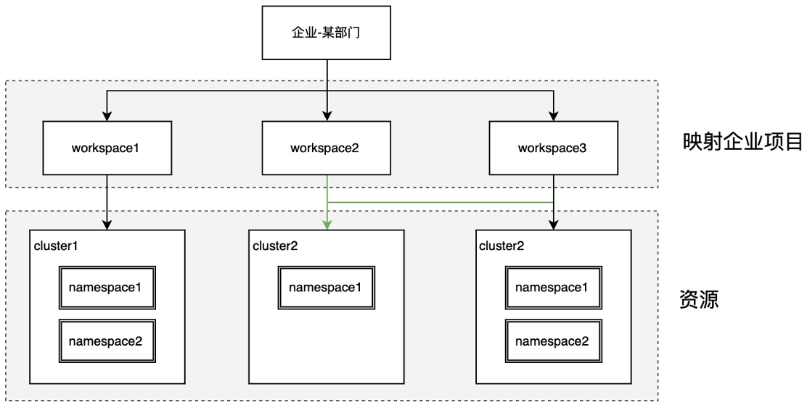
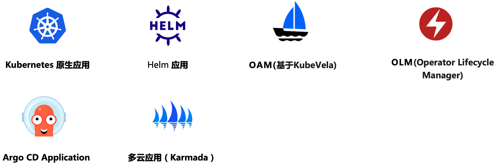
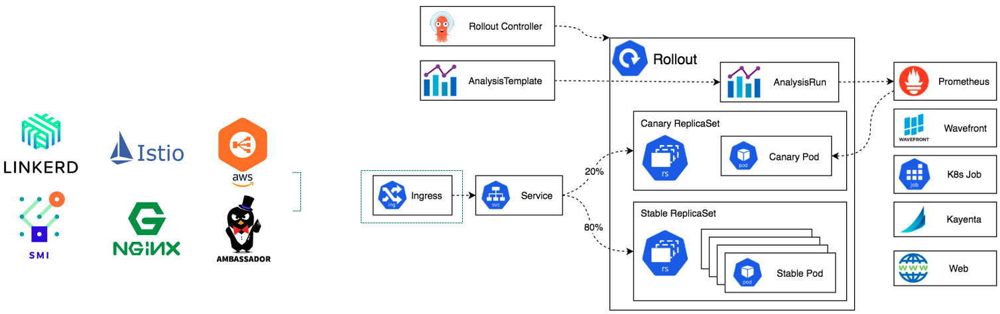
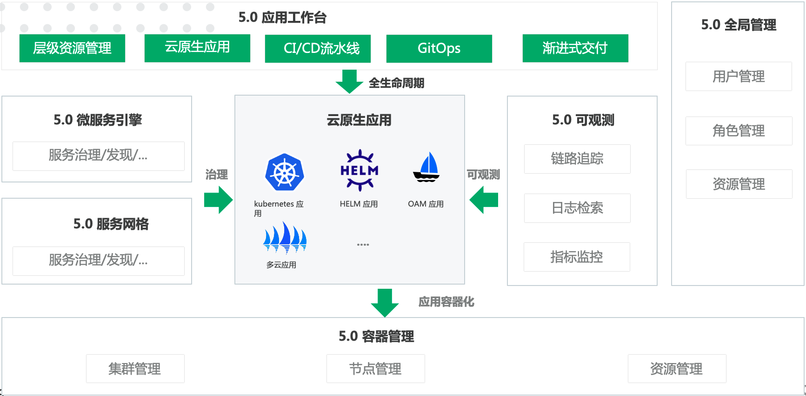

# What is Application Workbench?

Application workbench is a container-based cloud native DevOps platform, which provides a unified entrypoint for creating DCE 5.0 applications. In additionally, it is built-in with multi tenants supports and cross cluster deployments.

Application workbench is designed for the process of automated delivery of enterprise applications and infrastructures. It enables full lifecycle management of applications from development to testing, deployment and operation.

=== "Multi Tenants Management"

Taking the [workspace](../../ghippo/04UserGuide/02Workspace/ws-folder.md) as a minimum tenant unit, supports the ability to share resources in a single cluster and across clusters:

- Weak binding clusters, so as to obtain the ability to share resources across clusters and namespaces.
- Strong cluster binding, so as to obtain the ability of exclusive resources.
- Workspace management members can create namespace resources in the associated cluster.
- Self service resource creation mode. Users can self create namespaces in the workspace to divide resources.



=== "Cloud Native Based"

Support popular cloud native applications such as kubernetes manifests, Helm, OAM,OLM, etc. And it can seamlessly integrate with SpingCloud, Dubbo and ServiceMesh frameworks to achieve SOA (Service-Oriented Architecture). In additionally, DCE 5.0 [micro service engine](../../skoala/intro/features.md) and [service mesh](../../mspider/01Intro/What'smSpider.md), enables scaling , logging, monitoring and upgrading for applications.



=== "Efficient Continuous Integration"

You can use both Jenkins and Tekton in the same time. The pipeline can be edited simply by web UI. In the maintime, applications workbench support multiple SCM (Source Code Management).


=== "Automated Secure Progressive Delivery"

Application workbench introduces a concept of continuous deployment for cloud native, which designed for cooperate with GitOps. It integrates the progressive delivery component with Argo Rollout and supports grayscale publishing that improved the efficiency of application delivery.



!!! info

```go
Progressive delivery is an approach to gradually expose a new version to few initial users, and then become a larger subset to mitigate the risk of negative impacts (such as errors).

Argo-Rollout Kubernetes Progressive Delivery Controller，provide powerful deployment capabilities. Including grayscale publishing, blue-green deployment, experimentation, progressive delivery and so on.
```

## Status in DCE 5.0

The status of application workbench in DCE 5.0 is shown in the figure below.



Application workbench based on container and global management to achive hierarchical resource management  , and checked with CI/CD  and GitOps to achieve progressive delivery.

[Free trial of community version](../../dce/license0.md){ .md-button .md-button--primary }
