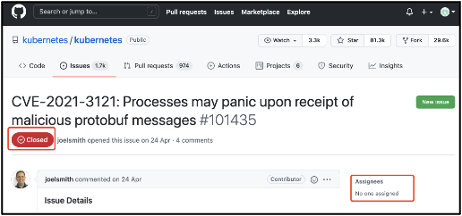

# KLTS

KLTS, known as Kubernetes Long Term Support, has a primary mission to provide free long-term maintenance support for early versions of Kubernetes.  

One of the reasons to maintain early versions is the fact that in a real production environment, the latest release is not the best or the most stable. In a normal case, a of Kubernetes is not available until one year after the initial release of a particular version. For details see [Kubernetes release cycle](#klts-release-cycle). After the community aborts maintenance, KLTS will continue to maintain it in the next three years.  

Why is the choice of most enterprises today to stay with early versions and not rush to upgrade?  

- Firstly, the high frequency of upgrades may cause more risks and each upgrade must be fully verified. In the financial industry, the change cycle of a PaaS platform is usually relatively long, because once the updated version has a bug, it needs to be forced to roll back or quickly respond and upgrade to a updated version, which will cause unnecessary expenditures.  

- Secondly, once an enterprise upgrades their the Kubernetes kernel, some functional alternatives may not yet fully ready for production, and incompatibility often occurs in the production environment.  

- Finally, the Kubernetes community only supports minor version upgrades one by one, and does not support cross-version upgrades, because the later upgrades often have some uncontrollable factors that may cause some production problems.  

Therefore, the choice of most enterprises today is to stay with early versions and not rush to upgrade. But the Kubernetes community only maintains the most recent three to four releases, how can you keep early versions safe from the CVE bugs and vulnerabilities that the community may discover from time to time? That’s where KLTS comes in! We provide free maintenance support for early versions for up to three years, actively fix the CVE vulnerabilities and critical bugs.

## KLTS release cycle

Kubernetes versions are expressed as x.y.z, where x is the major version, y is the minor version, and z is the patch version. For the versions maintained by KLTS, it is followed by a string beginning with lts. For the convenience of communication, people often use the first two digits x.y to describe the Kubernetes version.  

Assuming that the latest Kubernetes released by the community is x.y, according to the [Version Skew Policy](https://kubernetes.io/releases/version-skew-policy/#supported-versions), the community only maintains the latest three versions, and KLTS currently maintains nearly ten early versions starting from 1.10, as shown in the figure below.  

When the Kubernetes community discovers new CVE vulnerabilities or bugs that may affect production, it may be affected not only the versions that the community is maintaining, but also the early versions that have been discontinued before but are still in use by some enterprises and cannot be upgraded rashly, which are maintained by the KLTS team. The current maintenance cycle of KLTS is as follows:  

As shown above, the maintenance cycle of a certain version by the Kubernetes community is usually about one year, and KLTS can provide a long-term maintenance in the next three years until the code is incompatible, and then the corresponding version will be aborted.  

## Bugs fixed by KLTS

Some high-priority CVEs or serious bugs in the production environment may cause greater security risks. CVE security issues are the lifeblood of the cluster, so KLTS will fix mid-to-high-risk CVEs, and then fix major bugs to guarantee stable operation of the production environment.  

As an example, the [CVE-2021-3121](https://www.cvedetails.com/cve/CVE-2021-3121) vulnerability discovered in January 2021 has a CVSS score of 7.5. However, as of September 2021 the Kubernetes community:  

- Only fixed four versions: 1.18, 1.19, 1.20, 1.21
- Announced that “all prior versions remain exposed and users should stop using them immediately”
- Requests to [fix early versions](https://github.com/kubernetes/kubernetes/issues/101435) are denied:

KLTS addresses this situation by diligently fixing eight earlier versions that were heavily affected by the
[CVE-2021-3121](https://www.cvedetails.com/cve/CVE-2021-3121) vulnerability. No complaints, no demands!

- v1.17.17
- v1.16.15
- v1.15.12
- v1.14.10
- v1.13.12
- v1.12.10
- v1.11.10
- v1.10.13

[Go to KLTS repo](https://github.com/klts-io){ .md-button }

[Go to KLTS website](https://klts.io/){ .md-button }
