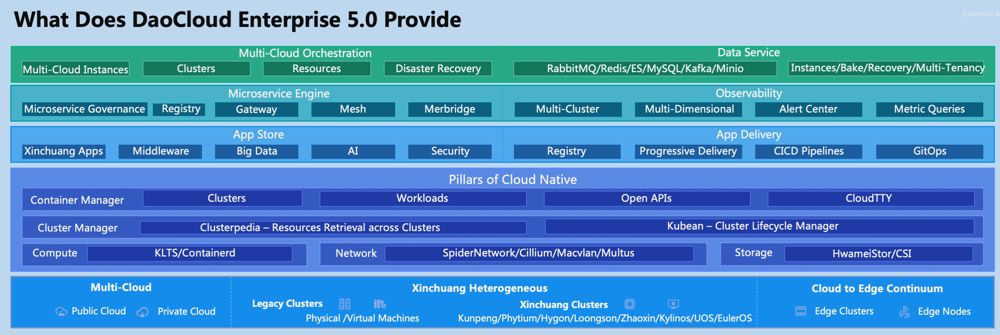
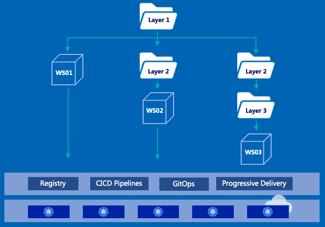

# DaoCloud Enterprise 5.0

On the occasion of the golden Autumn of 2022, DaoCloud gladly launches the next-generation, cloud-native, containerized, comprehensive platform by fusing the most popular cloud-native technologies in the open source community. After two years of continuous development, testing, and verification by hundreds of diligent developers, the flower of idealism finally blooms in the land of romantic open-source community. The new platform leads the paces and waves of cloud-native development globally.

DaoCloud Enterprise 5.0 or DCE 5.0 for short, is a high-performance and scalable cloud-native operating system. It is developed with many independent modules. You can use each of them like LEGO bricks, with zero downtime while upgrading one of modules. DCE 5.0 is easy to integrate with hundreds of cloud-native plugins, so you can simply custom solutions for different scenarios. Things go better with such as modular construction.

DCE 5.0 has built a highly adaptable Container Management, which can uniformly manage almost all kinds of containerized clusters on the market, with the feature of Multicloud Management to use OpenShift, VMware, and public clouds at the same time. It can centrally control the apps from app stores and registry, natively integrates the CI/CD pipeline and application workbench, and endows the most cutting-edge service mesh and microservice technology. You can easily get insight from detailed and customized metrics of clusters, nodes, workloads, and services. With the support of various types of selected databases and middleware such as RabbitMQ, Elasticsearch, MySQL, Redis, etc., you can easily learn the current service status in time from the dynamically updated dashboard and topology map, through which you can deep dive into your business data to help you make valuable decisions in advance to boost your business.

DaoCloud Enterprise 5.0 is a high-performance and scalable cloud-native operating system. In the past eight years, DaoCloud has invested huge to explore and develop a cloud-native operating system with custom and scalable modules to facilitate your business digitalization. You can use each module like a LEGO brick, with zero downtime while upgrading any module. DCE 5.0 is also easy to integrate with hundreds of cloud-native ecological plugins, so you can simply customize solutions for different scenarios. Things go better with such a kind of modular style to grow day by day.

=== "Multicloud Management"

    **Applicable scenarios**: The deployment of multi-cloud and multi-cluster in an enterprise has become the norm, and it is hoped to have the capabilities of multi-cloud app release and cross-cloud disaster recovery.

    **Benefits**: Using innovative technologies to orchestrate disaster recovery (DR) across clouds, this solution has high concurrent performance of cross-cloud resource retrieval, and can help your IT departments quickly plan and implement DR capabilities in combination with the capabilities of the Container Management to adapt to various scenarios such as edge and Xinchuang.

    **Modules**: [Container Management](../kpanda/03ProductBrief/WhatisKPanda.md), [Multicloud Management](../kairship/01product/whatiskair.md), cloud to edge continuum, Xinchuang Heterogeneous

    

=== "Data Service"

    **Applicable scenarios**: An enterprise has an app architecture that relies on mainstream middleware capabilities. It is hoped to run and maintain middleware in a unified manner and get more professional support capabilities for middleware planning, operation, and maintenance (O&M).

    **Benefits**: This solution has selected middlewares with a consistent UI to manage, with the help of HwameiStor capabilities designed for stateful applications, providing features of multi-tenant, deployment, observation, backup, operation and maintenance of the whole lifecycle of middleware management capabilities.

    **Modules**: [Container Management](../kpanda/03ProductBrief/WhatisKPanda.md), [HwameiStor](../hwameistor/intro/what.md), [Middleware](../middleware/midware.md)

    

=== "Microservice Governance"

    **Applicable scenarios**

    An enterprise decides to adopt a microservice architecture or has already adopted microservices, hopes to obtain a full range of technical support and O&M capabilities such as a microservice framework, or hopes to use service mesh technologies, and tries to achieve smoothness in the process of digital transformation.

    - The enterprise doesn't want to change anything, but just wants to view various service states via a panoramic view, and hopes to easily troubleshoot faults with traces and logs.
    - The enterprise has the idea of tranforming from the traditional microservice framework to service mesh, but it is more conservative. It is hoped that there will be a transition period for the gradual transformation. At this time, it is more suitable to use a service mesh solution.
    - The enterprise hopes to directly tranform to service mesh. In this case, it is a good idea to remove Eureka-related components and directly use the microservice engine and service mesh.
    - The enterprise does not want to tranform from traditional microservices to mesh, but wants to do east-west traffic management.

    **Benefits**

    Seamless integrate with legacy and popular microservice technologies, such as the first-generation microservices represented by SpringCloud and Dubbo and the new generation of microservices represented by Istio service mesh, with the lifecycle management capabilities of development, deployment, joining, exposing to external, observation, and O&M. Seamlessly add the existing microservice system of the enterprise, provide the complete capabilities of managed microservice governance, and offer the high-performance cloud-native microservice gateway.

    **Modules**: [Container Management](../kpanda/03ProductBrief/WhatisKPanda.md), [Microservice Engine](../skoala/intro/features.md), [Service Mesh](../mspider/01Intro/What'smSpider.md), [Insight](../insight/03ProductBrief/WhatisInsight.md), [App Workbench](../amamba/01ProductBrief/WhatisAmamba.md)

    

=== "Insight"

    **Applicable scenarios**: An enterprise has a weak capability to watch running applications, and hopes to complete the Insight through a lightweight or unmodified method, to get a panaramic view for current apps with logs, metrics, traces.

    **Benefits**: This solution provides in-depth and subtle observation of the current app status. With a comprehensive dashboard, you can query all cluster and workload data. It supports for microservice architecture, service mesh, eBPF-based network, and other observation capabilities.

    **Modules**: [Container Management](../kpanda/03ProductBrief/WhatisKPanda.md), [Insight](../insight/03ProductBrief/WhatisInsight.md)

    

=== "App Store"

    **Applicable scenarios**: An enterprise wants to obtain out-of-the-box cloud native apps capabilities for some exclusive scenarios

    **Benefits**: This solution provides the ecological capabilities including software products from partners,  with a complete software stack to meet the actual business needs. Where, you can easily find, test, and deploy middlewares running on DaoCloud Enterprise 5.0 with a development process of low-code or no-code.

    **Modules**: [Container Management](../kpanda/03ProductBrief/WhatisKPanda.md), App Store, Product Ecosystem

=== "App Delivery"

    **Applicable scenarios**: An enterprise adopts cloud-native technology on a large scale, and expects to promote cloud-native technology to a wider range by combining with DevOps concepts.

    **Benefits**: With a consistent workflow to deliver apps, this solution supports a hierarchical multi-tenant system, seamlessly adapts to the user's organizational structure to plan resource allocation, automates app build and deployment with the CI/CD pipelines, and innovatively introduces the GitOps progressive delivery capability.

    **Modules**: [Container Management](../kpanda/03ProductBrief/WhatisKPanda.md), [App Workbench](../amamba/01ProductBrief/WhatisAmamba.md), Registry

    

=== "Cloud Native Base"

    **Applicable scenarios**: The O&M team of an enterprise needs to undertake tasks to maintain thousands of clusters, and the cluster network needs to meet the traditional network supervision requirements.

    **Benefits**: 

    Breaking through the performance bottleneck of Kubernetes API, this solution supports for ultra-large scale clusters concurrently, and provides full life-cycle management capabilities from deployment, rolling update, certificate management, configuration settings, and garbage collection.

    - MacVLAN solution
    - SR-IOV smart network acceleration solution
    - SpiderPool IPAM solution
    - Clilum eBPF-based network solution
    - Underlay and Overlay network continuum

    All clusters and workloads are managed through Clusterpedia. This solution is compatible with joining standard Kubernetes clusters, breaking through the performance bottleneck of Kubernetes API and supporting thousands of users using it at the same time.

    **Modules**: [Container Management](../kpanda/03ProductBrief/WhatisKPanda.md), [Cluster lifecycle manager](../community/kubean.md), [Network](../network/), [HwameiStor](../hwameistor/)

    

=== "Xinchuang Heterogeneous"

    **Applicable scenarios**: An enterprise needs to set up Xinchuang infrastructure. For example, the CPU processor must be from one of Loongson, Hygon, Phytium, Kunpeng, Intel; and the operating system must be KirinOS, UOS, OpenEuler, etc.

    **Benefits**: This solution can consolidate Xinchuang cloud-native capabilities for government sectors and state-owned factories, supports domestic chips and servers in the north, and supports Xinchuang operating system and app ecosystem in containers in the south.

    **Modules**: [Container Management](../kpanda/03ProductBrief/WhatisKPanda.md), [Cluster lifecycle manager](../community/kubean.md), [信创中间件](../middleware/midware.md)

    

=== "cloud to edge continuum"

    **Applicable scenarios**: An enterprise designs an edge collaboration solution on the basis of cloud, edge, and terminal. The edge is a general computing platform and has strict computing requirements. The edge supports several deployment modes: edge node, edge cluster, data center computing downwards, edge device computing upwards.

    **Benefits**: This solution extends the general cloud-native framework, empowers the edge computing capability, uniformly manages and controls all edge clusters and nodes. Based on the traditional three-tier model of cloud, edge, and terminal. To meet the strict edge computing requirements, this solution provides a four-tier model from cloud to edge continuum by adding the edge clusters and nodes.

    **Modules**: [Container Management](../kpanda/03ProductBrief/WhatisKPanda.md), [Cluster lifecycle manager](../community/kubean.md), Edge nodes, clusters in the weak network

    

Just like Lego bricks, it combines dozens of the best open source technologies into a platform. After many dialectical selection, adaptation and running-in, coding debugging, and massive testing, a sword is sharpened in ten years. The new generation of containerized platforms can meet the needs of various scenarios for enterprises migrating to the cloud.
