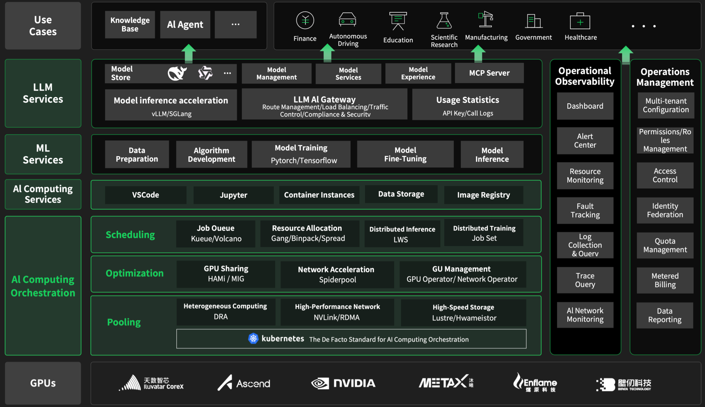
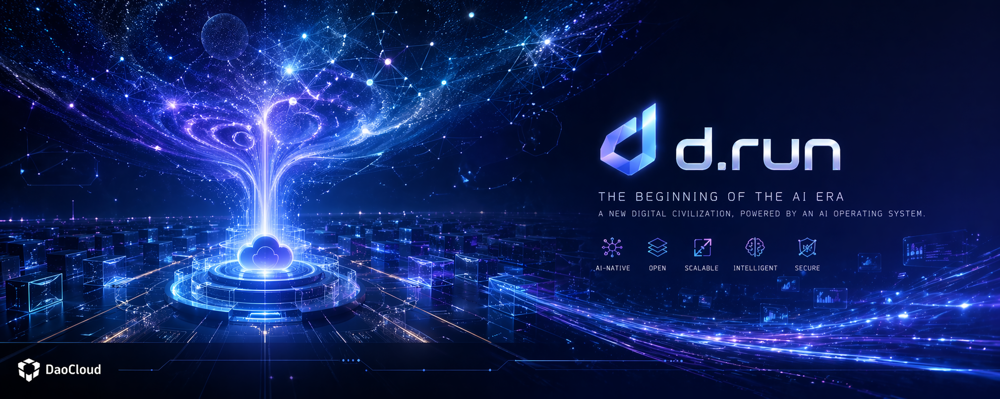

---
hide:
  - navigation
  - toc
---

  <h1 style="font-size: 30px; margin-bottom: 16px; font-weight: 800;">
    d.run AI Operating System
  </h1>

  An enterprise-grade platform that unifies compute, models, and applications

  

    d.run is a next-generation <strong>AI Operating System</strong> that unifies compute resources, AI models, and applications into a cloud-native runtime environment, 
    enabling AI workloads to be scheduled, managed, and optimized just like processes in a traditional operating system.
  

  

    From GPUs to models, from training to deployment, <strong>d.run turns AI infrastructure into a fully systemized runtime</strong>.
  

  <h2 style="font-size: 30px; margin-bottom: 16px; font-weight: 600;">
    Product Architecture
  </h2>

  <h2 style="font-size: 30px; margin-bottom: 16px; font-weight: 600;">
    Product Modules
  </h2>

- :shrimp:{ .lg .middle } __ClawOS Agent: Next-Generation Agent Runtime__

    ---

    Proactively plans tasks, invokes tools, and executes workflows autonomously—like a true digital employee handling end-to-end complex tasks

    - [Install ClawOS](./clawos/install.md)
    - [ClawOS Quick Start](./clawos/quickstart.md)
    - [Use ClawOS in Feishu](./clawos/feishu.md)
    - [ClawOS FAQ](./clawos/faq.md)

- :material-developer-board:{ .lg .middle } __AI Lab: One-Stop Machine Learning Platform__

    ---

    Integrates heterogeneous compute resources, optimizes GPU performance, and enables unified scheduling and operations to maximize utilization while reducing cost

    - [Install AI Lab Components](./baize/intro/install.md)
    - [Developer Console – Quick Start](./baize/developer/quick-start.md)
    - [Operations Management](./baize/oam/index.md)
    - [Deploy NFS for Dataset Preloading](./baize/best-practice/deploy-nfs-in-worker.md)
    - [Fine-tune ChatGLM3 with AI Lab](./baize/best-practice/finetunel-llm.md)

- :octicons-ai-model-16:{ .lg .middle } __LLM Studio: Enterprise-Grade AI Services__

    ---

    End-to-end lifecycle services from model deployment to operations, enabling enterprises and developers to efficiently adopt and utilize large model capabilities

    - [Deploy LLM Studio](./hydra/intro/deploy-ws.md)
    - [Model Square](./hydra/index.md)
    - [Playground](./hydra/exp.md)
    - [Deploy a Model](./hydra/deploy/deploy.md)
    - [Admin Console](./hydra/oam/index.md)

d.run is the foundation of the AI Operating System era—unifying compute, models, and AI applications into a single system, just as an operating system manages a computer.

[Learn more about d.run](https://d.run/product/drun){ .md-button .md-button--primary }
