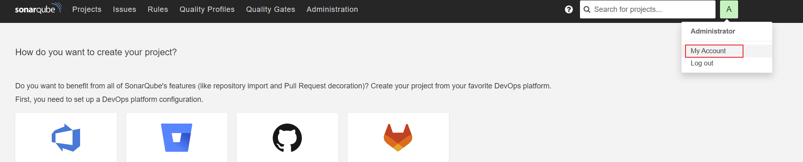
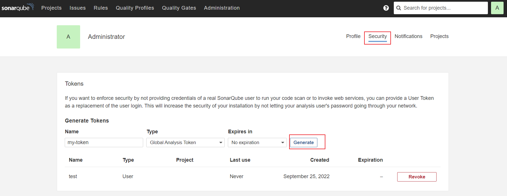
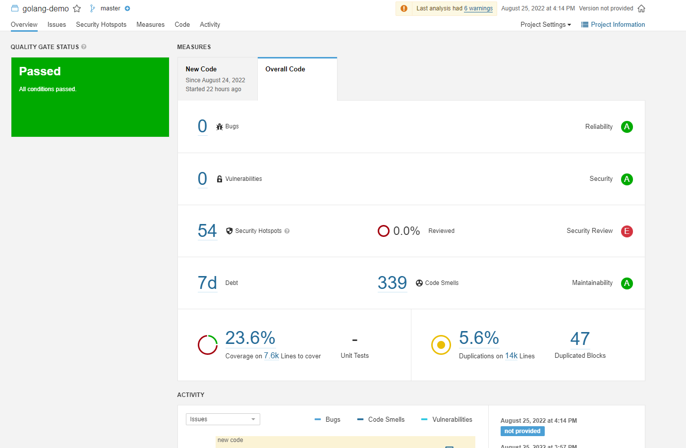

# Use pipeline to implement code scanning

The source code in the codebase is the original form of software, and its security flaws are the direct root cause of software vulnerabilities.
Therefore, finding security flaws in source code through code scanning analysis is an important method to reduce potential software vulnerabilities.

For example, SonarQube is an automatic code review tool for detecting bugs in project code, improving test coverage, and more.
It can be integrated with existing workflows in a project for continuous code reviews between project branches and pull requests.

This article will introduce how to integrate SonarQube in the pipeline to achieve code scanning capabilities.

## Deploy SonarQube

If you already have a SonarQube environment, you can skip this step, but you need to ensure that the current cluster can access the SonarQube server.

1. Install SonarQube via Helm.

    ```bash
    helm repo add sonarqube <https://SonarSource.github.io/helm-chart-sonarqube>
    helm repo update
    kubectl create namespace sonarqube
    helm upgrade --install -n sonarqube sonarqube sonarqube/sonarqube -n amamba-system --create-namespace --set service.type=NodePort
    ```

2. Check that the Pod STATUS under the corresponding namespace is Running, indicating that SonarQube is installed successfully.

    ```none
    kubectl get po
    NAME READY STATUS RESTARTS AGE
    sonarqube-postgresql-0 1/1 Running 0 3h59m
    sonarqube-sonarqube-0 1/1 Running 0 3h59m
    ```

3. View the access address of the SonarQube console. Usually the access address is `http://<Node IP>:<NodePort>`, and the account and password are `admin/admin`.

    ```bash
    export NODE_PORT=$(kubectl get --namespace amamba-system -o jsonpath="{.spec.ports[0].nodePort}" services sonarqube-sonarqube)
    export NODE_IP=$(kubectl get nodes --namespace amamba-system -o jsonpath="{.items[0].status.addresses[0].address}")
    echo http://$NODE_IP:$NODE_PORT
    ```

4. Generate an administrator token (Token) in SonarQube, the operation path is: `My Account` -> `Profile` -> `Security` -> `Generate` -> `Copy`

    

    

    

5. Create a Webhook server in SonarQube, the operation path:

    1. The operation path is `Administration` -> `Configuration` -> `Webhooks` -> `Create`.

    2. In the pop-up dialog box, enter `Name` and `Jenkins Console URL` (that is, the SonarQube Webhook address, which is the previously obtained SonarQube address + sonarqube-webhook).

    3. Click `Create` to complete the operation.

6. Provide an exposed Jenkins address, this is for users to add SonarQube server to Jenkins.

7. Create a SonarQube Token for the new project, the operation path is `Create new project` -> `Set Up` -> `Generate` -> `Continue`.

    

    

## Create pipeline

1. On the Pipeline page, click `Create Pipeline`.

    

2. Select `Custom Creation`.

    

3. Enter a name, others can use the default value, click `OK`.

    

## Edit Jenkinsfile

1. Click a pipeline to enter its details page, click `...` -> `Edit Jenkinsfile` in the upper right corner.

    

    

2. Copy and paste the following YAML code into jenkinsfile.

    ```yaml
    pipeline {
    agent {
        node {
        label 'go16'
        }
        
    }
    stages {
        stage('git clone') {
        steps {
            git(credentialsId: 'mabing-gitlab', branch: 'master', url: 'https://gitlab.daocloud.cn/bing.ma/jenkins-sonarqube-demo.git')
        }
        }
        
        stage('unit test') {
        steps {
            container('go') {
                sh 'go test-json > test-report.out'
                sh 'go test -coverprofile=coverage.out'
            }
        }
        }
        
        stage("SonarQube analysis") {
        steps {
            container('go') {
            withSonarQubeEnv('demo-dev-sonarqube') {
                sh 'sonar-scanner -Dsonar.projectKey=golang-demo -Dsonar.sources=. -Dsonar.host.url=http://10.6.182.101:32313 -Dsonar.login=4b337cbbafd89ae9bca46a746cddab4c993d2a7a'
            }
            }
        }
        }
        
        stage("Quality Gate") {
        steps {
            container('go') {
            timeout(time: 1, unit: 'HOURS') {
                waitForQualityGate abortPipeline: false // Set to false here, indicating that the pipeline can continue even if it does not pass the QUALITY GATE of sonarQube
            }
            }
        }
        }
        
        stage('build & push') {
        steps {
            container('go') {
            withCredentials([usernamePassword(credentialsId:'docker-credential',passwordVariable:'PASS',usernameVariable:'USER')]) {
                sh 'go build -o simple-http-server main/main.go'
                sh 'docker build -f Dockerfile . -t $registry/$project/$name:latest'
                sh 'docker login $registry -u $USER -p $PASS'
                sh 'docker push $registry/$project/$name:latest'
            }
            
            }
            
        }
        }
        
        stage('deply'){
        steps {
            container('go'){
            withCredentials([kubeconfigFile(credentialsId: 'kubeconfig-credential', variable: 'KUBECONFIG')]) {
                sh 'kubectl apply -f deploy.yaml'
            }
            }
        }
        
        }
        
    }
    parameters {
        string(name: 'registry', defaultValue: 'release-ci.daocloud.io', description: '')
        string(name: 'project', defaultValue: 'demo', description: '')
        string(name: 'name', defaultValue: 'http-hello', description: '')
    }
    }
    ```

    !!! note

        In the above code,
        
        - waitForQualityGate abortPipeline: false, indicating that the pipeline can continue even if it fails the gate quality check. If true, give up
        - For the shell statement under withSonarQubeEnv, it can be copied from SonarQube in the previous step

3. Run the pipeline immediately after saving.

## Go to SonarQube to view code scanning results

After waiting for the pipeline to run successfully, go to SonarQube to view the code scanning results.

