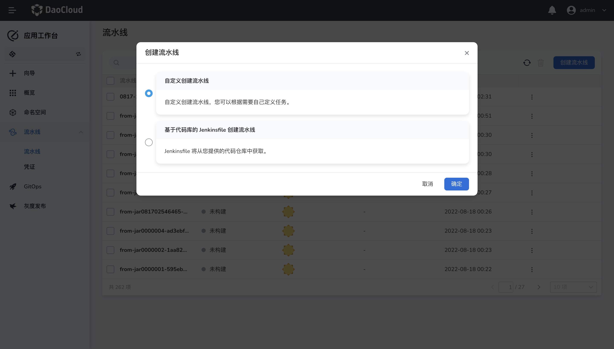
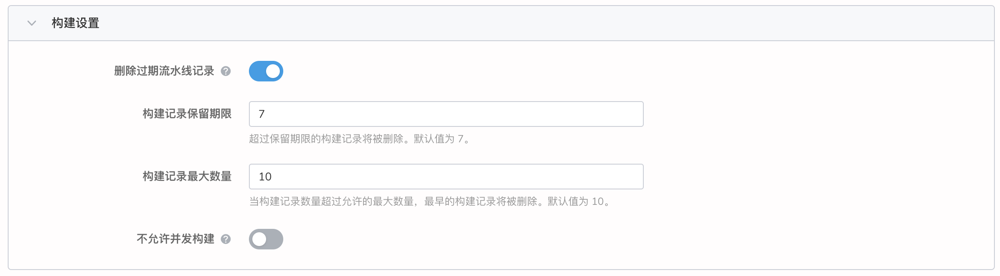
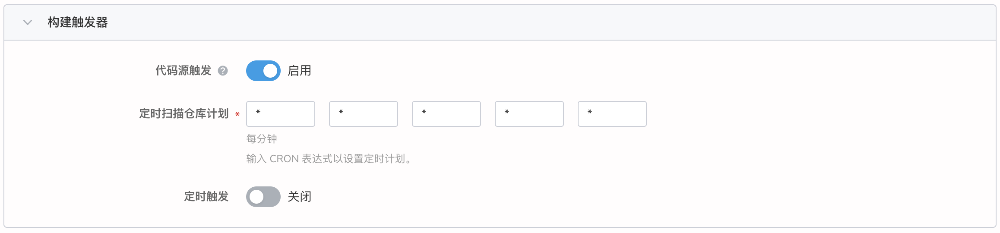

---
hide:
  - toc
---

# Create a single-code branch pipeline using Jenkinsfile

App Workbench Pipelines supports creating pipelines using a Jenkinsfile in a repository.

**Prerequisites**

- A workspace and a user need to be created, the user must be invited to the workspace and given the `workspace edit` role.
  Refer to [Creating Workspaces](../../../ghippo/04UserGuide/02Workspace/Workspaces.md), [Users and Roles](../../../ghippo/04UserGuide/01UserandAccess/User. md).

- There needs to be a code repository, and the source code in the code repository has a Jenkinsfile text file.

**The specific operation steps are as follows:**

1. Click `Create Pipeline` on the pipeline list page.

    

2. In the pop-up dialog box, select Custom Create Pipeline and click OK.

    

3. Enter `Jenkinsfile Creation Pipeline Based on codebase` and configure related parameters.

    

4. Fill in the basic information. The name of the pipeline, which must be unique in the same workspace.

    

5. Fill in the codebase information.

    

    - codebase address: fill in the address of the remote codebase.

    - Credentials: If your remote repository is private, please create a credential in advance and select it when using it.

    - Branch: Fill in the branch where the code you want to pull is located, if not filled, the master branch will be pulled by default.

    - Script path: the absolute path of the Jenkinsfile in the code repository.

6. Fill in the build settings.

    

    - Delete expired build records: Determines when build records under a branch are deleted to save disk space used by Jenkins.

    - Do not allow concurrent builds: If enabled, multiple builds cannot run concurrently.

7. Fill in the build parameters. A parameterized build process allows you to pass in one or more parameters when starting to run your pipeline.
   Five parameter types are provided by default: `string`, `multiline string`, `boolean`, `option` and `password`.
   When parameterizing a project, the build is replaced with a parameterized build, where the user is prompted to enter a value for each defined parameter.

    

8. Fill in the build triggers.

    

    - Code source triggering: Allows periodic execution of build pipelines.

    - Timing trigger: Allows regular execution to scan the remote code repository, and execute the build pipeline if there is a change in the code repository.

9. Complete the creation. After confirming that all parameters have been entered, click the `OK` button to complete the creation of the custom pipeline and automatically return to the pipeline list. Click `︙` to the right of the list to perform various actions.

    