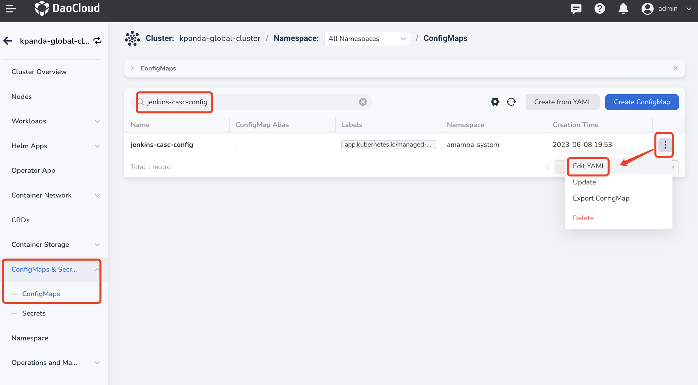
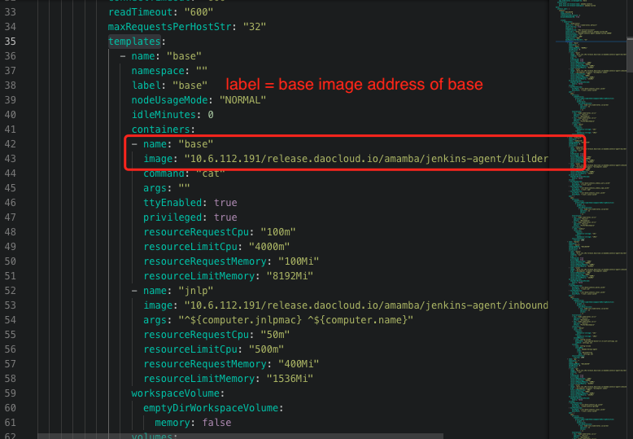
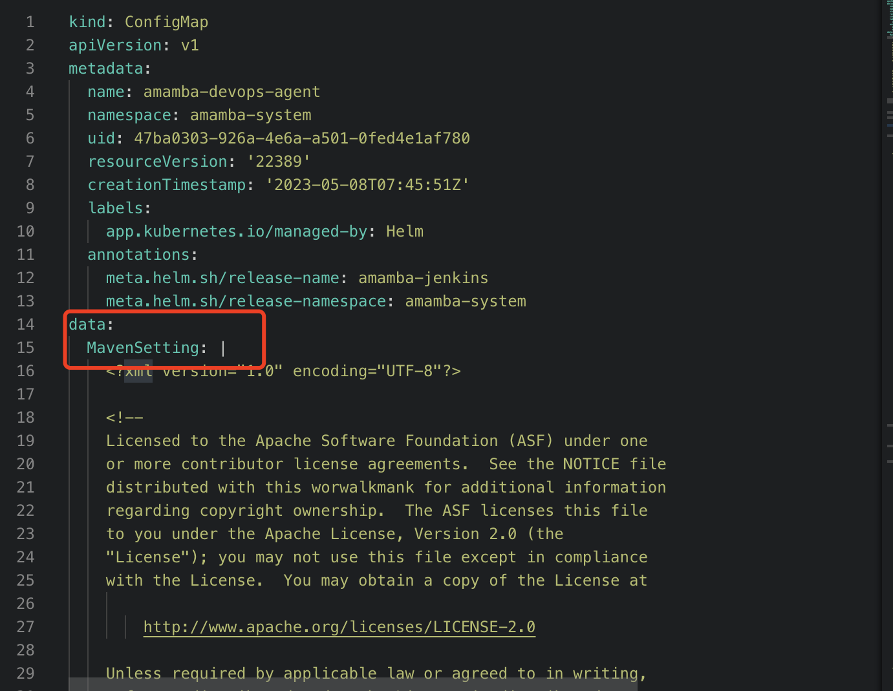
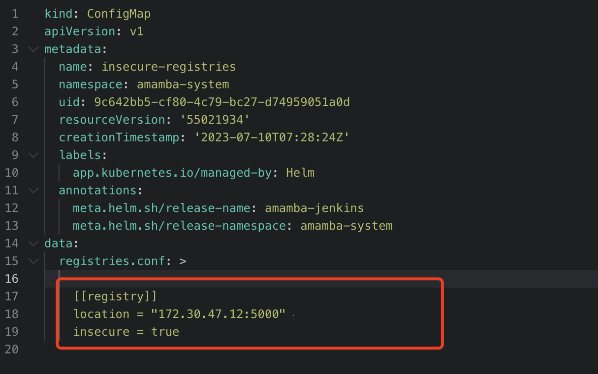

# Pipeline Issues

This page provides solutions to some common issues you may encounter when using the pipeline feature.

## Error when running a pipeline

High network communication delay can lead to pipeline running errors, if Jenkins and
the application are deployed in different data centers. The error message is similar to:

```console
E0113 01:47:27.690555 50 request.go:1058] Unexpected error when reading response body: net/http: request canceled (Client.Timeout or context cancellation while reading body)
error: unexpected error when reading response body. Please retry. Original error: net/http: request canceled (Client.Timeout or context cancellation while reading body)
```

**Solution:**

In the pipeline's Jenkinsfile, change the deployment command from `kubectl apply -f` to
`kubectl apply -f. --request-timeout=30m`.

## Update `podTemplate` image of built-in Labels

The Workbench module declares 7 labels with the podTemplate CRD: `base`, `maven`, `mavenjdk11`,
`go`, `go16`, `node.js`, and `python`. You can specify an Agent label to use the corresponding
podTemplate for your applications. If these build-in images cannot satisfy your need, update or
add images with the following steps.

1. Go to the `Container Management` module and click the name of the cluster where the Jenkins component is running.

2. In the left navigation bar, click `ConfigMaps & Secrets` -> `ConfigMaps`.

3. Search for `jenkins-casc-config` and click `Edit YAML` in the Actions column.

    

4. Under `data` -> `jenkins.yaml` -> `jenkins.clouds.kubernetes.templates`, select the podTemplate whose image you want to change.

    

5. Once you have made the necessary updates, go to `Workloads` section and restart Jenkins deployment.

## Modify dependency source in `settings.xml` in Maven?

When use Maven as the pipeline build environment, most users need to modify `settings.xml`
file to change the dependency source. You can follow these steps:

1. Go to the Container Management module and click the name of the cluster where the Jenkins component is running.

2. In the left navigation bar, click `ConfigMaps & Secrets` -> `ConfigMaps`.

3. Search for `amamba-devops-agent` and click `Edit YAML` in the Actions column.

4. Modify the `MavenSetting` under the `data` section as per your requirement.

    

5. Once you have made the necessary updates, go to `Workloads` and restart Jenkins.

## Unable to access private image repositories when building images through Jenkins

### Podman runtime

1. Go to the Container Management module and click the name of the cluster where the Jenkins component is running.

2. In the left navigation bar, click `ConfigMaps & Secrets` -> `ConfigMaps`.

3. Search for `insecure-registries` and click `Edit YAML` in the Actions column.

4. Configure under the `registries.conf` file in the `data` section.

    Pay attention to the formatting and indentation when making modifications.
    Each registry should have a separate `[[registry]]` section, as shown in the image below:

    

    !!! note

        The value of the `registries` keyword should be the complete domain name or
        IP address of the container registry, without adding the `http` or `https` prefix.
        If the container registry uses a non-standard port number, you can add a colon `:`
        followed by the port number after the address.

        ```toml
        [registries]
        location = "registry.example.com:5000"
        insecure=true

        [registries]
        location = "192.168.1.100:8080"
        insecure=true
        ```

    Refer to [Podman documentation](https://podman-desktop.io/docs/containers/registries/insecure-registry).

### Cluster runtime is Docker

1. Open the Docker configuration file. On most Linux distributions, the configuration file
   is located at `/etc/docker/daemon.json`. If it doesn't exist, please create this configuration file.

2. Add the repository address to the `insecure-registries` field.

    ```json
    {
      "insecure-registries": ["10.16.10.120:4443"]
    }
    ```

3. After saving, restart Docker by executing the following commands:

    ```bash
    sudo systemctl daemon-reload
    sudo systemctl restart docker
    ```

!!! note

    Refer to [Docker documentation](https://docs.docker.com/engine/reference/commandline/dockerd/#configuration-reload-behavior).
