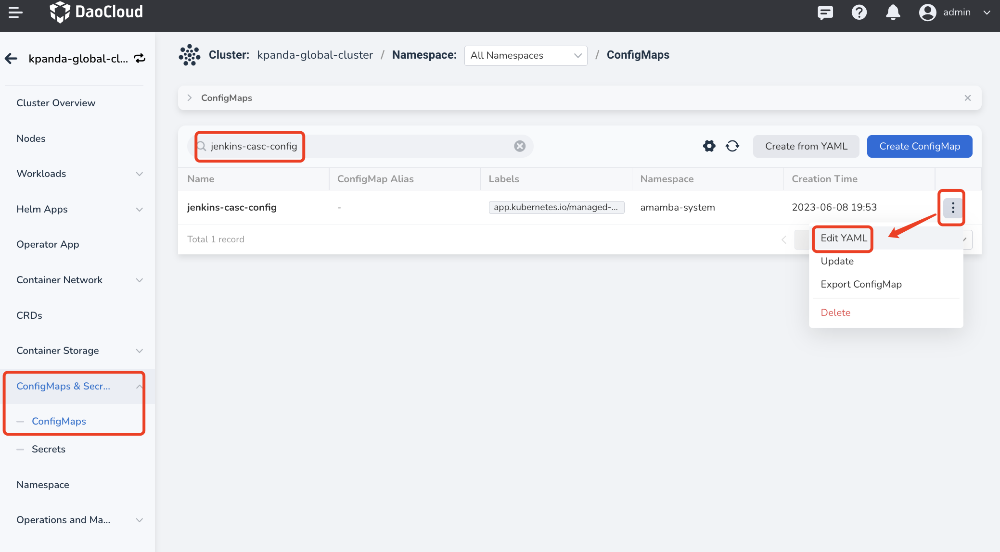
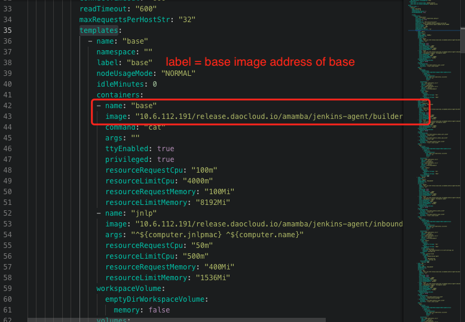
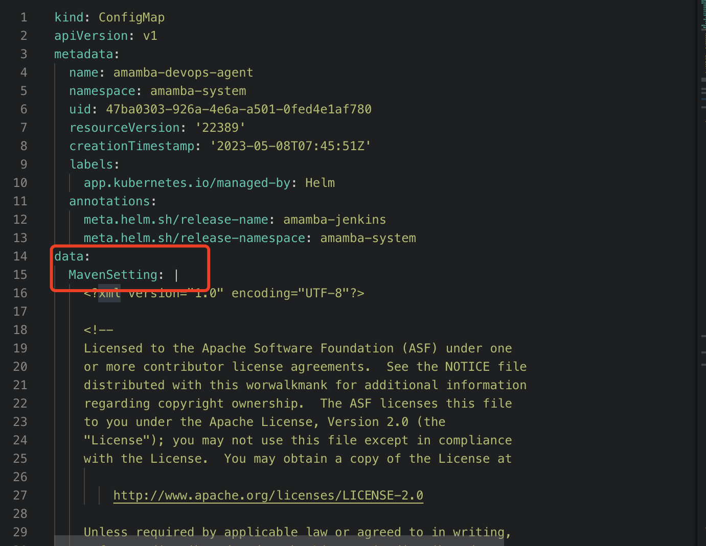

# 流水线相关问题

This page provides solutions to some common issues you may encounter when using the pipeline feature.

## Error when running a pipeline

High network communication delay can lead to pipeline running errors, if Jenkins and the application are deployed in different data centers. The error message is similar to:

```bash
E0113 01:47:27.690555 50 request.go:1058] Unexpected error when reading response body: net/http: request canceled (Client.Timeout or context cancellation while reading body)
error: unexpected error when reading response body. Please retry. Original error: net/http: request canceled (Client.Timeout or context cancellation while reading body)
```

**Solution:**

In the pipeline's Jenkinsfile, change the deployment command from `kubectl apply -f` to `kubectl apply -f. --request-timeout=30m`.

## Update `podTemplate` image of built-in Labels

The Application Workbench module declares 7 labels with the podTemplate CRD: `base`, `maven`, `mavenjdk11`, `go`, `go16`, `node.js`, and `python`. You can specify an Agent label to use the corresponding podTemplate for your applications. If these build-in images cannot satisfy your need, update or add images with the following steps.

1. Go to the Container Management module and click the name of the cluster where the Jenkins component is running.

2. In the left navigation bar, click `ConfigMaps & Secrets` -> `ConfigMaps`.

3. Search for `jenkins-casc-config` and click `Edit YAML` in the Actions column.

    

4. Under `data` -> `jenkins.yaml` -> `jenkins.clouds.kubernetes.templates`, select the podTemplate whose image you want to change.

    

5. Once you have made the necessary updates, go to `Workloads` section and restart Jenkins deployment.

## Modify dependency source in `settings.xml` in Maven?

When use Maven as the pipeline build environment, most users need to modify `settings.xml` file to change the dependency source. You can follow these steps:

1. Go to the Container Management module and click the name of the cluster where the Jenkins component is running.

2. In the left navigation bar, click `ConfigMaps & Secrets` -> `ConfigMaps`.

3. Search for `amamba-devops-agent` and click `Edit YAML` in the Actions column.

4. Modify the `MavenSetting` under the `data` section as per your requirement.

    

5. Once you have made the necessary updates, go to `Workloads` and restart Jenkins.

## Unable to access private image repositories when building images through Jenkins

### Podman runtime

1. Go to the Container Management module and click the name of the cluster where the Jenkins component is running.

2. In the left navigation bar, click `ConfigMaps & Secrets` -> `ConfigMaps`.

3. Search for `insecure-registries` and click `Edit YAML` in the Actions column.

4. Configure the `registries.conf` under the `data` section.

    !!! note

      - Do not forget to apply indention.
      - Each registry should have a separate `[[registry]]` section, as shown in the example image.

    
