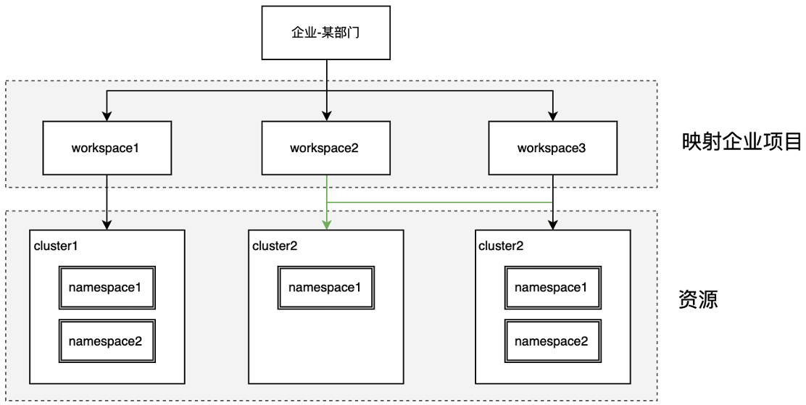
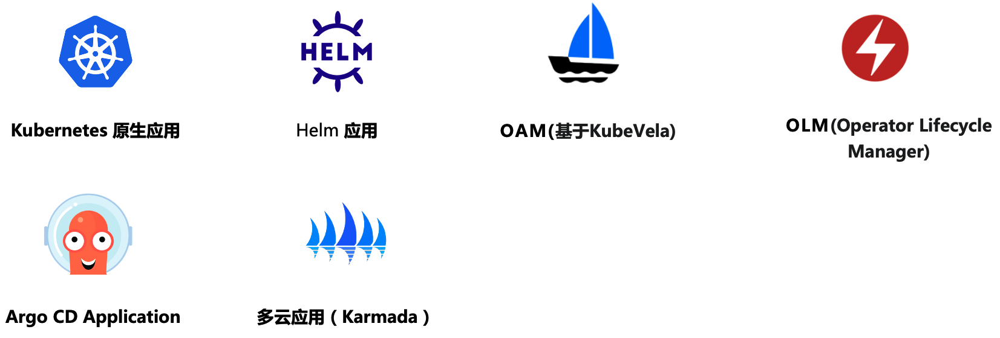

# What is Workbench?

Workbench is a container-based DevOps cloud native application platform.
It provides a unified entry point for creating applications in DCE 5.0.
It offers various functionalities such as graphical form-based creation
of multiple pipelines, GitOps, canary deployments, blue/green deployments,
AB testing, project management, and toolchain integration.

Workbench focuses on automating the delivery of enterprise applications
and infrastructure changes. It provides end-to-end lifecycle management for business
applications from "development -> testing -> deployment -> operation". It effectively
helps enterprises achieve digital transformation and improve IT delivery capabilities and competitiveness.

=== "Hierarchical Multi-Tenant Resource Management"

Using [Workspace](../../ghippo/user-guide/workspace/ws-folder.md) as the smallest unit of tenancy, it supports both dedicated resources within a single cluster and shared resources across clusters:

- Supports loosely coupled clusters to share resources across namespaces.
- Supports tightly coupled clusters to provide dedicated resources.
- Workspace members can create namespace resources in associated clusters.
- Self-service resource creation allows users to create namespaces within workspaces for resource isolation.



=== "Centered around Cloud-Native Applications"

Supports "polyform" cloud native applications in cloud native scenarios, including Kubernetes native applications, Helm applications, OAM applications, etc.
Can integrate microservice applications based on SpingCloud, Dubbo, and ServiceMesh frameworks to achieve microservice governance. Seamlessly integrates with DCE 5.0's [Microservice Engine](../../skoala/intro/index.md) and [Service Mesh](../../mspider/intro/index.md).
Provides full lifecycle management for cloud native applications, such as scaling, logging, monitoring, and application updates.



=== "Efficient Continuous Integration"

Supports Jenkins and Tekton as dual pipeline engine systems. Allows graphical editing of pipelines with a WYSIWYG effect. Can build applications from different code sources.


=== "Secure Automated Progressive Delivery"

Workbench embraces the GitOps concept for continuous deployment of cloud native applications. It fully integrates with progressive delivery component Argo Rollout to support canary deployments, improving application delivery stability and efficiency.


!!! info

    Progressive delivery is an approach to expose a new version of an application gradually to an initially small portion of users, gradually expanding to larger subsets, in order to mitigate risks such as errors.
    
    Argo-Rollout Kubernetes Progressive Delivery Controller provides powerful deployment capabilities, including canary releases, blue/green deployments, experimentation, and progressive delivery features.

## Positioning in DCE 5.0

Built on container management, hierarchical resource management through global management,
creating and managing cloud native applications with CI/CD pipelines and GitOps processes,
facilitating progressive delivery.


## Deployment Method

It is recommended to install Workbench using the
[DCE 5.0 Enterprise Package installation package](../../install/commercial/start-install.md),
as it installs all modules of DCE 5.0 at once, without worrying about component compatibility.

However, if you want to install or upgrade the Workbench module separately, run the following command:

```bash
export VERSION=**** # Replace with the actual version to be deployed.
helm repo add amamba-release https://release.daocloud.io/chartrepo/amamba
helm repo update amamba
helm upgrade --install --create-namespace --cleanup-on-fail amamba amamba-release/amamba -n amamba-system --version=${VERSION}
```

[Download DCE 5.0](../../download/index.md){ .md-button .md-button--primary }
[Install DCE 5.0](../../install/index.md){ .md-button .md-button--primary }
