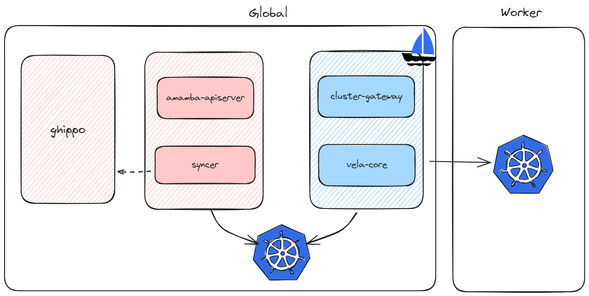

# Workbench Technical Overview

*[Amamba]: dev codename of DCE 5.0 Workbench
*[Mspider]: dev codename of DCE 5.0 Service Mesh

## Objectives

- Gain an overall understanding of the Workbench architecture
- Explain the included components and integration methods
- Examples and guide documentation

## System Components

The amamba-system mainly includes the following three components:

- **apiserver**: The entry point for all services, stateless, providing access through gRPC and REST.
  It calls `Providers` services via REST or gRPC or creates resources through kube-client or kpanda
  to interact with `Controllers`.
- **devops-server**: Mainly communicates with Jenkins and provides relevant interfaces to
  `apiserver` to support lazy loading, event-based synchronization, and other functions.
- **syncer**: Primarily responsible for maintaining data consistency between `Providers`,
  `Controllers`, and the system, ensuring that the system configuration is correctly
  distributed to each component.

## CI

### Jenkins

Amamba [Jenkins](https://github.com/amamba-io/jenkins-agent) is enhanced based on the
[Kubernetes plugin](https://plugins.jenkins.io/kubernetes/). Compared to native Jenkins,
Workbench offers the following advantages:

1. **Complete Cloud-Native Solution**

    Compared to traditional VM deployments, cloud-native offers elasticity, scalability, high availability,
    and flexibility. We provide a full set of Jenkins cloud-native solutions, including running in Kubernetes,
    building images and artifacts, publishing, integrating with other toolchains, and DR.

2. **Optimized Read Speed**

    We provide a relational database-based cache where pipeline and run-related data are
    stored in the DB, ensuring timely updates through an event mechanism.

3. **Deploy Once, Run Anywhere**

    Thanks to the DB, the deployment location and persistence of Jenkins are no longer important.
    Workbench can always connect to another Jenkins instance deployed in a different cluster
    and run previously created pipelines on it.

4. **Lower Barrier to Entry**

    [Jenkinsfile](https://www.jenkins.io/doc/book/pipeline/jenkinsfile/) is powerful but has
    a relatively high understanding and usage barrier. Workbench provide a graphical interface to
    help users create and edit pipelines through drag-and-drop, allowing users to get started quickly.

5. **Multi-Tenancy**

    Based on the Workspace mechanism of DCE5, we have isolated pipelines and credentials.

Additionally, the Workbench currently has the following issues:

1. **Slow Startup**

    Compared to using registered node agents traditionally, running pipelines on Kubernetes-based Jenkins
    requires creating Pods, waiting for scheduling, and pulling images, resulting in slower startup speeds.

2. **Cache**

    Due to the sandbox environment of Pods, the cache cannot be effectively utilized.
    Workbench can mount persistent storage for it, but this almost always means additional planning and management costs.

3. **Plugins**

    Installing plugins still requires operations and configuration on the Jenkins management interface,
    and they will be lost when migrating to other clusters. We recommend forking
    [amamba-io/jenkins-agent](https://github.com/amamba-io/jenkins-agent) and modifying
    `formula.yaml` to rebuild and persist plugins into the image.

4. **Noisy Neighbour**

    We have not implemented resource quotas and limits for pipelines because we believe CI
    and deployment resources should not be considered together. Instead, it relies on
    the administrator's pre-planning of the CI system, which may lead to some pipelines
    monopolizing all resources.

5. **Slow Image Build**

    Besides the cache issue mentioned earlier, when the Kubernetes runtime is not Dockerd,
    you can only use methods like [dind](https://hub.docker.com/_/docker) or
    [pind](https://podman.io/) to build images. Running containers inside containers can
    lead to [some IO performance loss](https://www.alibabacloud.com/blog/container-security-a-look-at-rootless-containers_595153).

Based on this, Workbench is also planning to support Jenkins deployments using traditional methods.

#### Overall Architecture

- By utilizing the event mechanism provided by the
  [Generic Event plugin](https://plugins.jenkins.io/generic-event/), you can update the pipeline's
  running status timely. To avoid event loss caused by different network environments,
  we deploy `event-proxy` as a sidecar, which provides stronger network traffic control and
  a reliable event system. For Amamba, it is completely transparent and can be omitted if
  the network environment is controllable.
- To ensure `apiserver` is completely stateless and scalable, we use `devops-server` to handle
  state-related services, including receiving Jenkins events, synchronizing pipeline status,
  lazy loading of runtime data, exposing Jenkins event metrics, and providing an SDK for `apiserver` to call.
- Since Jenkins instances may run in any cluster, `syncer` helps us synchronize part of the system
  to different instances, including:
    - Our credentials are managed uniformly using `secret`, and `syncer` will synchronize the
      pipeline part to Jenkins.
    - Jenkins configurations are effective based on [CasC](https://www.jenkins.io/projects/jcasc/).
      We retain the changed parts in the system and use `syncer` to synchronize them to the sub-clusters.
- Pipelines are actually executed in Pods, communicating with Jenkins through the
  [jnlp](https://hub.docker.com/r/jenkins/inbound-agent) container.
  This architecture allows most tasks to continue running even if Jenkins goes down.

#### More Resources

- More reliable usage:
    - HA: [Jenkins High Availability Solution - DaoCloud Enterprise](../quickstart/jenkins-HA.md)
    - Configuration and planning: [Jenkins Scenario Configuration - DaoCloud Enterprise](../quickstart/scenarios-config.md)
- Extensions:
    - Custom tools: [Using Custom Toolchains in Jenkins - DaoCloud Enterprise](../quickstart/jenkins-custom.md)
    - Reusing pipelines: [Custom Templates - DaoCloud Enterprise](../user-guide/pipeline/template/custom-template.md)
    - Custom Agent: [Custom Jenkins Agent Image - DaoCloud Enterprise](../user-guide/pipeline/jenkins-agent.md) (__Missing Kubernetes Type Agent Definition Method__)
    - Custom steps: WIP
- Acceleration (WIP, missing a systematic document):
    - [Running Pipelines on Specified Nodes - DaoCloud Enterprise](../quickstart/pipeline-on-node.md)
    - [Using Cache in Pipelines - DaoCloud Enterprise](../quickstart/job-cacher.md)
- Integration:
    - SornaQube: [Code Scanning with Pipelines - DaoCloud Enterprise](../quickstart/scan-with-pipeline.md)
    - Integrated Gitlab: WIP (basic principles, how to use)
- Practices:
    - [Building Microservice Applications from Git Repositories - DaoCloud Enterprise](../user-guide/wizard/create-app-git.md)
    - [Building Java Applications from Jar Packages - DaoCloud Enterprise](../user-guide/wizard/jar-java-app.md)
    - Using ArgoCD: [CI/CD with Pipeline + GitOps - DaoCloud Enterprise](../quickstart/argocd-rollout.md)
    - Building Multi-Architecture Images (WIP with errors):
      [Building Multi-Architecture Images - DaoCloud Enterprise](../user-guide/pipeline/podman.md)

## CD

### Argo CD

Amamba uses [Argo CD](https://argo-cd.readthedocs.io/en/stable/) as the engine to
implement GitOps capabilities. Compared to native Argo CD, we have mainly enhanced integration with DCE 5.0:

1. Applications are isolated by tenant and can only be deployed to the corresponding clusters and namespaces.
2. Permissions are controlled according to the global RBAC strategy, and only users with proper rules
   can perform corresponding operations.

Issues:

1. Code repositories are not isolated by tenant: This is a design flaw of Argo CD, and we are
   actively pushing the community to optimize it:
   [argoproj/argo-cd #18290](https://github.com/argoproj/argo-cd/pull/18290)
2. ApplicationSet is not yet supported.

#### Overall Architecture

- We access `argo-server` through the SDK provided by Argo, using AppProject -
  Workspace one-to-one mapping to create and update corresponding resources for users.
- `syncer` constantly watches the changes of tenants in the system and applies the
  changes to Argo's resources.

#### More Resources

- More reliable usage:
    - HA: [Argo-CD High Availability Deployment - DaoCloud Enterprise](../quickstart/argo-cd-HA.md)
    - [Enabling Credential Encryption in GitOps - DaoCloud Enterprise](../user-guide/gitops/gitops-secret.md)
- Multi-environment promotion deployment (WIP);
- [How to Model Your GitOps Environments](https://codefresh.io/blog/how-to-model-your-gitops-environments-and-promote-releases-between-them/)
  provides ideas for promoting across multiple environments based on kustomization.
- [GitHub - cloudogu/gitops-patterns: Collection of patterns, examples and resources for GitOps process design, GitOps repository structures, etc](https://github.com/cloudogu/gitops-patterns)
  summarizes some common GitOps pattern choices and their pros and cons.

### Argo Rollouts

Amamba provides progressive release capabilities based on Argo Rollouts.
Compared to native Argo Rollouts, we have mainly enhanced the following aspects:

1. Easier to use, providing a Step By Step interface to convert workloads in the current cluster
   into `Rollout` and start progressive release.
2. Support for cross-cluster creation and management.
3. Better integration with Mspider (when using istio as a traffic control tool) and skoala (when using contour).

Issues:

1. In Mspider's managed mesh mode, the VirtualService and DestinationRule deployed in sub-clusters
   will not take effect, making it impossible to use Istio-based Rollout in this scenario.
   Mspider is optimizing it and is expected to support it in version v0.26.
2. Creating Rollout based on Deployment will cause temporary access failures. The community is
   working to fix this issue
   [argoproj/argo-rollouts #3111](https://github.com/argoproj/argo-rollouts/issues/3111),
   which is expected to be resolved in version v1.7.

#### More Resources

- [Progressive Release with Argo Rollout - DaoCloud Enterprise](../quickstart/argocd-rollout.md)
- [Progressive Release with Contour - DaoCloud Enterprise](../quickstart/contour-argorollout.md)

## Applications

We support native applications, Helm apps, OAM applications, and OLM Apps.

### Native Applications

Native applications refer to resources of Kubernetes native workload types, such as Deployment,
StatefulSet, and DaemonSet. We have not added any cognitive load, but to associate related resources,
we use [kubernetes-sigs/application](https://github.com/kubernetes-sigs/application)
to indicate the resource types and labels included in the current application.

The controller corresponding to this CRD is optional and needs to be manually installed in each sub-cluster.
Not deploying it will not cause resource creation failures, but deploying it allows continuous synchronization
of resource status, returning the readiness of resources.

### OAM Applications

OAM applications are implemented based on [kubevela](https://kubevela.io/).
We have mainly enhanced multi-tenancy:

1. When creating an OAM application for the first time under the current tenant, it will prompt to
   create or specify a namespace as the location for all `applications.core.oam.dev` under that
   Workspace, achieving application isolation under different tenants.
2. `syncer` constantly watches the changes of tenants in the system and applies the changes to KubeVela's resources.

### Helm and OLM Apps

OLM and Helm apps are mainly encapsulated based on proper capabilities of Kpanda.

## Versions

All Addons of Amamba can be deployed in the app store using Helm from v0.21 (for installer v0.12)
onwards, with no version restrictions. However, the default version has undergone complete testing
and can be better integrated into the current system. The following table shows the version
relationship between Addons and Amamba:

| Addon                                  | Start Version | End Version |
| -------------------------------------- | ------------- | ----------- |
| amamba-io/Jenkins 0.3.1 (2.413)        | v0.21         | v0.24       |
| argocd 5.34.6 (2.7.3)                  | v0.21         | -           |
| argo-rollouts 2.32.0 (1.6.0)           | v0.21         | -           |
| vela-core 1.7.7 (1.7.7)                | v0.21         | v0.23       |
| vela-core 1.9.7 (1.9.7)                | v0.23         | -           |
| amamba-io/Jenkins 0.3.2 (2.413)        | v0.24         | -           |
| amamba/kube-app-manager 0.1.4 (0.8.3)  | ?             | -           |
