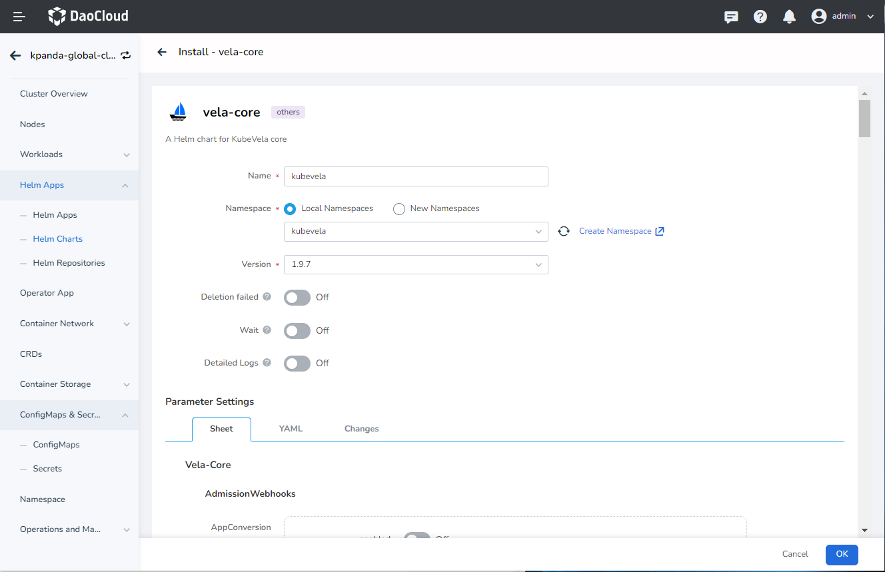
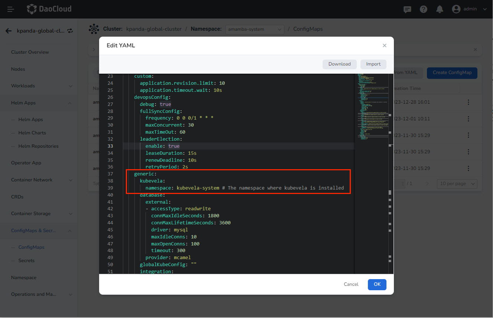
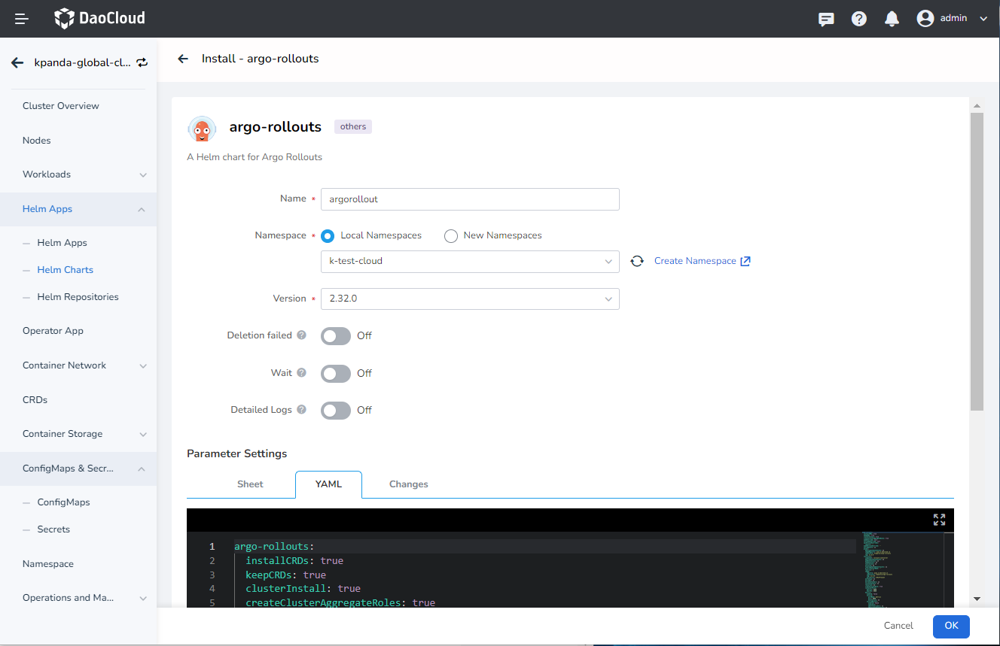

# Deploying Pluggable Components for the Workbench

## Overview

Some features in the Workbench leverage the capabilities of open-source components. Starting from
v0.21.0 of the Workbench, a pluggable design pattern is adopted to decouple these functional
components. Therefore, when deploying the Workbench, you can choose whether to enable them in
the __manifest.yaml__ file of the installer. If they are not enabled during installation, you can
follow the instructions below to enable them.

The corresponding functionalities for each component are as follows:

| Component   | Feature Module | Remarks |
| ----------- | -------------- | ------- |
| argo-cd     | Continuous Deployment | Installed by default |
| argo-rollouts | Canary Release | Not installed by default |
| vela-core   | OAM Applications | Not installed by default |

!!! note

    If you want to enable or disable the related components of the Workbench during the deployment
    of DCE 5.0, you can set the __enable__ keyword in the __manifest.yaml__ file to true or false to
    choose whether to enable them.

## Deploying the argo-cd Component

If you chose not to enable it during the deployment of DCE 5.0, follow the instructions below
to deploy it and use the continuous deployment capability provided by the Workbench.

### Procedure

1. In the DCE 5.0 product module, go to __Container Management__ -> __Cluster List__ and enter the details page of the __kpanda-global-cluster__.

2. In the cluster details page, navigate to the menu on the left side and go to __Helm Apps__ -> __Helm Charts__
   -> select the __All__ repository. Search for __argo-cd__, click on it to enter the details page, and install it.

3. On the installation interface, fill in the required installation parameters.


    Parameter descriptions:

    - Name: Please enter __argocd__.
    - Version: The default version is __5.34.6__, which is the only version available in the addon repository.
    - Namespace: Select __argocd__.

    !!! note

        You can use the default values for the rest of the parameters.

4. Click the OK button at the bottom right to complete the installation. Confirm that the related argo-cd resources in the __argocd__ namespace are all in the __Running__ state.

5. After successfully deploying the resources mentioned above, go to the __Configurations & Secrets__ -> __Configurations__
   menu on the left side of the current cluster details page. Search for __amamba-config__ and click on __Edit YAML__.

6. Add the following parameters in the __data->amamba-config.yaml__ section:

    ```yaml
    generic:
      argocd:
        host: argocd-server.argocd.svc.cluster.local:80  # argocd server address, format: argocd-server service name.namespace.svc.cluster.local:80
        namespace: argocd  # argocd deployment namespace
    ```

7. After making the changes, go to the __Workloads__ -> __Pods__ menu on the left side of the current cluster details
   page and search for __amamba-apiserver__ and __amamba-syncer__. Restart them one by one.

8. Once the restart is successful, you can go to the __Workbench__ module to use the continuous deployment capability.

### Notes

For the argo-cd component in the addon, we made some configuration changes based on the open-source version. The main changes are as follows:

- Modified the helm template to use the three-part structure of __registry:repository:tag__ for the image,
  which can be set using __global.imageRegistry__ for the global registry address.
- Modified two configmaps of argo-cd for authentication. These can be installed directly through
  the argo-cd component in the addon, and no manual operation is required.

```shell
[root@demo-dev-master1 ~]# kubectl get cm -n argocd argocd-cm -o yaml
apiVersion: v1
data:
  accounts.amamba: apiKey
  admin.enabled: "true"
kind: ConfigMap
metadata:
  name: argocd-cm

[root@demo-dev-master1 ~]# kubectl get cm -n argocd argocd-rbac-cm -o yaml
apiVersion: v1
data:
  policy.csv: |
    g, amamba, role:admin
  policy.default: ""
  scopes: '[groups]'
kind: ConfigMap
metadata:
  name: argocd-rbac-cm
```

## Deploying the vela-core Component

If you chose not to enable it during the deployment of DCE 5.0, follow the instructions below
to deploy and utilize the OAM application capabilities provided by the Workbench.

### Procedure

1. In the DCE 5.0 product module, go to __Container Management__ -> __Cluster List__ and enter
   the details page of the __kpanda-global-cluster__ cluster.

2. In the cluster details page, navigate to the left sidebar menu and select __Helm Apps__ -> __Helm Charts__ -> choose the addon repository. Search for __vela-core__, click on it to enter the details page, and proceed with the installation.

3. On the installation page, fill in the required installation parameters:

    

    Parameter explanation:

    - Name: Please enter __kubevela__ (recommended).
    - Version: By default, select __1.7.7__ as the addon repository only has this version available.
    - Namespace: Select __vela-system__ (recommended).

    !!! note
        - Use the default values for the rest of the parameters.
        - Note that the parameter __applicationRevisionLimit__ indicates the limit on the number of OAM application versions, which is set to 10 by default but can be changed based on your preference.

4. Click the __OK__ button on the bottom right corner to complete the installation. You can check if the relevant workloads under the __vela-system__ namespace are all in the __Running__ state.

5. Once you have confirmed the successful deployment of the above workloads, go to the current cluster's details page and navigate to the left sidebar menu and select __Configuration Items & Keys__ -> __Configuration Items__. Search for __amamba-config__ and click on __Edit YAML__.

6. In the __data->amamba-config.yaml__ section, add the following parameters:

    ```yaml
    generic:
      kubevela:
        namespace: kubevela-system # The namespace where kubevela is installed
    ```

    

7. After making the changes, go to the left sidebar menu of the current cluster's details page and select __Workloads__ -> __Containers__. Search for __amamba-apiserver__ and __amamba-syncer__ respectively, and restart them one by one.

8. Once the restart is successful, you can access the __Workbench__ module to utilize the OAM application capabilities.

## Deploying argo-rollouts

If you chose not to enable it during the deployment of DCE 5.0, follow the instructions below to deploy and utilize the gray release capabilities provided by the Workbench.

### Procedure

1. In the DCE 5.0 product module, go to __Container Management__ -> __Cluster List__ and enter the details page of the __kpanda-global-cluster__ cluster (the cluster where you want to perform gray releases on applications).

2. In the cluster details page, navigate to the left sidebar menu and select __Helm Apps__ -> __Helm Charts__ -> choose
   the addon repository. Search for __argo-rollouts__, click on it to enter the details page, and proceed with the installation.

3. On the installation page, fill in the required installation parameters:

    

    Parameter explanation:

    - Name: Please enter __argorollout__ (recommended).
    - Version: By default, select __2.32.0__ as the addon repository only has this version available.
    - Namespace: Select __argo-rollouts-system__ (recommended).

    !!! note

        Use the default values for the rest of the parameters.

4. Click the __OK__ button on the bottom right corner to complete the installation. You can check if the
   relevant workloads under the __argo-rollouts-system__ namespace are all in the __Running__ state.

5. Once the deployment is successful, you can access the __Workbench__ module to utilize the gray release
   capabilities in the current cluster.

!!! note

    Argo Rollouts is a tool for Kubernetes application blue-green and canary deployments.
    It focuses on the deployment and update processes of applications.
    During usage, it needs to be deployed in the cluster where the application resides.
    If you want to use gray release capabilities in multiple clusters,
    you need to deploy the argo-rollout component in each corresponding cluster.
