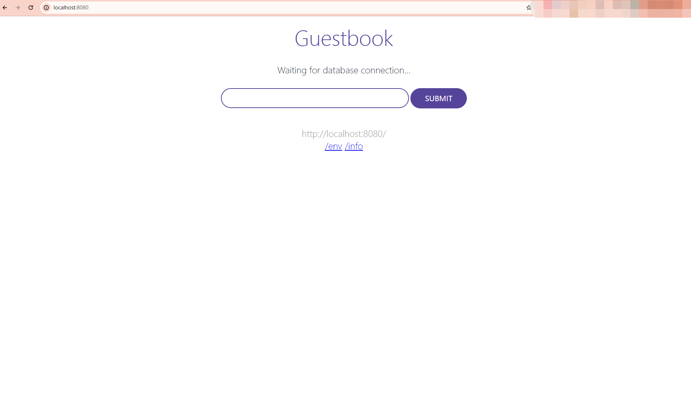

# CI/CD is realized based on pipeline and GitOps

This text introduces how to implement CI/CD based on pipeline and GitOps functions on the workbench.

## Overall process

<!--screenshots-->

## Prerequisites

Based on the overall process, we need to prepare the following information:

1. Prepare two code repositories on gitlab, one as a repository for business code and one as a repository
   for application configuration files (yaml). In this example, we place them in different directories within the same repository for convenience:

    ```console
    Refer to github config:
   
    Business Code：https://github.com/amamba-io/amamba-examples/tree/main/guestbook-go
    App Config：https://github.com/amamba-io/amamba-examples/tree/main/plain-yaml
    ```

2. Prepare a Harbor mirror warehouse.

3. Prepare the pipeline credentials, named git-credentials, git-app-credentials, and harbor-credentials.

## Create pipeline

This example includes the following steps: pull the service code, build an image, and update the application 
configuration file.

After the __Update app profile__ step is successfully executed, Argo CD detects the change and updates to 
synchronize the latest configuration file and deploy it to the cluster.

1. For details about how to create a pipeline, see [create pipeline](../user-guide/pipeline/create/custom.md).

2. After successful creation, select the pipeline operation: __Edit Jenkinsfile__

    ??? note "Click to view the pipeline Jenkinsfile example"

        ```groovy
        pipeline {
          agent {
            node {
              label 'base'
            }
          }
          environment {
            SOURCE_REPO          = '<https://github.com/amamba-io/amamba-examples.git>'
            SOURCE_CREDENTIAL_ID = '<source-credential-id>'
            DEPLOY_REPO          = 'github.com/amamba-io/amamba-examples.git'
            DEPLOY_CREDENTIAL_ID = '<deploy-credential-id>'
            DEPLOY_PATH          = 'plain-yaml'
            DOCKERFILE_ROOT      = 'guestbook-go'
            DOCKER_REPO          = 'docker.io/amambadev/guestbook'
            DOCKER_CREDENTIAL_ID = '<docker-credential-id>'
          }
          stages {
            stage('git clone') {
              steps {
                git(branch: 'main', credentialsId: "${SOURCE_CREDENTIAL_ID}", url: "${SOURCE_REPO}")
                script {
                    env.COMMIT_ID = sh(script: 'git rev-parse --short=8 HEAD',
                                        returnStdout: true).trim()
                    echo "commit id: ${COMMIT_ID}"
                }
              }
            }
            stage('build & push') {
              steps {
                container('base') {
                  withCredentials([usernamePassword(passwordVariable:'PASS',usernameVariable:'USER',credentialsId:"${DOCKER_CREDENTIAL_ID}")]) {
                    sh 'docker login ${DOCKER_REPO} -u $USER -p $PASS'
                    sh 'docker build -f Dockerfile -t ${DOCKER_REPO}:${COMMIT_ID} ${DOCKERFILE_ROOT}'
                    sh 'docker push ${DOCKER_REPO}:${COMMIT_ID}'
                  }
                }
              }
            }
            stage('update manifest') {
              environment {
                DOCKER_TAG = "${COMMIT_ID}"
              }
              steps {
                container('base'){
                  dir('deploy') {
                    git(branch: "main", url: "https://${DEPLOY_REPO}", credentialsId: "${DEPLOY_CREDENTIAL_ID}")
                    sh 'yum install -y gettext'
                    sh 'envsubst < pipelines/templates/guestbook-ui-deployment.yaml.tmpl > plain-yaml/guestbook-ui-deployment.yaml'
                    withCredentials([usernamePassword(passwordVariable:'PASS', usernameVariable:'USER', credentialsId:"${DEPLOY_CREDENTIAL_ID}")]) {
                        sh '''
                            git config user.name "robot"
                            git config user.email "<robot@amamba.io>"

                            git add .
                            git commit -m "Bump image with ${DOCKER_REPO}:${DOCKER_TAG}"
                            git push "https://${USER}:${PASS}@${DEPLOY_REPO}"
                        '''
                        }
                  }
                }
              }
            }
          }
        }
        ```

### Continuous deployment based on Kustomize

If the deployment files are managed using Kustomize, we can update the step `update manifest` in the pipeline 
to accommodate this scenario:

```groovy
environment {
  ...
  DEPLOY_PATH          = 'kustomize-guestbook/'
}
stages{
  ...
  stage('update manifest') {
    environment {
      DOCKER_TAG = "${COMMIT_ID}"
    }
    steps {
      container('base'){
        dir('deploy') {
          git(branch: "main", url: "https://${DEPLOY_REPO}", credentialsId: "${DEPLOY_CREDENTIAL_ID}")
          sh '''
              cd ${DEPLOY_PATH}
              # install kustomize
              curl -s "https://raw.githubusercontent.com/kubernetes-sigs/kustomize/master/hack/install_kustomize.sh"  | bash
              ./kustomize edit set image ${DOCKER_REPO}:latest=${DOCKER_REPO}:${DOCKER_TAG}
          '''
          withCredentials([usernamePassword(passwordVariable:'PASS', usernameVariable:'USER', credentialsId:"${DEPLOY_CREDENTIAL_ID}")]) {
          sh '''
              git config user.name "robot"
              git config user.email "robot@amamba.io"

              git add .
              git commit -m "Bump image with ${DOCKER_REPO}:${DOCKER_TAG}"
              git push "https://${USER}:${PASS}@${DEPLOY_REPO}"
          '''
          }
        }
      }
    }
  }
}

```

### Continuous deployment based on Helm

If the deployment files are managed using Helm Charts, we can update the `update manifest` step in the pipeline 
to accommodate this scenario:

```groovy
environment {
  ...
  DEPLOY_PATH          = 'helm-guestbook/values-production.yaml'
}
stages{
  ...
  stage('update manifest') {
    environment {
      DOCKER_TAG = "${COMMIT_ID}"
    }
    steps {
      container('base'){
        dir('deploy') {
          git(branch: "main", url: "https://${DEPLOY_REPO}", credentialsId: "${DEPLOY_CREDENTIAL_ID}")
          sh '''
              yum install -y yq
              yq -i ".image.tag=${DOCKER_TAG}" ${DEPLOY_PATH}
          '''
          withCredentials([usernamePassword(passwordVariable:'PASS', usernameVariable:'USER', credentialsId:"${DEPLOY_CREDENTIAL_ID}")]) {
          sh '''
              git config user.name "robot"
              git config user.email "robot@amamba.io"

              git add .
              git commit -m "Bump image with ${DOCKER_REPO}:${DOCKER_TAG}"
              git push "https://${USER}:${PASS}@${DEPLOY_REPO}"
          '''
          }
        }
      }
    }
  }
}
```

## Create continuous deployment applications

1. Import argocd-examples repository in Http mode, [refer to steps](../user-guide/gitops/import-repo.md).

2. Create a continuously deployed application

    <!--screenshots-->

3. After the creation is complete, a record is generated, and the synchronization status is displayed __Not synced__

    <!--screenshots-->

4. Click __Synchronize__ to complete application deployment

    <!--screenshots-->

## Run pipeline to trigger CI/CD

1. Select the pipeline created above and click __Run Now__

    <!--screenshots-->

2. Viewing Run Logs

    <!--screenshots-->

3. After the pipeline runs successfully, verify that the image is uploaded to Harbor and the tag defined in Jenkinsfile
   is v2.0. At the same time, contents in the deployment repositories have been renewed.

    <!--screenshots-->

4. Continue to verify the continuous deployment application and find that the status is __Not synced__ . At this moment, deployment resources are not synchronized yet.

    <!--screenshots-->

    <!--screenshots-->

5. Click __Sync__ , after the synchronization, view Deployment resources and confirm the current image version.

    <!--screenshots-->

    <!--screenshots-->

6. Use `port-forward` to mirror a local port to the guestbook-ui service and access it locally:

    ```console
    kubectl port-forward svc/guestbook-ui -n demo-gitops 8080:80
    ```

    

## Others

Based on the above process, you can also use [Argo Rollouts](https://argo-rollouts.readthedocs.io/en/stable/) 
to replace Deployment for implementing canary releases and blue-green deployments. We provide examples 
in the sample code that can be used as a reference for **Pipeline - GitOps - Canary/Blue-Green Deployment**:

- [Canary Deployment Based on Replicas](https://github.com/amamba-io/amamba-examples/tree/main/replicas-rollouts) and [Pipeline](https://github.com/amamba-io/amamba-examples/blob/main/pipelines/replicas-rollouts.jenkinsfile)
- [Canary Deployment Based on Istio](https://github.com/amamba-io/amamba-examples/tree/main/istio-rollouts) and [Pipeline](https://github.com/amamba-io/amamba-examples/blob/main/pipelines/istio-rollouts.jenkinsfile)
- [Blue-Green Deployment](https://github.com/amamba-io/amamba-examples/tree/main/blue-green) and [Pipeline](https://github.com/amamba-io/amamba-examples/blob/main/pipelines/blue-green.jenkinsfile)