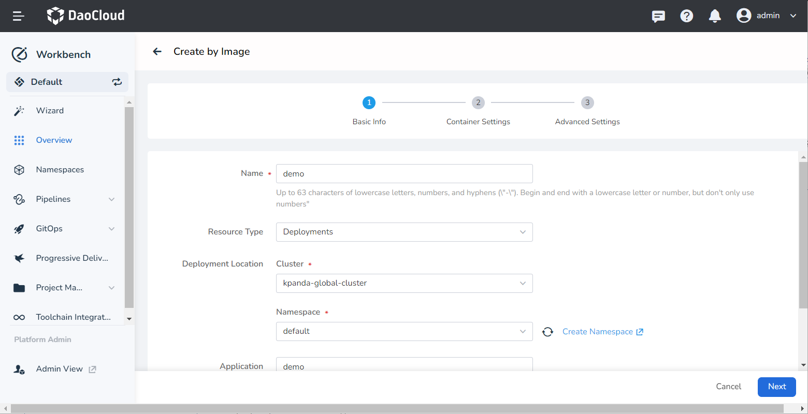
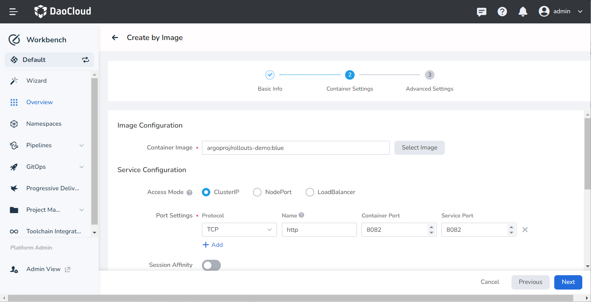
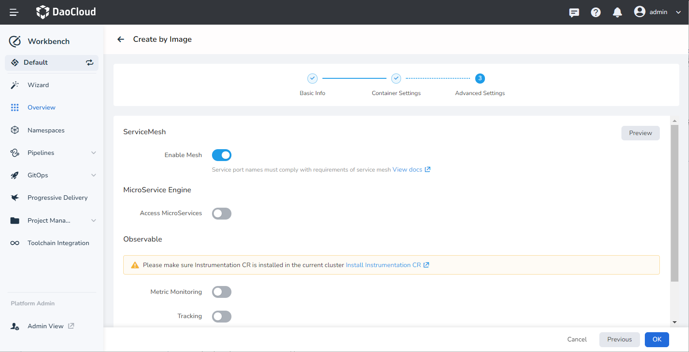
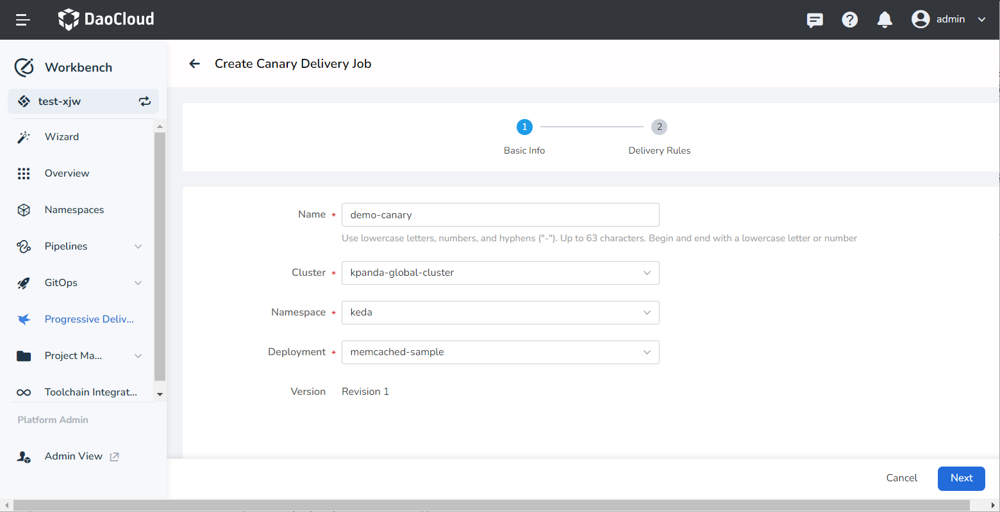
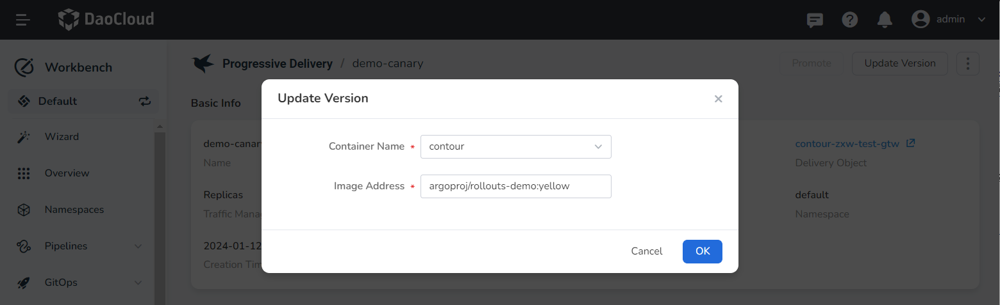
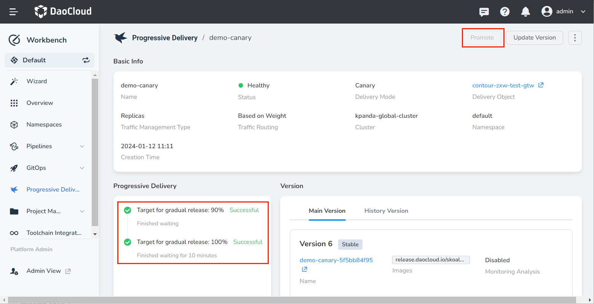

# Implement Progressive Delivery with Argo Rollout

This article introduces how to implement progressive delivery based on the open-source [Argo Rollout](https://argoproj.github.io/argo-rollouts/).

## Prerequisites

- The images in the example need to access the public network: __argoproj/rollouts-demo:yellow__ and __argoproj/rollouts-demo:blue__.

- Only applicable to DCE 5.0 platform deployed via installer with metallb.

- The use of canary deployment capabilities requires the installation of Istio and Argo Rollout components in the cluster.

## Steps

The entire process is divided into four steps: building an application by image, configuring Istio-related resources, creating a canary delivery job, and verifying the effect.

### Building an application by image

1. Select __Container Image__ as the entry point in the wizard.

2. Fill in the basic information:

    

3. Fill in the container settings. For example:

    - Container Image: __argoproj/rollouts-demo:blue__
    - Port Settings: Name is __http__ , container port is __8082__ , and service port is __8082__ .

    

4. Fill in the advanced settings and enable __Enable Mesh__ .

    

5. After creation, an application record will be generated in __Overview__ -> __Applications__ .

### Configurating Istio related resource

Create the following resources in the [Service Mesh](../../mspider/intro/index.md) module or console.

1. Create Gateway

    ```yaml title="gateway.yaml"
    apiVersion: networking.istio.io/v1beta1
    kind: Gateway
    metadata:
      name: rollout-demo
      namespace: rollout-demo # (1)
    spec:
      selector:
        istio: ingressgateway
      servers:
      - hosts:
        - '*'
        port:
          name: http
          number: 8082
          protocol: HTTP
    ```

    1. Namespace where the application is deployed.

2. Deploy Gateway

    ```shell
    vi gateway.yaml
    kubectl apply -f gateway.yaml
    ```

3. Modify VirtualService

    ```shell
    kubectl edit vs {# application name #} -n {# application namespace #}
    ```

    Only need to modify the prompted fields, and other fields do not need to be modified.

    ```yaml
    apiVersion: networking.istio.io/v1beta1
    kind: VirtualService
    metadata:
      creationTimestamp: "2022-11-07T10:46:23Z"
      generation: 84
      name: demo01
      namespace: default
      resourceVersion: "5741370"
      uid: 8109f754-aa9d-49f1-b8a9-d4daf5108032
    spec:
      gateways:
      - rollout-demo # (1)
      hosts:
      - '*' # (2)
      http:
      - name: primary
        route:
        - destination:
            host: demo01
            subset: stable
          weight: 100
        - destination:
            host: demo01
            subset: canary
          weight: 0
    ```

    1. Modify here, you need to add a new gateway, which points to the name of the gateway created in the previous step.
    2. Modify here, the original host was the name of the virtual service, which needs to be deleted and changed to __‘*’__ .

4. Configure istio-ingressgateway

    ```shell
    kubectl edit svc istio-ingressgateway -n istio-system
    ```

    Only need to modify the prompted fields, and other fields do not need to be modified.

    ```yaml
    apiVersion: v1
    kind: Service
    metadata:
      labels:
        app: istio-ingressgateway
        app.kubernetes.io/managed-by: Helm
        app.kubernetes.io/name: istio-ingressgateway
        app.kubernetes.io/version: 1.15.0
        helm.sh/chart: gateway-1.15.0
        istio: ingressgateway
      name: istio-ingressgateway
      namespace: istio-system
      resourceVersion: "5775680"
      uid: 53bd7344-ba45-4547-b695-aca2c4dd713d
    spec:
      allocateLoadBalancerNodePorts: true
      clusterIP: 100.66.222.131
      clusterIPs:
      - 100.66.222.131
      externalTrafficPolicy: Cluster
      internalTrafficPolicy: Cluster
      ipFamilies:
      - IPv4
      ipFamilyPolicy: SingleStack
      ports:
      - name: status-port
        nodePort: 32384
        port: 15021
        protocol: TCP
        targetPort: 15021
      # Add this content
      - name: rollout-demo
        port: 8082
        protocol: TCP
        targetPort: 8082
      # --------------
      selector:
        app: istio-ingressgateway
        istio: ingressgateway
      sessionAffinity: None
      type: LoadBalancer
    ```

5. Create AuthorizationPolicy Resource

    The purpose of this step is to ensure that js-related resources can be accessed normally when accessing through a browser.

    ```yaml
    apiVersion: security.istio.io/v1beta1
    kind: AuthorizationPolicy
    metadata:
      name: demo01
      namespace: istio-system
    spec:
      rules:
      - to:
        - operation:
            paths:
            - /*
      - from:
        - source:
            requestPrincipals:
            - '*'
      selector:
        matchLabels:
          app: istio-ingressgateway
    status:
      loadBalancer:
        ingress:
        - ip: 10.29.135.48
    ```

### Creating a Canary delivery job

Create a canary delivery job in the application workbench. For more detailed creation instructions, please refer to [Create a Canary Delivery Job](../user-guide/release/canary.md).

1. Select the application for which you want to enable canary deployment.

    

2. Set the release rules, select the traffic management type as __Istio__, and the traffic scheduling type as __Based on Weight__.

3. Click __Create and Update App__ . In the pop-up dialog, enter the image address: __argoproj/rollouts-demo:yellow__ .

    

### Verifying effects

Access the address: `http://{istio-ingressgateway LB IP}:8082`, and the following access effect will be obtained.

This interface will concurrently call `http://{istio-ingressgateway LB IP}:8082/color`, and fill the obtained color information into the grid.
In the canary deployment object, the specified colors are __blue, yellow__, which will be displayed according to the defined rule 1:9 traffic ratio.


At this time, you can adjust the traffic ratio in the canary deployment module of the application workbench and continue to release the application until the final successful release.


