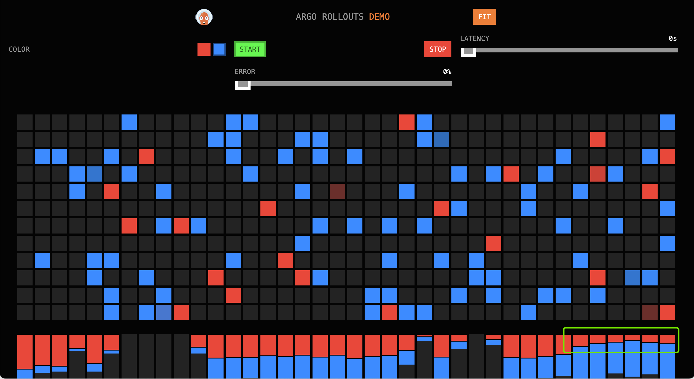
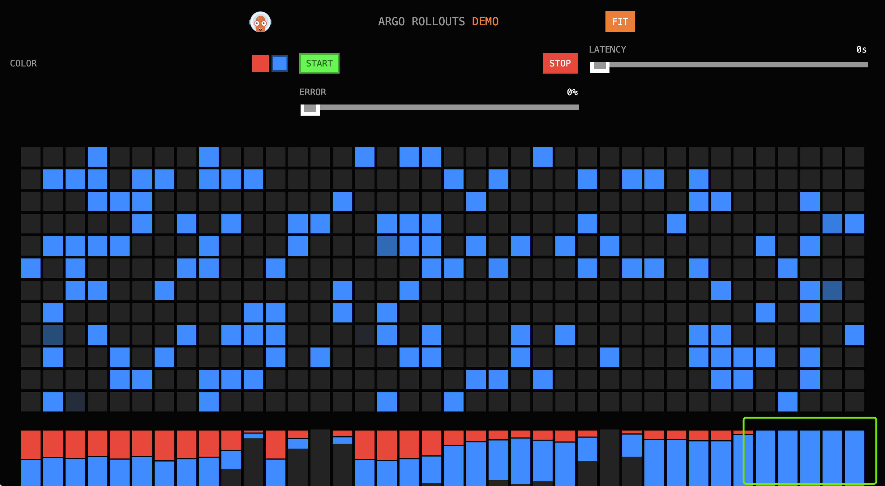

# Canary Releases Practice Based on Contour

This article will go through the best practices for canary releases
based on a cloud-native gateway, divided into the following steps:

1. Create application resources for the canary release.
2. Create gateway resources related to the microservices engine.
3. Create a canary release task based on the cloud-native gateway.
4. Observe the deployment of the release task.

## Prerequisites

- Please add the `contour-plugin` configuration to `argo-rollouts`,
  refer to the deployment documentation for [argo-rollouts](../pluggable-components.md).
- The `Microservices Engine` module is deployed on the current platform.

## Creating Application Resources

After logging into DCE 5.0, click on **Application Workbench** -> **Wizard** -> **Based on Container Image** in the left navigation bar,
and create an application `rollouts-demo` in the target cluster/namespace.

**Notes:**

- Container/Service port: 8080
- Container image: argoproj/rollouts-demo:red (image tag can also be blue/green/orange)

## Microservices Engine Gateway Resources

### Create a Gateway

Refer to the [Creating a Gateway document](../../skoala/gateway/index.md).

**Notes:**

- The gateway's jurisdiction namespace must include the namespace where the canary release service is located.

### Create a Domain

Enter the gateway details page, and [create a domain](../../skoala/gateway/domain/index.md) in `Domain Management`.

**Notes:**

Enter a simple HTTP domain, such as `gateway.canary`.

### Create an API

Enter the gateway details page, and [create an API](../../skoala/gateway/api/index.md) in `API Management`.

**Notes:**

- Select the domain `gateway.canary`.
- Choose `Prefix Match` for path matching rules, and fill in `/`.
- Select `GET` and `POST` for request methods, or you can `Select All`.
- For route configuration, choose `Backend Service` and the `Auto Discover` service `rollouts-demo`.

### Accessing the Canary Release Demo Application Through the Gateway

Configure local domain resolution to resolve gateway.canary to the gateway address, which can be obtained in the `Network Information` section of the `Overview` module on the gateway details page.

```shell
$ cat /etc/hosts | grep gateway.canary
10.6.222.21 gateway.canary
```

Enter <http://gateway.canary:30000/> in the browser, and you should see the following interface (traffic is all directed to red):

- Turn off network proxy to avoid 502 errors.
- Port 30000 is the gateway's HTTP port, using the HTTP domain, so use the HTTP port.


## Creating a Canary Release Task

[Create a Canary Release Task](../user-guide/release/canary.md) in the Application Workbench.

1. Choose the target location's rollouts-demo application for the basic information in the first step.

2. The release rules for the second step are as follows:

    - Choose Cloud-Native Gateway for traffic management type (this option depends on whether the microservices engine is installed).
    - Select the service corresponding to the stateless load in the basic information (i.e., the service for canary release).
    - The gateway instance is determined by whether the target location in the basic information is governed by a particular gateway.
    - Select the API name corresponding to the API in the gateway that is bound to the canary release service.
    - Refer to the following for traffic scheduling strategy:

## Updating the Release Task, Observing the Release Situation

You need to update the version in the release interface, replacing the image with: argoproj/rollouts-demo:blue.
After the version update, access <http://gateway.canary:30000/> in the browser, then observe the traffic statistics:

### First Phase

In the first minute, the traffic ratio red:blue is approximately 4:1.


### Second Phase

In the second and third minutes, the traffic ratio red:blue is approximately 1:1.


### Third Phase

In the fourth minute, the traffic ratio red:blue is approximately 1:4.



### Final Phase

Upon completion of the release, all traffic is blue.


