# Create a Pipeline

This section will provide a step-by-step guide to create a pipeline through editing, building, and deploying, enabling you to quickly set up a pipeline.

## Prerequisites

- You need to create a workspace and a user. This user should join the workspace and be assigned the __Workspace Editor__ role.
  Refer to [Creating Workspace](../../ghippo/user-guide/workspace/workspace.md) and [Users](../../ghippo/user-guide/access-control/user.md).
- Create two credentials that can access the image repository and the cluster, named: __registry__ and __kubeconfig__ respectively.
  For more information on creating credentials, please refer to [Credential Management](../user-guide/pipeline/credential.md).
- Prepare a GitHub repository and a DockerHub repository.

## Create credentials

1. Create two credentials on the __Credentials__ page:

    - docker-credential: Username and password for accessing the image repository.
    - demo-dev-kubeconfig: To access the Kubernetes cluster using this kubeconfig.

2. After creation, you can see the credential information on the credential list page.

## Create a custom pipeline

1. Click __Create Pipeline__ on the pipeline list page.

    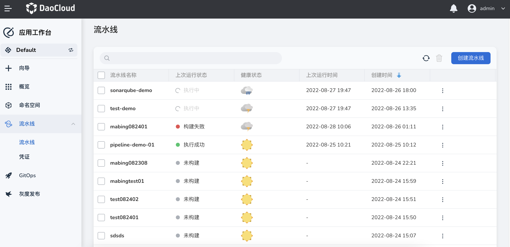

2. In the pop-up dialog box, select __Create a custom pipeline__ , then click __OK__ .

    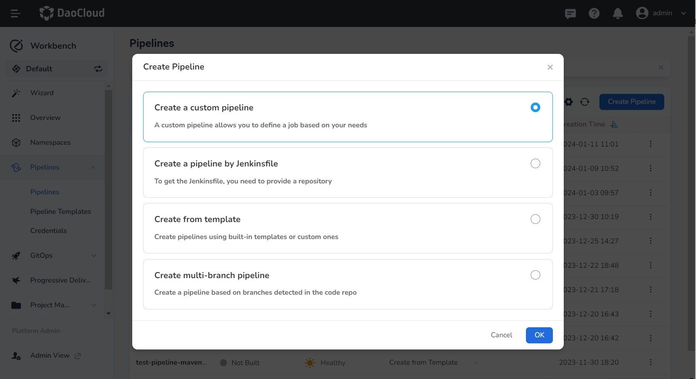

3. Enter __test-demo__ as the pipeline name on the __Create a custom pipeline__ page.

    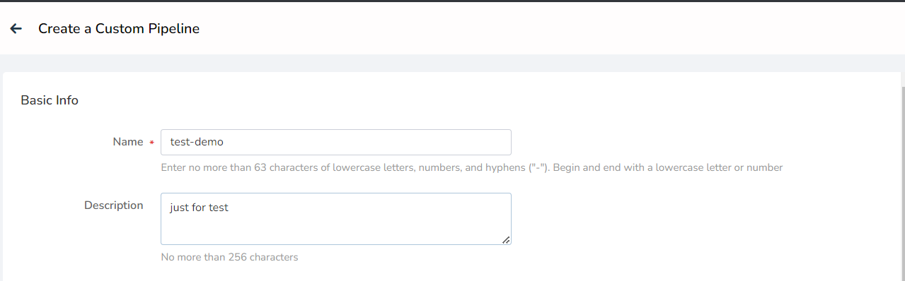

4. Add three string parameters in __Build Parameters__ , these parameters will be used in the image build command.

    - registry: Image repository address. Example value: __release.daocloud.io__ .
    - project: The project name in the image repository. Example value: __demo__ .
    - name: The name of the image. Example value: __http-hello__ .

    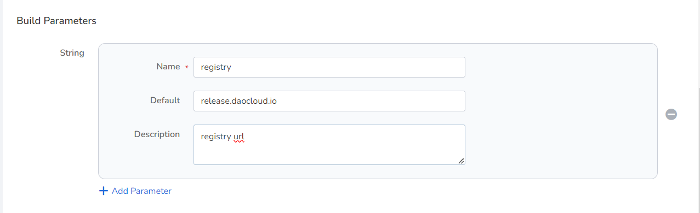

5. After adding, click __OK__ .

## Edit pipeline

1. Click a pipeline's name on the pipeline list page.

    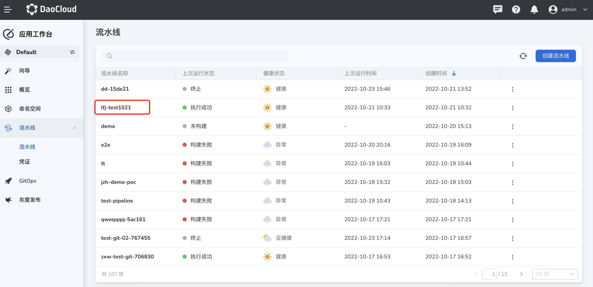

2. Click __Edit Pipeline__ in the upper right corner.

    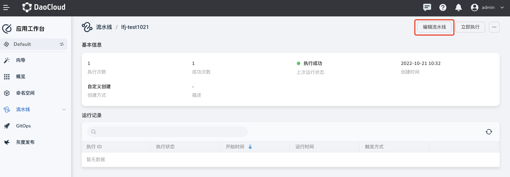

3. Click __Global Settings__ in the upper right corner.

    

4. Set the type to __node__ , and label to __go__ , then click __OK__ .

    

5. Add stage -> Pull Source Code.

    - Click __Add Stage__ on the canvas. Set the name in the stage settings on the right to: git clone.
    - Click __Add Step__ , select git clone under step type in the pop-up dialog box, and configure the relevant parameters:
        - Repo URL: Enter the GitLab repository address.
        - Branch: If not filled in, the default is the master branch.
        - Credential: If it is a private repository, you need to provide a credential.

    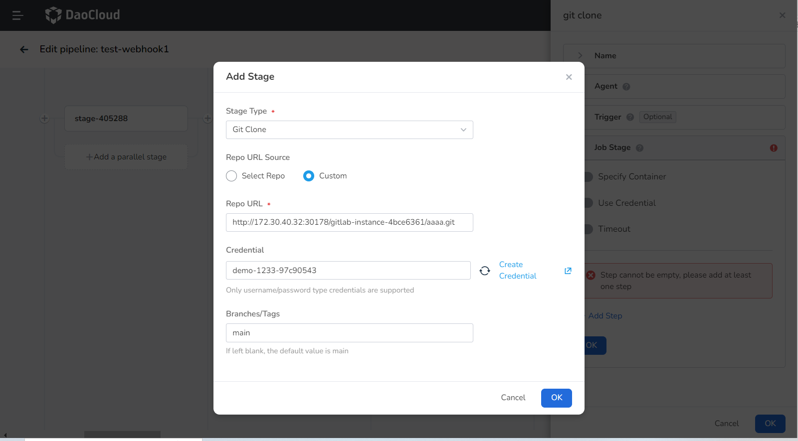

6. Add stage -> Build and Push Image.

    - Click __Add Stage__ on the canvas. Set the name in the stage settings on the right to: build & push.

    - In the step module, select to enable __Specify Container__ , fill in the container name __go__ in the pop-up dialog box, then click __OK__ .

        

    - In the step module, select to enable __Use Credential__, fill in the relevant parameters in the pop-up dialog box, then click __OK__ .

        - Credentials: Select the Docker hub credentials you created for accessing the image repository.
        - Password Variable: PASS
        - Username Variable: USER

        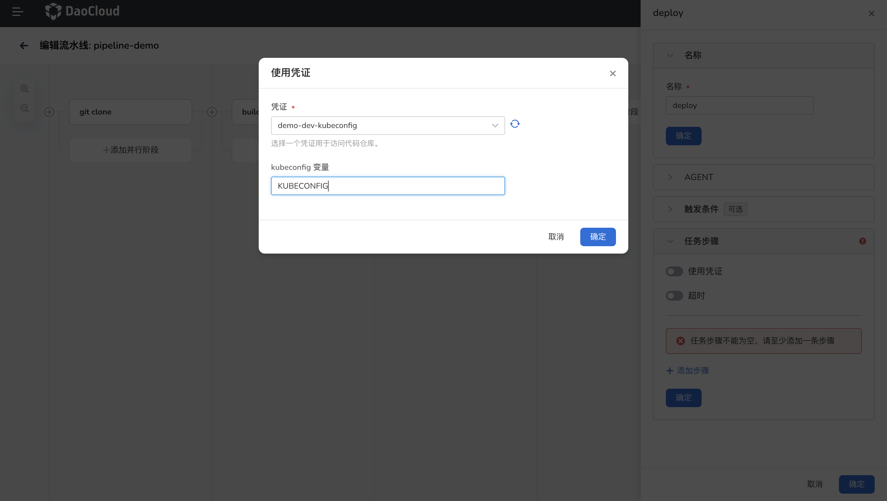

    - Click __Add Step__ to build the code, select __shell__ under step type in the pop-up dialog box, and enter the following command in the command line, then click __OK__ .

        ```go
        go build -o simple-http-server main.go
        ```

    - Click __Add Step__ to build a Docker image according to the Dockerfile in the source code, select __shell__ under step type in the pop-up dialog box, and enter the following command in the command line, then click __OK__ .

        ```docker
        docker build -f Dockerfile . -t $registry/$project/$name:latest
        ```

    - Click __Add Step__ to log in to the image repository, select __shell__ under step type in the pop-up dialog box, and enter the following command in the command line, then click __OK__ .

        ```docker
        docker login $registry -u $USER -p $PASS
        ```

    - Click __Add Step__ to push the image to the image repository, select __shell__ under step type in the pop-up dialog box, and enter the following command in the command line, then click __OK__ .

        ```docker
        docker push $registry/$project/$name:latest
        ```

7. Add stage -> Deploy to Cluster.

    - Click __Add Stage__ on the canvas. Set the name in the stage settings on the right to: deploy.

    - In the step module, select to enable __Specify Container__ , fill in the container name __go__ in the pop-up dialog box, then click __OK__ .

        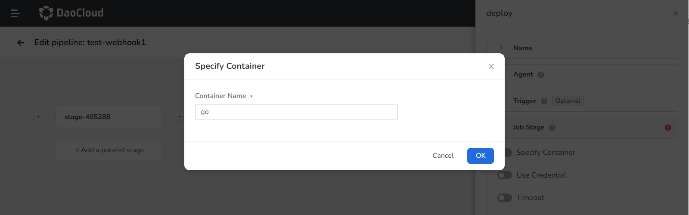

    - In the step module, select to enable __Use Credential__ , fill in the relevant parameters in the pop-up dialog box, then click __OK__ .

        - Credentials: Choose the kubeconfig type credential.
        - kubeconfig Variable: If you are using the kubectl apply deployment method, the variable value must be KUBECONFIG.

        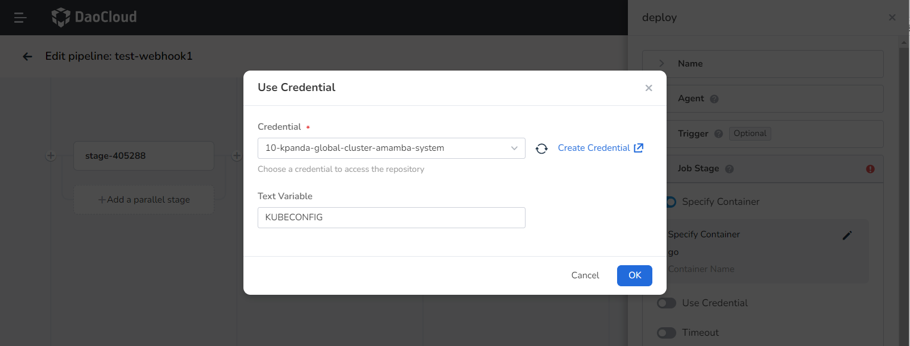

    - Click __Add Step__ to deploy to the cluster, select shell under step type in the pop-up dialog box, and enter the following command in the command line, then click __OK__.

        ```shell
        kubectl apply -f deploy.yaml
        ```

## Save and run pipeline

1. After completing the previous step, click __Save and Run__ .

    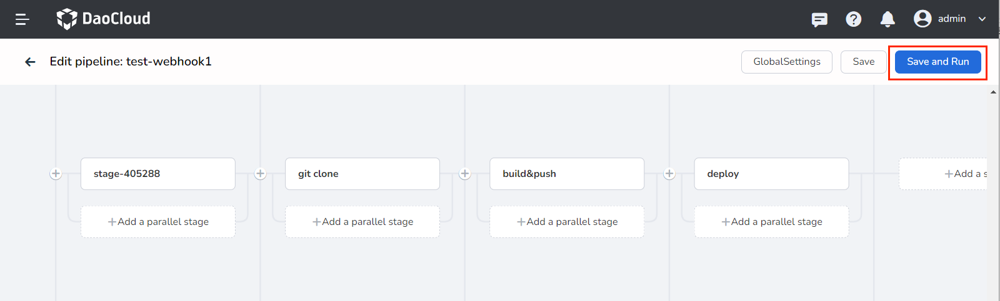

2. In the pop-up dialog box, input the example parameters from step two. Click __OK__ to successfully run the pipeline.

    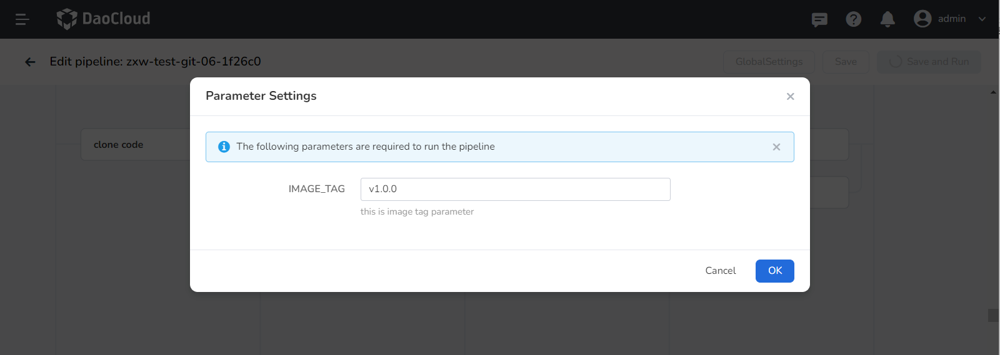
