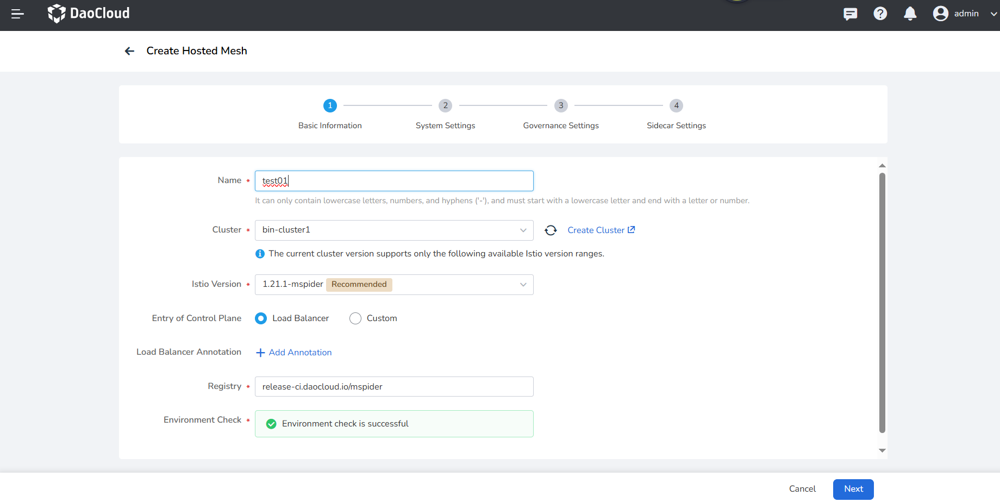
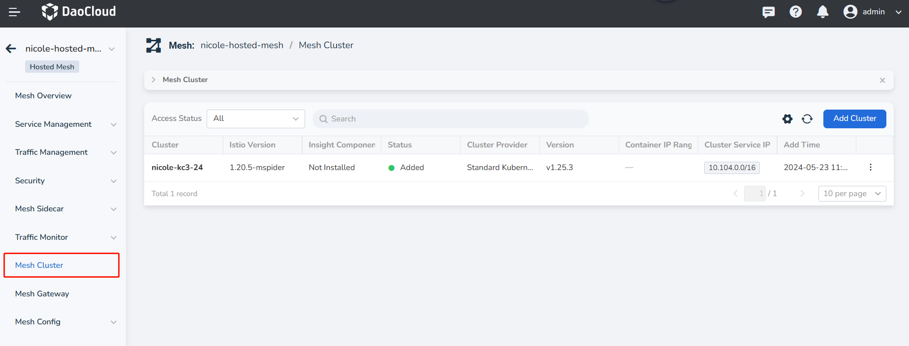

# Deploy Istio Resources in a Hosted Mesh Work Cluster Based on GitOps

Scenario: How can customers deploy Istio-related resources in a Hosted Mesh work cluster using GitOps?

## Prerequisites

- Prepare the workbench and service mesh, with the service mesh version being v0.26.0 or above.
- Prepare a work cluster.

## Create a Hosted Mesh and Manage the Work Cluster

### Steps

1. Click **Service Mesh** and refer to [Create a Hosted Mesh](../../mspider/user-guide/service-mesh/README.md).

2. Select **Load Balancer** as the Entry of Control Plane, and keep other settings as default.

    

3. After creating the hosted mesh, manage the work cluster into it by referring to [Add a Cluster](../../mspider/user-guide/cluster-management/join-clus.md).

    

### Notes

When deploying Istio-related resources directly to a work cluster under a hosted mesh based on GitOps, 
the resources in the work cluster need to be deployed to the hosted mesh to take effect. You need to 
conduct the following operations:

1. In the Global Management cluster, find the CRD resource `globalmeshes.discovery.mspider.io` in the `mspider-system` namespace, 
   edit the YAML resource with the same name as the hosted mesh, and modify it as follows:

    ```yaml
    # 1. Add under controlPlaneParams
      enabled_resources_synchronizer: true  # Enable resource synchronization for the work cluster
      sync_resource_worker_cluster: "zcl-98"  # Choose the name of the work cluster to monitor and synchronize

    # 2. Add at the same level as controlPlaneParams
    controlPlaneParamsStruct:
      global:
        sync_istio_resources:
          - group: networking.istio.io
            kind: VirtualService
            resource: virtualservices
            version: v1beta1
          - group: networking.istio.io
            kind: DestinationRule
            resource: destinationrules
            version: v1beta1
          - group: networking.istio.io
            kind: Gateway
            resource: gateways
            version: v1alpha3   
    ```

2. If the current `Service Mesh` version is v0.26.0, additional operations are required to properly synchronize `gateway` resources.

    - In the Global Management cluster, edit the YAML of the ConfigMap named `mspider-mcpc` in the `mspider-system` namespace:

    ```yaml
    # Add the following information
    sync_istio_resources:
    - group: networking.istio.io
      kind: VirtualService
      resource: virtualservices
      version: v1beta1
    - group: networking.istio.io
      kind: DestinationRule
      resource: destinationrules
      version: v1beta1
    - group: networking.istio.io
      kind: Gateway
      resource: gateways
      version: v1alpha3
    ```

    - In the Global Management cluster, edit the YAML of the ConfigMap named `mspider-mcpc-ckube-remote` in the `mspider-system` namespace:

    ```yaml
    # Add the following information        
    {
      "group": "networking.istio.io",
      "version": "v1alpha3",
      "resource": "gateways",
      "list_kind": "GatewayList",
      "index": {
        "namespace": "{.metadata.namespace}",
        "name": "{.metadata.name}",
        "labels": "{{- range $key, $value := .metadata.labels }}{{- print $key \"=\" $value | quote }},{{- end -}}",
        "createdAt": "{.metadata.creationTimestamp}",
        "port": "{.spec.servers[*].port}",
        "hosts": "{.spec.servers[*].hosts}"
        }
    },
    ```

    !!! note

        Service Mesh versions below v0.26.0 do not support this capability. Versions above v0.26.0 do not require this step.

3. Go to the host cluster of the hosted mesh, in the `istio-system` namespace -> **Deployments**, 
   and restart the resource **mspider-mcpc-mcpc-controller**

## Deploy Application Resources Based on GitOps and Verify

### Introduction

Demonstration example repository: https://github.com/amamba-io/rollout-examples

The `dubbo3-consumer` and `dubbo3-provider` services are related. When accessing the /hello interface of dubbo3-consumer, 
dubbo3-consumer will forward the request to dubbo3-provider.

### Steps

1. [Create Application](../user-guide/gitops/create-argo-cd.md) in `GitOps`, with the repository address: `https://github.com/amamba-io/rollout-examples`. 
   Path should be set to `rollouts/v1`, and select the namespace in the work cluster.

3. After creating application, manually **synchronize** the application resources.

4. Go to the service mesh and check the vs, dr, and gateway resources synchronized in the work cluster under the hosted mesh. 
   If not found, check if the notes in the **[Create a Hosted Mesh and Manage the Work Cluster](../../mspider/user-guide/service-mesh/README.md)** section are configured correctly.

5. By default, the load balancer of the work cluster exposes port `80`, so you need to modify the gateway port of the service 
   to 80 in the work cluster to access the service.

6. Access `http://<work cluster node IP>/hello?name=test-v1` in the browser. Successful access indicates 
   that the Istio-related resources are effective.
