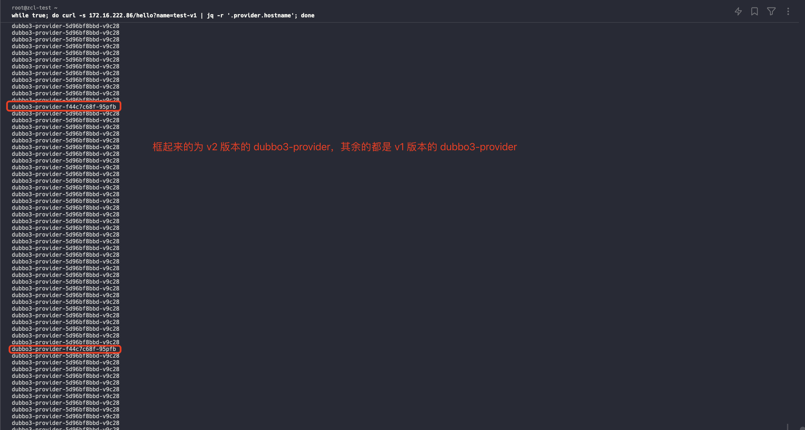
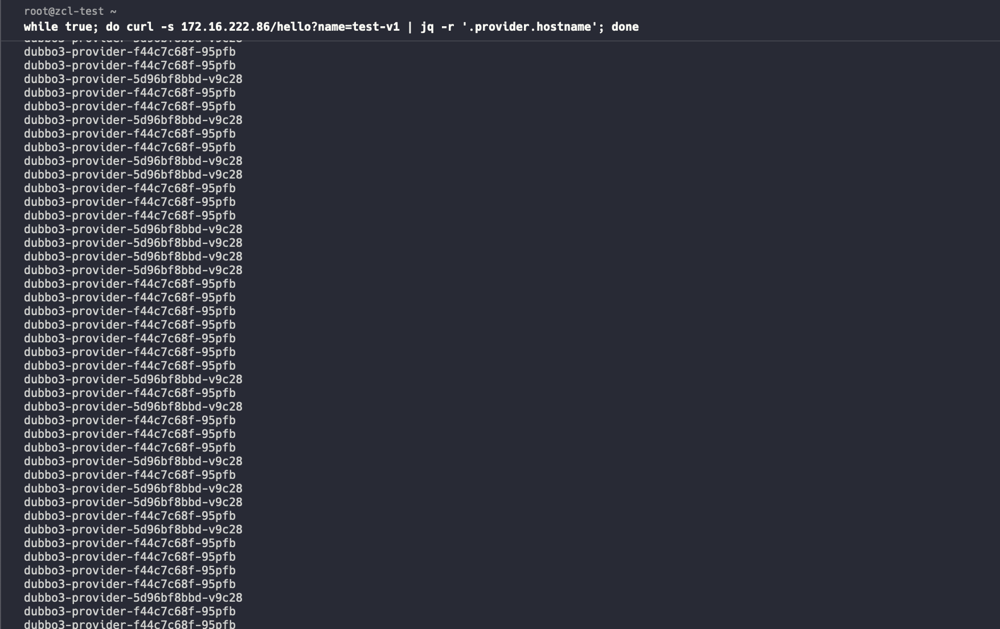
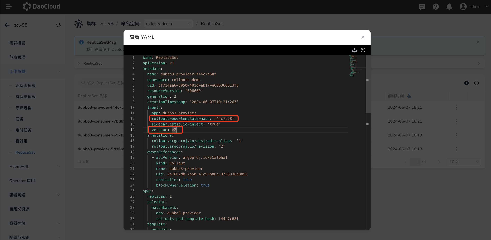
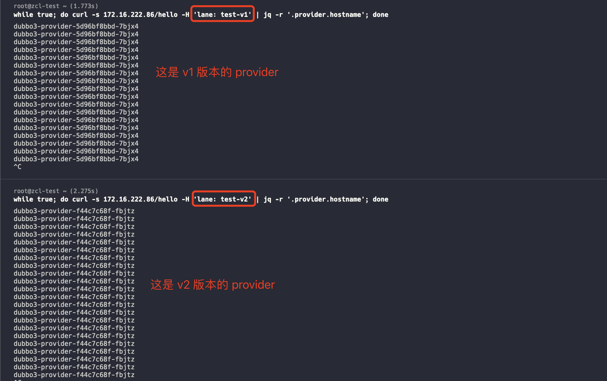

# Progressive Delivery in a Hosted Mesh Work Cluster Based on GitOps

Scenario: How can customers perform a progressive delivery in a hosted mesh work cluster using GitOps?

## Prerequisites

Refer to the documentation [Deploy Istio Resources in a Hosted Mesh Work Cluster Based on GitOps](istio_argocd.md) 
and complete all steps before `Create a Hosted Mesh and Manage the Work Cluster`.

## Implementing Weight-Based Progressive Delivery with GitOps

1. Navigate to Workbench, and [Create Application](../user-guide/gitops/create-argo-cd.md) in `GitOps`, 
   with the repository address: `https://github.com/amamba-io/rollout-examples`. 
   Path should be set to `rollouts/v1`, and select the namespace in the work cluster.

1. After the application is successfully created,  **synchronize** the application resources.

1. Go to the service mesh and check the vs, dr, and gateway resources synchronized in the work cluster under the hosted mesh.
   If not found, check if the notes in the **[Create a Hosted Mesh and Manage the Work Cluster](../../mspider/user-guide/service-mesh/README.md)** section are configured correctly.

1. By default, the load balancer of the work cluster exposes port `80`, so you need to modify the gateway port 
   of the service to 80 in the work cluster to access the service.

1. Access `http://<work cluster node IP>/hello?name=test-v1` in the browser.

1. Navigate to Workbench, in the **Progressive Delivery** list, select `dubbo3-provider` to edit the YAML, 
   and change `version: v1` to `version: v2`.

1. After the modification, `dubbo3-provider` begins the progressive process.

    As shown above: You can distinguish based on the workload labels rollouts-pod-template-hash and version.

    !!! note

        - v1 Pod: dubbo3-provider-5d96bf8bbd-v9c28
        - v2 Pod: dubbo3-provider-f44c7c68f-95pfb

1. Explanation of the canary rules can be found in the git repository under the directory `rollouts-legacy/v1/rollout-provider.yaml`.

    ```yaml
    ...
    strategy:
      canary:
        trafficRouting:
          istio:
            virtualService:
              name: provider
              routes:
                - test-v1
            destinationRule:
              name: dubbo-provider
              stableSubsetName: stable
              canarySubsetName: canary
        # When entering the progressive deivery, the traffic weight of the new version is set to 5%. After 10 minutes, the weight is set to 50%.
        steps:
          - setWeight: 5
          - pause:
              duration: 10m
          - setWeight: 50
          - pause:
              duration: 10m
    ```

9. The terminal simulation results are as follows:

    - When the new version's weight is 5%, the traffic distribution between v1 Pod and v2 Pod is as follows:

        

    - When the new version's weight is 50%, the traffic distribution between v1 Pod and v2 Pod is as follows:

        

    - After a successful release, all the traffic is directed to the v2 Pod.

        

## Implementing Header-Based Progressive Delivery with GitOps

### Introduction

Demonstration example repository: https://github.com/amamba-io/rollout-examples

The `dubbo3-consumer` and `dubbo3-provider` services are related. When accessing the /hello interface of dubbo3-consumer, dubbo3-consumer will forward the request to dubbo3-provider. The release process will update the dubbo3-provider service and route according to the preset header information.

### Steps

1. Navigate to Workbench, [Create Application](../user-guide/gitops/create-argo-cd.md) in `GitOps`, with the repository address: `https://github.com/amamba-io/rollout-examples`.
   Path should be set to `rollouts-legacy/v1`, and select the namespace in the work cluster.

1. After an applcation is successfully created, **synchronize** the application resources.

1. Go to the service mesh and check the vs, dr, and gateway resources synchronized in the work cluster under the hosted mesh. 
   If not found, check if the notes in the **[Create a Hosted Mesh and Manage the Work Cluster](../../mspider/user-guide/service-mesh/README.md)** section are configured correctly.

1. By default, the load balancer of the work cluster exposes port `80`, so you need to modify the gateway port
   of the service to 80 in the work cluster to access the service.

1. Access `http://<work cluster node IP>/hello?name=test-v1` in the browser.

1. Navigate to Workbench, in the **Progressive Delivery** list, select `dubbo3-provider` to edit the YAML, and change `version: v1` to `version: v2`.

    

1. After the modification, `dubbo3-provider` begins the progressive process.

    As shown above: You can distinguish based on the workload labels rollouts-pod-template-hash and version.

    !!! note

        - v1 Pod: dubbo3-provider-5d96bf8bbd-v9c28
        - v2 Pod: dubbo3-provider-f44c7c68f-95pfb

1. Explanation of the canary rules can be found in the git repository under the directory `rollouts-legacy/v1/rollout-provider.yaml`.

    ```yaml
    ...
    strategy:
      canary:
        canaryService: dubbo3-provider-canary
        stableService: dubbo3-provider
        trafficRouting:
          managedRoutes:
            - name: test-v2
          istio:
            virtualService:
              name: provider
              routes:
                - test-v1
        # During the delivery, the vs header is set to test-v2. If the request header contains `lane: test-v2`, it will be routed to the new version.
        steps:
          - setCanaryScale:
              weight: 100
          - setHeaderRoute:
              name: test-v2
              match:
              - headerName: lane
                headerValue:
                  exact: test-v2
          - pause: {}
    ```

1. The terminal simulation results are as follows:

    

## FAQ

### Does the above process support multi-cluster progressive delivery?

Yes, it does. The following operations are required:

1. First, you need to place multiple clusters under the same hosted mesh.

2. You need to create namespaces with the same name, and deploy the same GitOps application in each cluster's namespace.

3. During the delivery, you need to operate the corresponding services in both clusters separately.