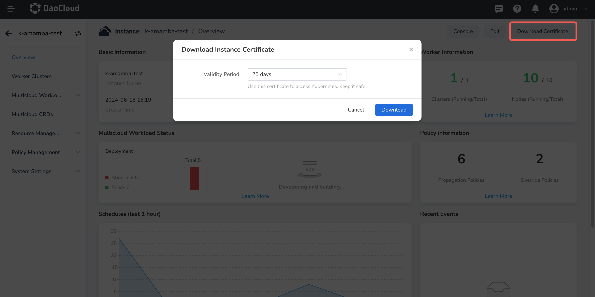
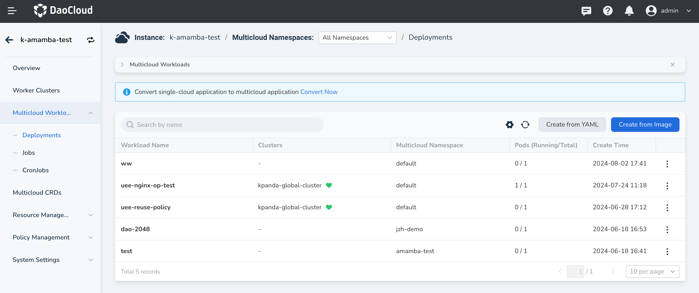

# Deploy Multicloud Resources with Pipelines

This guide explains how to deploy multicloud resources using a pipeline.

## Environment Setup

### Repository Setup

1. Create a folder for your YAML files, including the `PropagationPolicy` for multicloud management
   (add desired resources in `resourceSelectors`).
2. Prepare a Dockerfile to build your image.
3. Obtain a token for pipeline access to the repository (or set the repository to public).

### Multicloud Management Setup

1. Create a multicloud instance, obtain the kubeconfig certificate, and add it
   to the pipeline credentials in the Workbench.
2. Set up a multicloud namespace in the instance.

Refer to the image below for guidance on obtaining the certificate:

### Workbench Setup

1. Ensure the kubeconfig certificate for the multicloud instance is in the Workbench
   pipeline credentials and synchronized with Jenkins.
2. Ensure the repository token is in the Workbench pipeline credentials and synchronized with Jenkins.
   (This step is unnecessary if the repository is public. For GitLab integration, just verify the connection status.)
3. At this point, the Workbench cannot access the multicloud instance and namespace created
   during pipeline setup, so you'll need to manually write the `JenkinsFile`.

## Create the Pipeline

For sample code, refer to [this open-source JenkinsFile repository](https://github.com/amamba-io/amamba-examples).

Create your pipeline using the
[guestbook-kairship.jenkinsfile](https://github.com/amamba-io/amamba-examples/blob/main/pipelines/guestbook-kairship.jenkinsfile)
as a template. Modify the relevant parameters and run it. The pipeline for deploying to multicloud management
is similar to other pipelines; however, since the Workbench cannot access the multicloud instance and namespace,
you'll deploy resources using `kubectl` with the provided kubeconfig certificate.

## Check Results

