# Run Pipelines on Specified Nodes

This article describes how to run the pipeline tasks on the specified nodes in Workbench.

## Modify jenkins-casc-config

1. Go to the __Container Management__ module and enter the details page of the target cluster, such as the __kpanda-global-cluster__ cluster.

    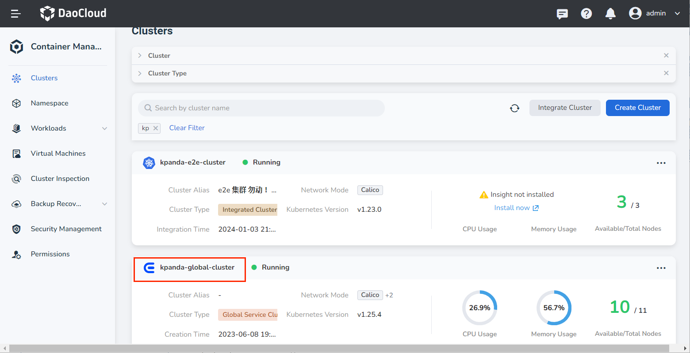

2. Click __ConfigMaps & Secrets__ -> __ConfigMaps__ in the left navigation.

    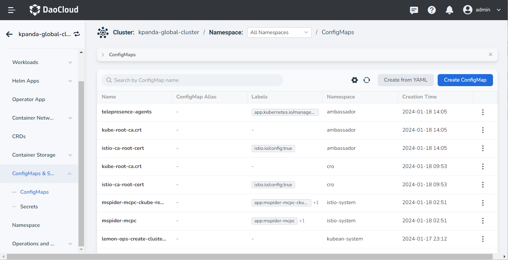

3. Search for __jenkins-casc-config__ , choose __Edit YAML__ in the list.

    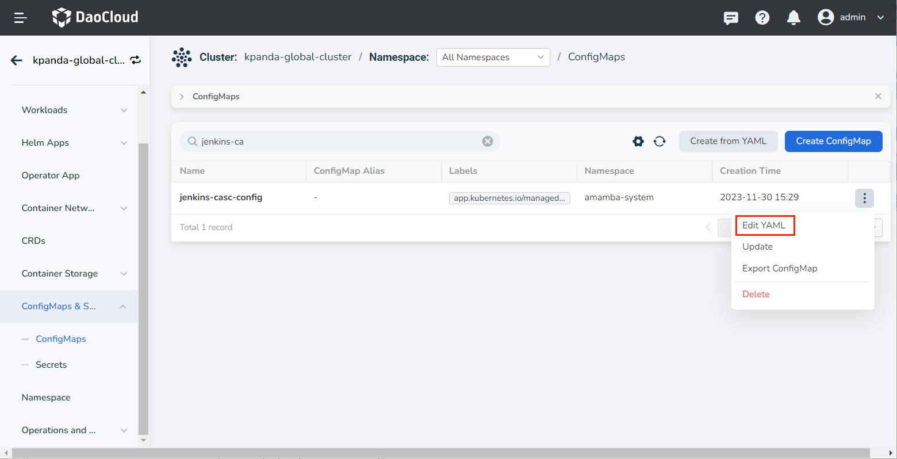

4. Add __nodeSelector: "ci=base"__ for a specific Agent under __jenkins.cloud.kubernetes.templates__ in the YAML configuration item __jenkins.yaml__ , and click __OK__ to save the changes.

    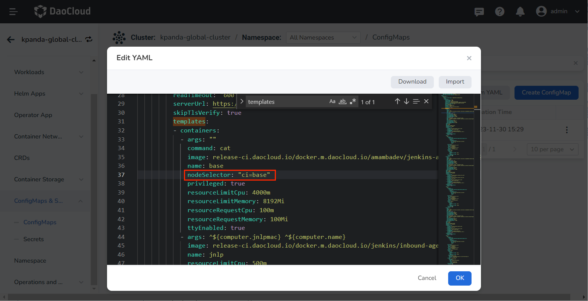

## Add labels to the specified nodes

1. Enter the __Container Management__ module, on the __kpanda-global-cluster__ cluster details page, click __Nodes__ on the left navigation.

    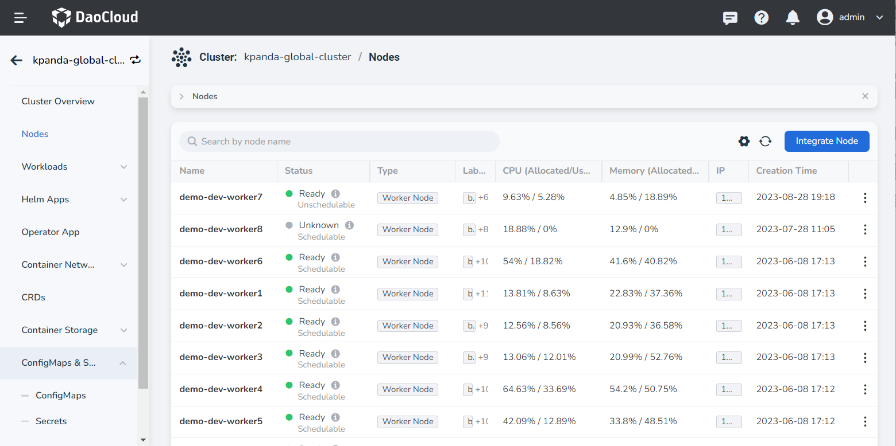

2. Select the target worker node (for example, demo-dev-worker8), and click __Edit Labels__ .

    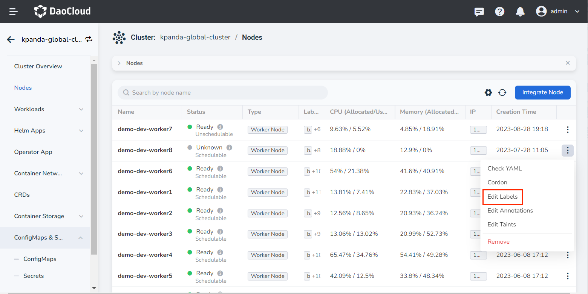

3. Add the __ci=base__ label and click __OK__ to save the changes.

    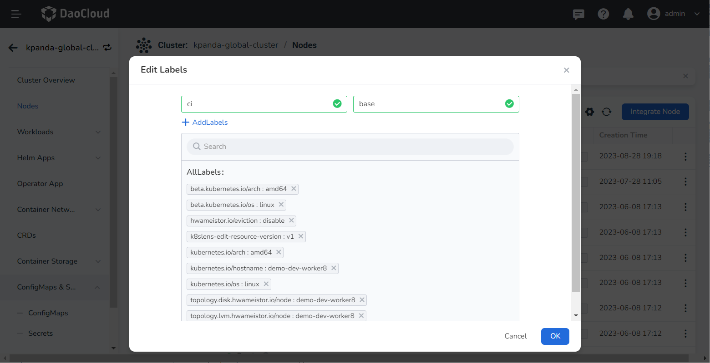

## Access Jenkins dashboard and reload configuration

First of all, it is necessary to expose the access address of Jenkins Dashbord through NodePort (other exposure methods are exposed according to the actual business situation).

1. Enter __Container Management__ module, on the __kpanda-global-cluster__ cluster page, click __Container Network__ -> __Services__ in the left navigation bar.

    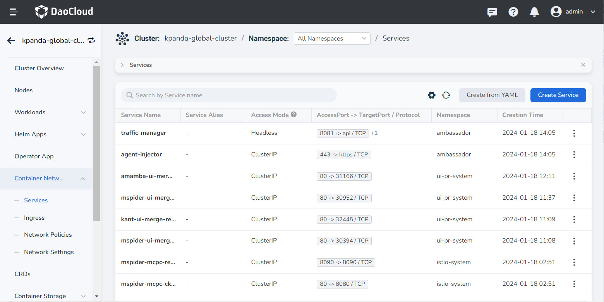

2. Search __amamba-jenkins__ and choose __Update__ from the list.

    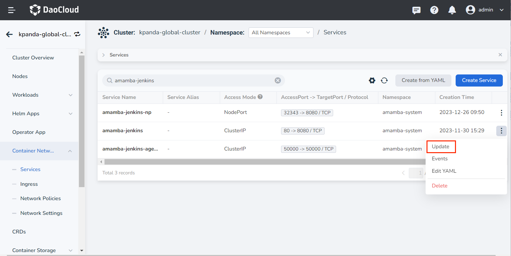

3. Change the access type to __NodePort__ , and the node port selection will be automatically generated.

    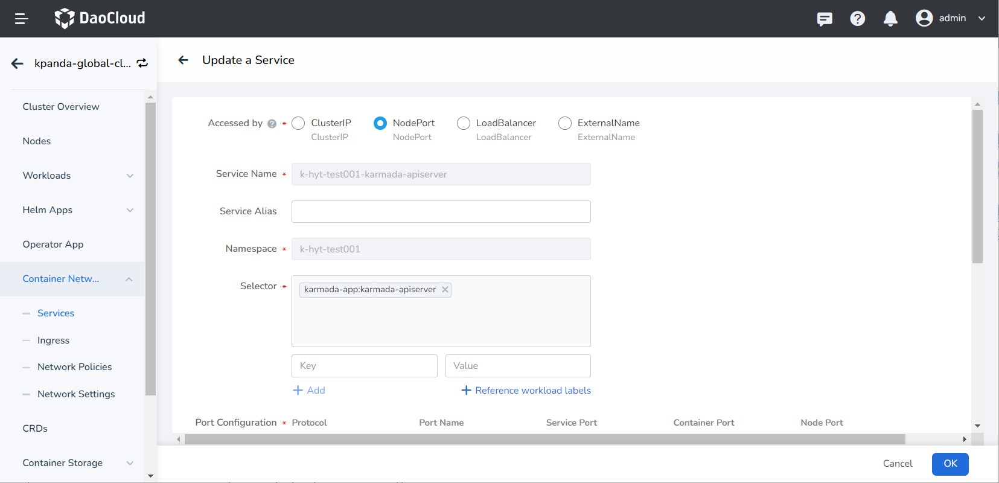

4. Click __OK__ , then return to the details page and click the link to access the Jenkins Dashboard.

    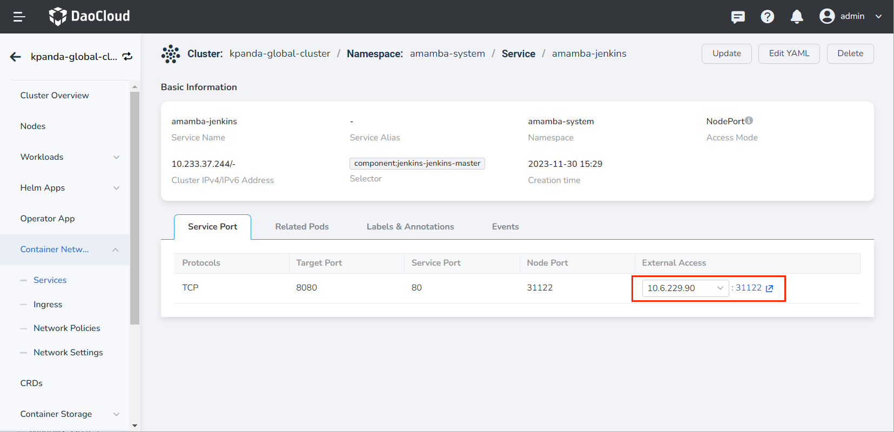

5. Enter the account/password (the default is __admin/Admin01__ ) to enter the Jenkins Dashboard page.

    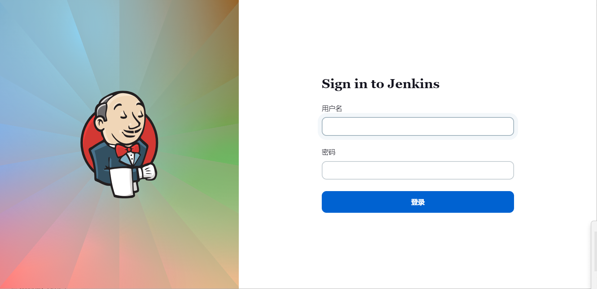

6. Choose __Manage Jenkins__ in the left navigation bar.

    

7. Click __Configuration as Code__ .

    

8. Click __Reload existing configuration__ in __Configuration as Code__ . If there is no prompt on the current page after clicking, it means that the configuration loading takes effect.

    

## Run pipelines and verify nodes

1. Create a pipeline job in __Workbench__ , and edit __Jenkinsfile__ as follows:

    ```groovy        
    pipeline {
      agent {
        node {
          label 'base'
        }

      }
      stages {
        stage('Hello') {
          agent none
          steps {
            container('base') {
              echo 'Hello World'
              sh 'sleep 300'
            }

          }
        }

      }
    }
    ```

    !!! note

        It should be noted that the agent part needs to select label as base. Because the specified node is only set for the base in the configuration file, if it needs to be set for other agents. Repeat the above operation.

1. Click __Run Now__ for the pipeline, and go to __Container Management__ to view the running node of the Pod that executes the task.

    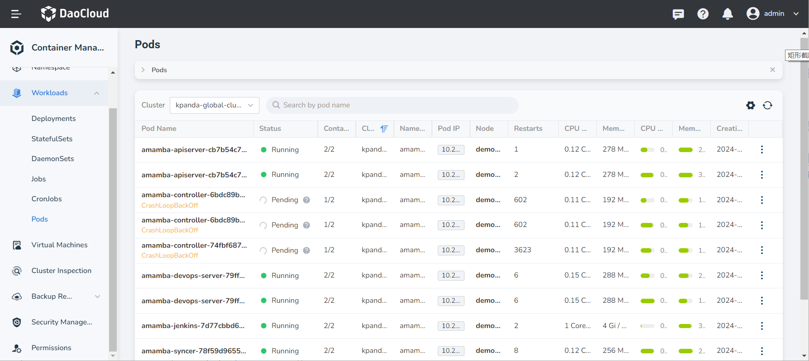

1. You can see that the Pod executing the pipeline task is running on the expected __demo-dev-worker8__ node.
