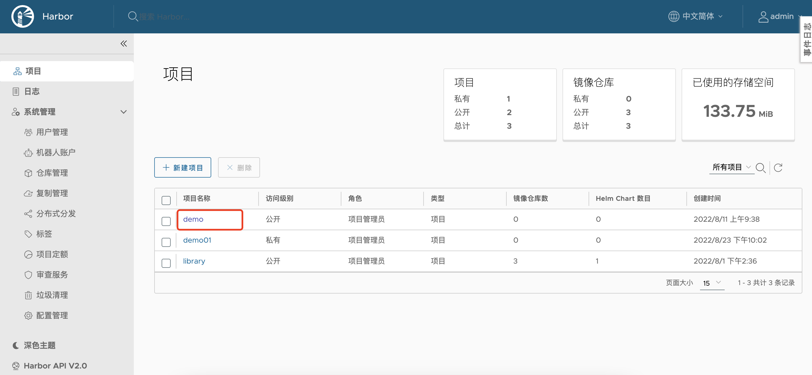
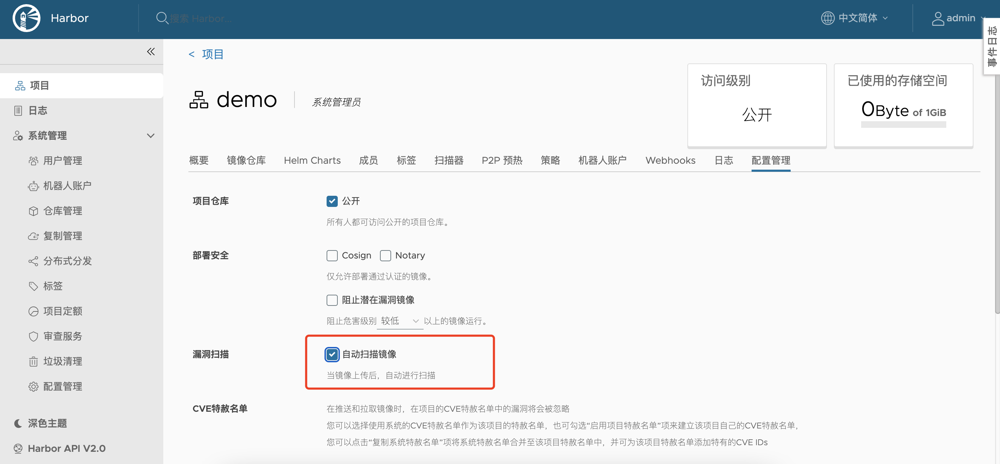
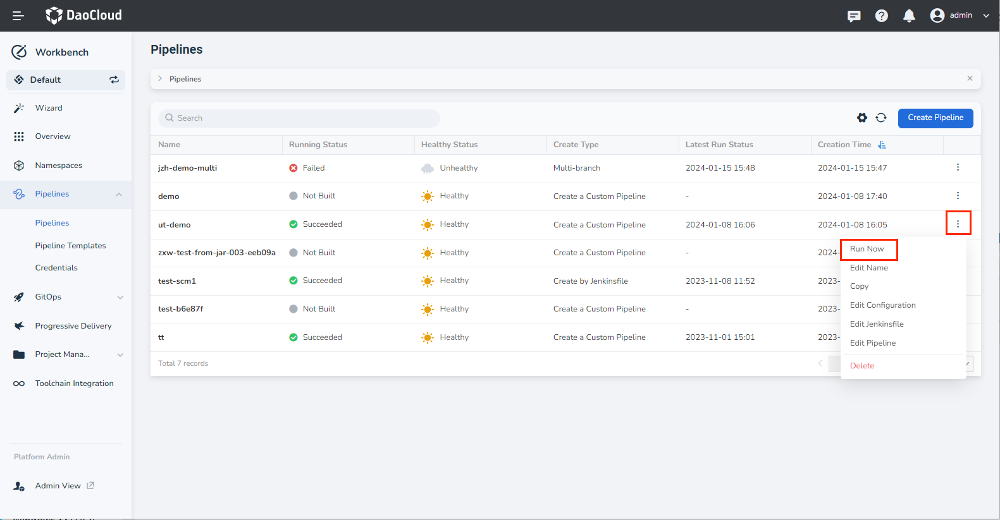
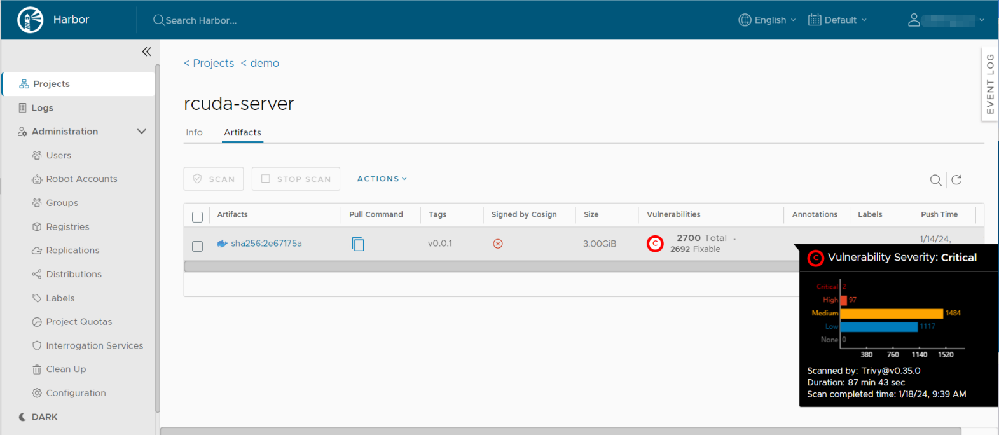

# Integrate Harbor to Scan Image Security

This page will introduce how to integrate Harbor in the pipeline and implement image security scanning.

## Enable automatic image scanning in Harbor

1. Log in to Harbor and click a specific project.

    

2. Choose the __Configuration__ tab, and check __Automatically scan images on push__ .

    

## Configure the pipeline in Workbench

1. In Workbench, create a pipeline, refer to [Quickly create a pipeline](deploy-pipeline.md), and click __Run Now__ after the configuration is complete.

    

1. In the pop-up dialog box, enter the address of the mirror warehouse in the above Harbor configuration project.

1. Wait for the pipeline to run successfully.

## View image security scanning in Harbor

Visit __Project__ -> __Image Repository__ in turn in Harbor to view the vulnerability information of the mirror.

