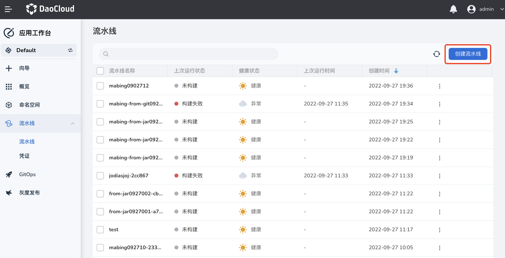
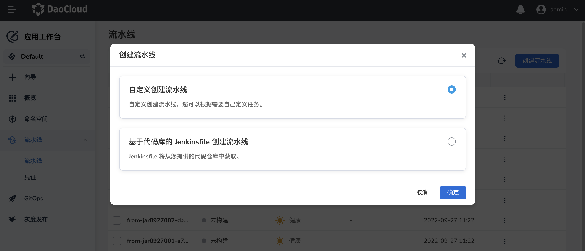
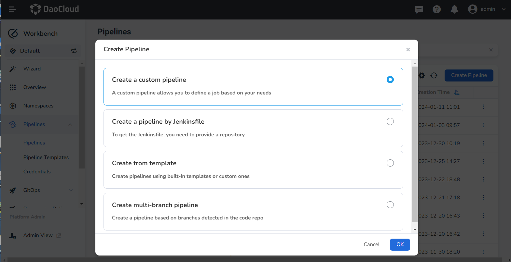
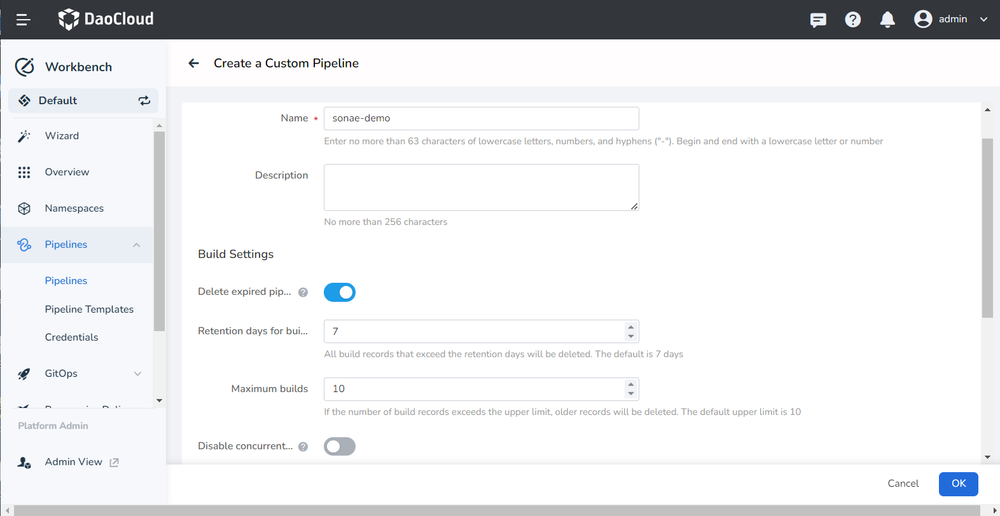
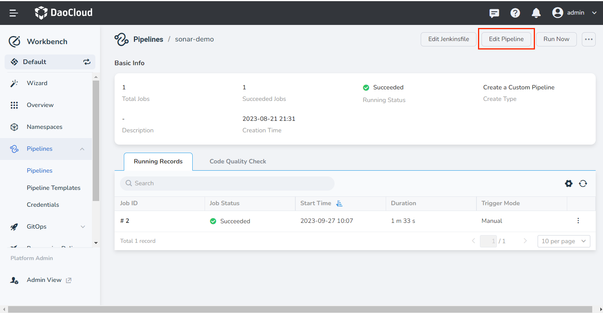
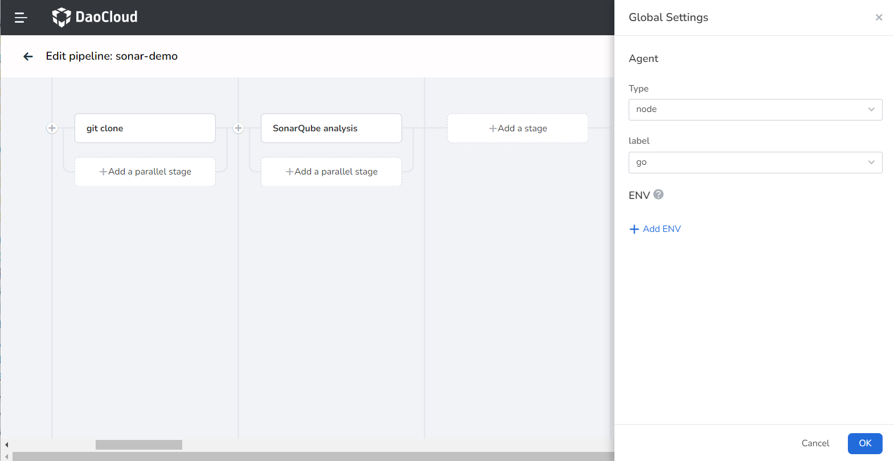
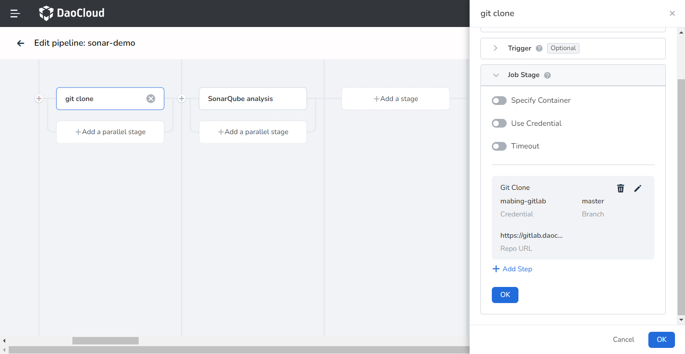
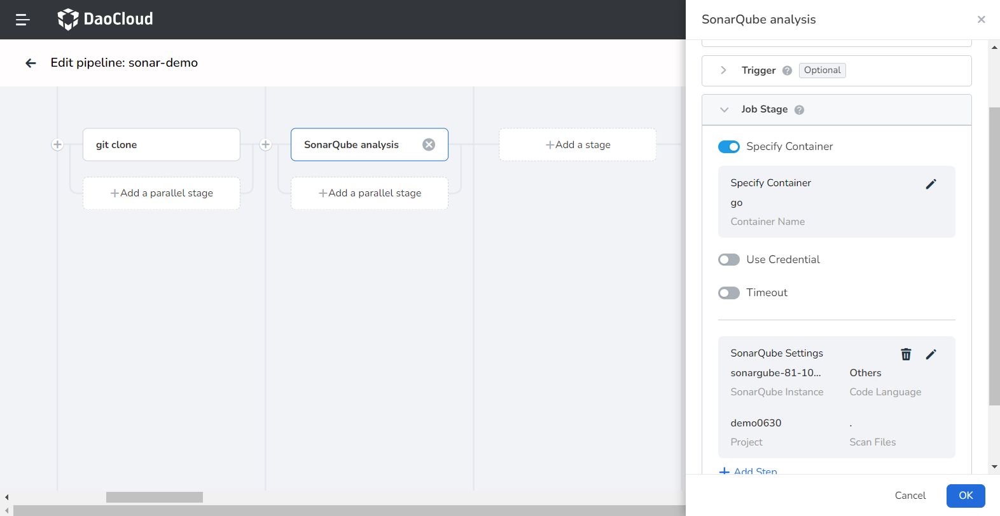
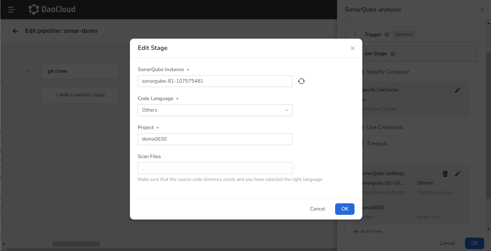
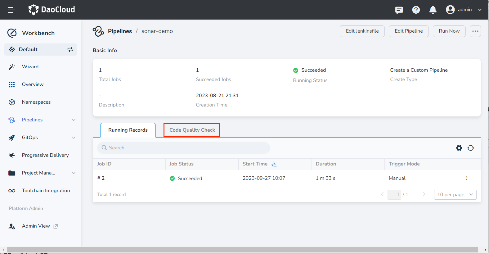

# Implement Code Scanning with Pipelines

The source code in the code repository, as the original form of software, its security flaws are the direct root cause of software vulnerabilities. Therefore, discovering security flaws in the source code through code scanning analysis is an important method to reduce potential vulnerabilities in software.

For example, SonarQube is an automatic code review tool used to detect bugs in project code and improve test coverage, etc. It can be integrated with existing workflows in the project for continuous code checks between project branches and pull requests.

This article will introduce how to integrate SonarQube into the pipeline to implement code scanning capabilities.

## Integrate SonarQube by workspace

Please ensure that you have a SonarQube environment and that it is network-connected with the current environment without any problems.

1. Enter the __Toolchain Integration__ page, click the __Toolchain Integration__ button.

    

2. Refer to the following instructions to configure the relevant parameters:

    - Tools: Choose a toolchain type for integration.
    - Integration Name: The name of the integrated tool, must not be duplicated.
    - SonarQube Address: The address that can access the toolchain, starting with a domain name or IP address that starts with http://, https://.
    - Token: Generate an administrator token (Token) in SonarQube, the operation path is: __My Account__ -> __Profile__ -> __Security__ -> __Generate__ -> __Copy__

    

3. Click __OK__ to return to the toolchain list page after successful integration.

## Creating a pipeline

1. On the pipeline page, click __Create Pipeline__.

    

2. Choose __Create a custom pipelines__.

    

3. Enter a name, use the other default values, and click __OK__.

    

## Editing pipeline

1. Click a pipeline to enter its details page, and click __Edit Pipeline__ in the upper right corner.

    

2. Configure global settings:

    

3. Define stage one __git clone__ in the graphical interface as follows:

    

4. Define stage two __SonarQube analysis__ in the graphical interface as follows:

   - SonarQube Instance: Select the SonaQube instance integrated in the above steps.
   - Code Language: Since different code languages correspond to different SonaQube scan commands, if the language is Java, please select Maven, otherwise select others. In this example, we choose others.
   - Project: Define the project to be scanned in SonarQube
   - Scan Files: The directory address of the file in the code repository that needs to be scanned

    

    

5. Save and immediately run the pipeline, and wait for the pipeline to run successfully.

## Viewing code scanning results

1. After the pipeline runs successfully, click __Code Quality Check__ on the pipeline details page.

    

2. View the code scanning results, click __View More__ to go to the SonarQube backend to view more scanning information.
