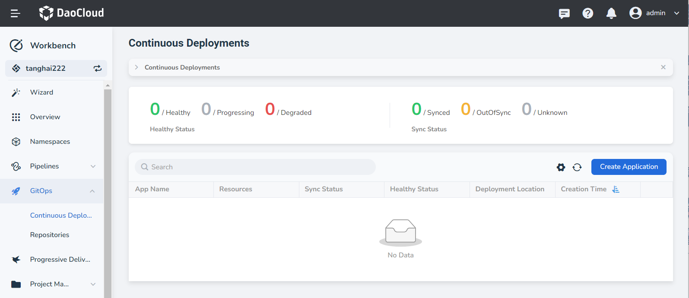
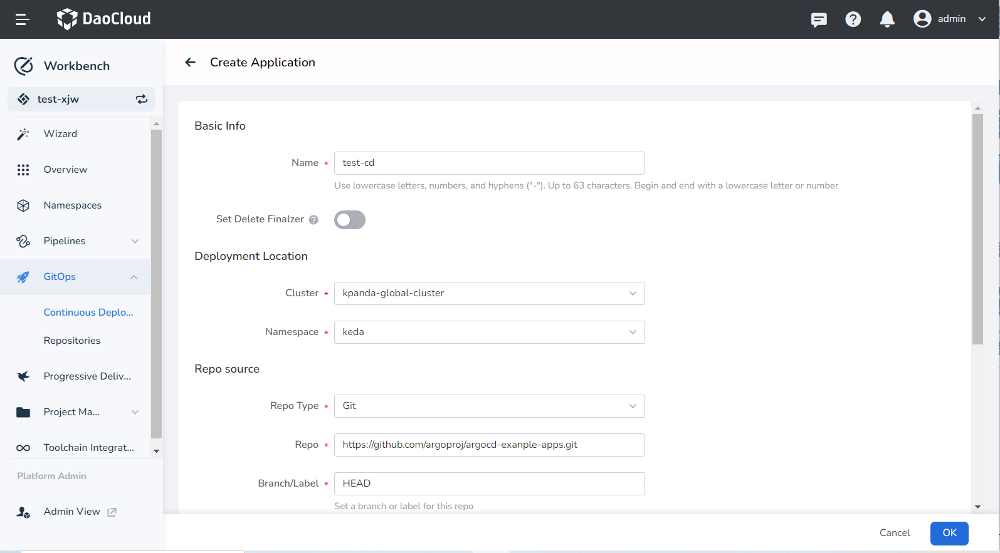
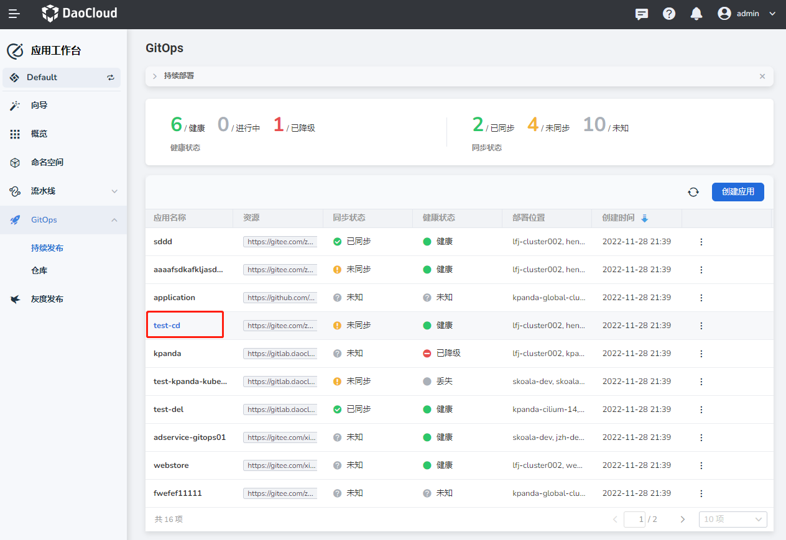
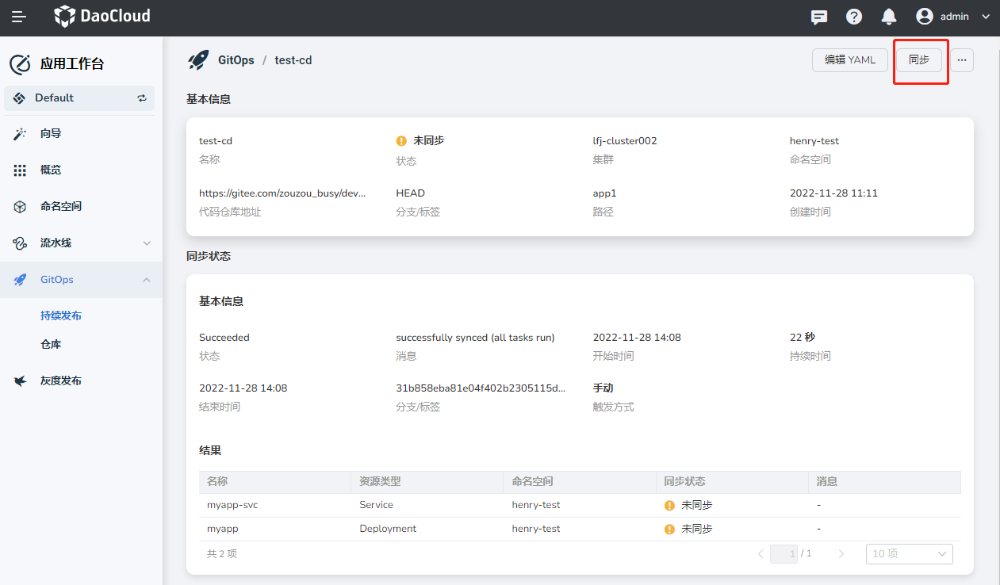
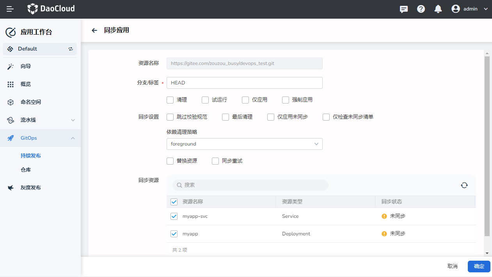

# Create an Argo CD Application

The Workbench implements continuous deployment based on the open-source software [Argo CD](https://argo-cd.readthedocs.io/en/stable/). This page demonstrates how to implement continuous deployment of applications.

## Prerequisites

- A workspace and a user are required to be created. The user needs to join the workspace and be assigned the __workspace edit__ role.
  Refer to [Creating a Workspace](../../../ghippo/user-guide/workspace/workspace.md), [Users and Roles](../../../ghippo/user-guide/access-control/user.md).
- Prepare a Git repository. If the code repository where the manifest files of the continuously deployed application are located is not public, you need to import the repository to Workbench in advance. Refer to [Import Repository](import-repo.md).

## Creating an Argo CD application

1. On the __Workbench__ -> __Continuous Deployments__ page, click the __Create Application__ button.

    

2. On the __Create Application__ page, assign and configure __Basic Info__, __Deployment Location__, __Repo Source__, and __Sync Policy__, then click __OK__.

    - Repo Source:
        - Repo: Select an imported code repository or enter a public code repository address. For example: `https://github.com/argoproj/argocd-example-apps.git`
        - Branch/Label: Set the branch or tag of the code repository, default is HEAD
        - Path: Enter the manifest file path, for example, gustbook
    - Sync Policy:
        - Manual Sync: Manually decide whether to sync
        - Auto Sync: Automatically detect changes in the manifest files in the code repository, and immediately sync the application resources to the latest state once changes occur. It also supports resource cleanup and self-recovery options:
            - Clear Resources: Delete resources no longer defined in the code repository during sync
            - Auto Recovery: Ensure synchronization with the expected state in the code repository
        - Sync Settings:
            - Skip Schema Validation: Skip the validation of application manifest files
            - Prune Last: Only delete non-existent resources after all resources have been synced and are in a healthy state
            - Apply Out Of Sync Only: Only apply unsynced resources
            - Prune Propagation Policy: Choose a specific cleanup strategy:
                - Foreground: Delete the owner object only after all dependent objects have been deleted
                - Background: Delete all dependent objects only after the owner object has been deleted
                - Orphan: All dependent objects remain after the owner object is deleted
            - Replace: Whether to replace existing resources
            - Retry: Make application sync retry parametric, support setting maximum retry times, retry duration, maximum retry duration, factor

    

## Viewing the application

1. After successful creation, click the application name to enter the details page, where you can view the application details.

    

2. As the sync mode chosen is __Manual Sync__, we need to manually perform the sync, click __Sync__.

    

3. For specific parameter explanations during the sync process, please refer to [Manually Sync Application](./sync-manually.md), click __OK__.

    

4. Wait for the sync to succeed, then view the sync result.
