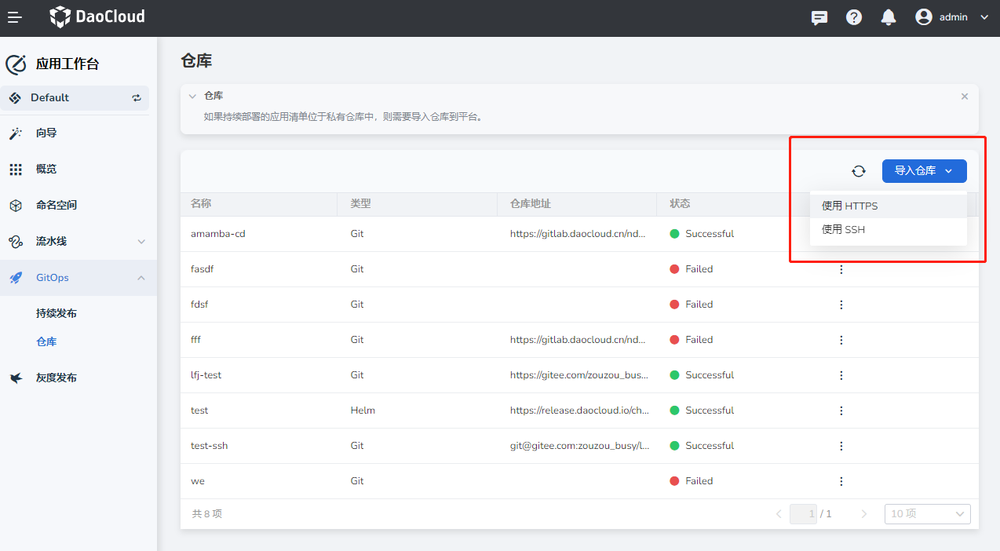
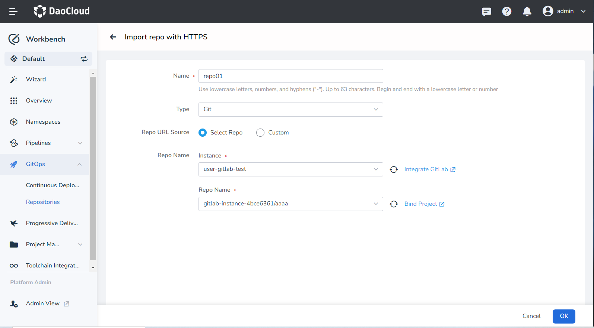
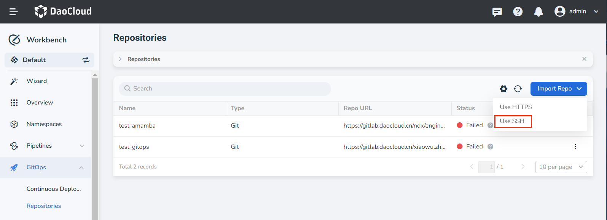
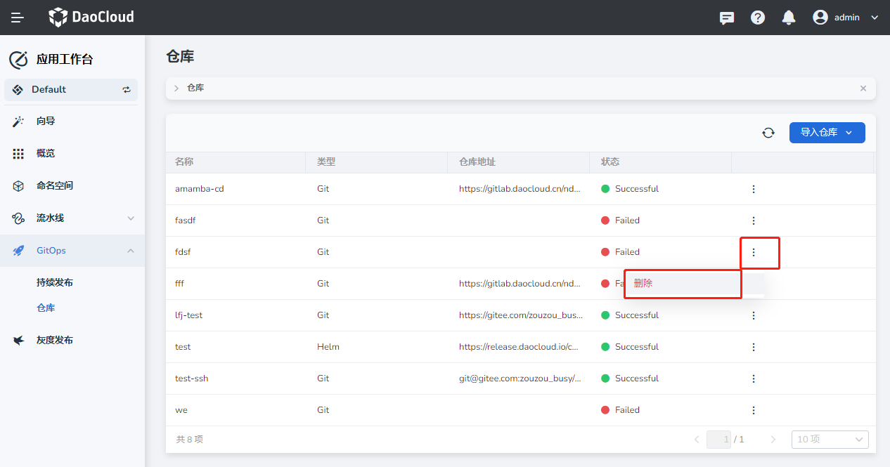
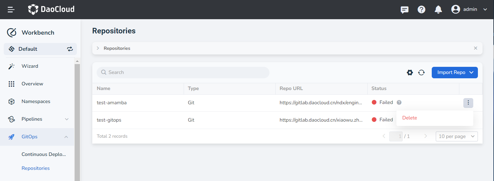
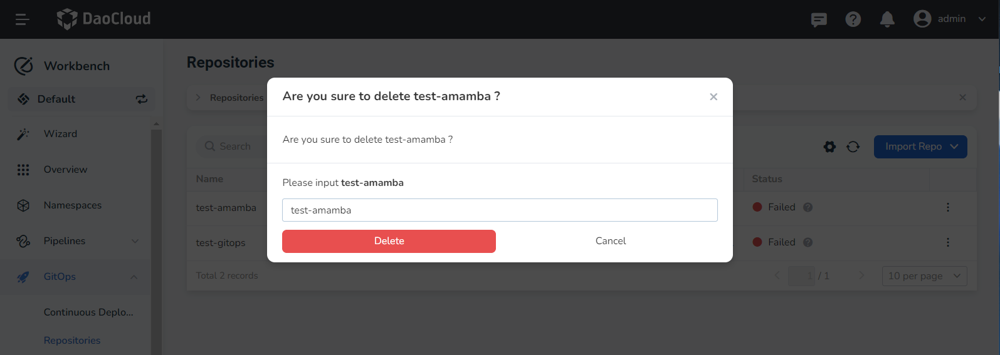

# Import Repository

This page shows how to import repositories.

## Prerequisites

- A workspace and a user are required to be created. The user needs to join the workspace and be assigned the __workspace edit__ role.
  Please refer to [Creating a Workspace](../../../ghippo/user-guide/workspace/workspace.md) and [Users](../../../ghippo/user-guide/access-control/user.md).
- A Git repository is prepared.

## Import a repository

If the code repository where the manifest files of the continuously deployed application are located is not public, you need to import the repository to the application workbench in advance.
The application workbench currently supports two import methods: __Importing a repository using HTTPS__ and __Importing a repository using SSH__.

### Import a repository using HTTPS

1. In the __Workbench__ -> __GitOps__ -> __Repositories__ page, click the __Import Repo__ button and select __Use HTTPS__.

    

2. In the __Import repo with HTTPS__ page, configure the relevant parameters and click __OK__.

    

### Import a repository using SSH

1. In the __Workbench__ -> __GitOps__ -> __Repositories__ page, click the __Import Repo__ button and select __Use SSH__.

    

2. In the __Import repo with SSH__ page, configure the relevant parameters and click __OK__.

    

## Delete repository

If you no longer use a certain code repository, you can delete it following the steps below.

1. Select a repository in the repository list page, click __︙__, and click __Delete__ in the pop-up menu.

    

2. Click __Delete__ in the second confirmation pop-up window.

    
