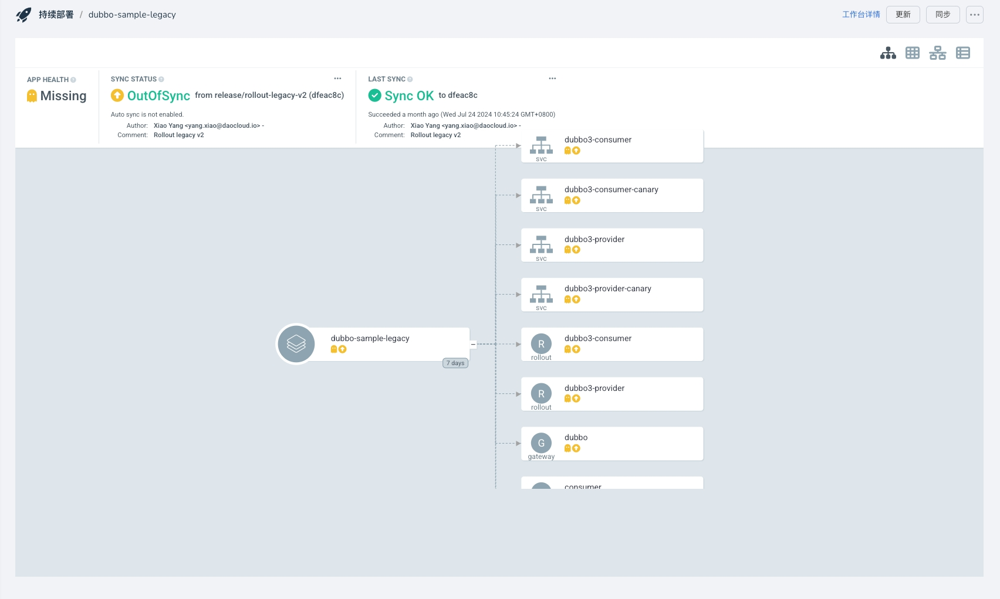

# Enable ArgoCD-Native UI

To facilitate users in directly viewing ArgoCD application details using ArgoCD's native UI from the Workbench,
DCE 5.0 Workbench provides a feature to enable the ArgoCD UI.
This document will guide you on how to enable the ArgoCD UI.

!!! note

    The UI is read-only. For other operations, please use the Workbench.

Enabling the ArgoCD UI requires modifying several ConfigMaps, and these configurations
may influence each other. Please strictly follow the steps below for configuration.

## Modify ArgoCD Configuration

The following configurations are all in the `kpanda-global-cluster` cluster,
and it is assumed that your ArgoCD is installed in the `argocd` namespace.

Go to __Container Management__ -> __Clusters__ -> __kpanda-global-cluster__ -> __Custom Resources__ , search based on resource group and version (i.e., the `apiVersion` field. For example, for `Gateway`, search for `networking.istio.io`), enter the custom resource details, select the corresponding namespace and version, and click __Create from YAML__ on the right side. Create the following resources.

1. Create Gateway

    ```yaml
    apiVersion: networking.istio.io/v1alpha3
    kind: Gateway
    metadata:
      name: argocd-gateway
      namespace: argocd # Note the namespace
    spec:
      selector:
        istio: ingressgateway
      servers:
        - hosts:
            - "*"
          port:
            name: http
            number: 80
            protocol: HTTP
          tls:
            httpsRedirect: false
        - hosts:
            - "*"
          port:
            name: https
            number: 443
            protocol: HTTPS
          tls:
            cipherSuites:
              - ECDHE-ECDSA-AES128-GCM-SHA256
              - ECDHE-RSA-AES128-GCM-SHA256
              - ECDHE-ECDSA-AES128-SHA
              - AES128-GCM-SHA256
              - AES128-SHA
              - ECDHE-ECDSA-AES256-GCM-SHA384
              - ECDHE-RSA-AES256-GCM-SHA384
              - ECDHE-ECDSA-AES256-SHA
              - AES256-GCM-SHA384
              - AES256-SHA
            credentialName: argocd-secret
            maxProtocolVersion: TLSV1_3
            minProtocolVersion: TLSV1_2
            mode: SIMPLE
    ```

2. Create VirtualService

    ```yaml
    apiVersion: networking.istio.io/v1alpha3
    kind: VirtualService
    metadata:
      name: argocd-virtualservice
      namespace: argocd # Note the namespace
    spec:
      gateways:
        - argocd-gateway
      hosts:
        - "*"
      http:
        - match:
            - uri:
                prefix: /argocd
          route:
            - destination:
                host: amamba-argocd-server
                port:
                  number: 80
    ```

3. Create GProductProxy

    ```yaml
    apiVersion: ghippo.io/v1alpha1
    kind: GProductProxy
    metadata:
      name: argocd
    spec:
      gproduct: amamba
      proxies:
        - authnCheck: false
          destination:
            host: amamba-argocd-server.argocd.svc.cluster.local
            port: 80
          match:
            uri:
              prefix: /argocd/applications/argocd
        - authnCheck: false
          destination:
            host: amamba-argocd-server.argocd.svc.cluster.local # If the namespace is not argocd, change the svc name
            port: 80
          match:
            uri:
              prefix: /argocd
    ```

    The `amamba-argocd-server.argocd.svc.cluster.local` in the host needs to be modified according to your ArgoCD service name and namespace. The specific modification path is __Container Management__ -> __Clusters__ -> __kpanda-global-cluster__ -> __Container Network__ , search for the keyword `amamba-argocd-server` based on the namespace where ArgoCD is installed to confirm.

4. Modify ArgoCD-related configurations

    Go to __Container Management__ -> __Clusters__ -> __kpanda-global-cluster__ -> __Workloads__ -> __Deployments__ , select the namespace where you installed ArgoCD, such as argocd. Find `amamba-argocd-server` and click the __Restart__ button on the right.

    Modify `argocd-cmd-params-cm`:

    ```yaml
    kind: ConfigMap
    metadata:
      name: argocd-cmd-params-cm
      namespace: argocd
    data:
      server.basehref: /argocd # Add these three lines
      server.insecure: "true"
      server.rootpath: /argocd
    ```

    Modify `argocd-rbac-cm`:

    ```yaml
    apiVersion: v1
    kind: ConfigMap
    metadata:
      name: argocd-rbac-cm
      namespace: argocd
    data:
      policy.csv: |-
        g, amamba, role:admin
        g, amamba-view, role:readonly   # Add this line
    ```

    Modify `argocd-cm`:

    ```yaml
    apiVersion: v1
    kind: ConfigMap
    metadata:
      name: argocd-cm
      namespace: argocd
    data:
      accounts.amamba: apiKey
      accounts.amamba-view: apiKey # Add this line
    ```

5. After modifying the above options, you need to restart the `amamba-argocd-server` Deployment.

    Go to __Container Management__ -> __Clusters__ -> __kpanda-global-cluster__ -> __Workloads__ -> __Deployments__ , select the namespace where you installed ArgoCD, such as argocd. Find `amamba-argocd-server` and click the __Restart__ button on the right.

## Modify Workbench ConfigMaps

After the above steps, you also need to change the ConfigMaps of the Workbench to make the ArgoCD UI effective.

1. Go to __Container Management__ -> __Clusters__ -> __kpanda-global-cluster__ -> __ConfigMaps and Secrets__ -> __ConfigMaps__ , select the namespace `amamba-system`, and modify the `amamba-config` ConfigMap, changing the following ConfigMaps:

    ```yaml
    generic:
      argocd:
        host: amamba-argocd-server.argocd.svc.cluster.local:443  # Change the port to 443
        enableUI: true         # Add this option
    ```

    Keep the host port as 443, and modify `amamba-argocd-server.argocd.svc.cluster.local` based on your ArgoCD service name and namespace. The specific modification path is __Container Management__ -> __Clusters__ -> __kpanda-global-cluster__ -> __Container Network__ , search for the keyword `amamba-argocd-server` based on the namespace where ArgoCD is installed to confirm.

2. After modifying the above options, go to __Container Management__ -> __Clusters__ -> __kpanda-global-cluster__ -> __Workloads__ -> __Deployments__ , select the namespace `amamba-system`, and restart both `amamba-apiserver` and `amamba-syncer` Deployments.

## View Topology

1. In the __Workbench__ -> __Continuous Release__ page, click an application name to enter the details page.

2. In the details page, click `ArgoCD Topology` to view the topology diagram:

    
