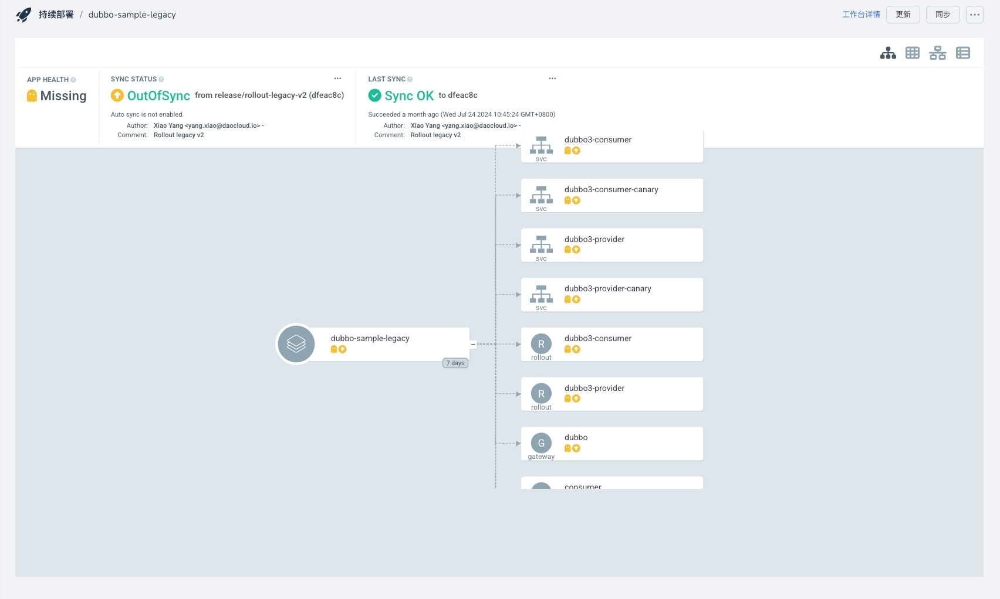

# Enable ArgoCD UI

To make it convenient for users to directly view the details of ArgoCD applications using the native UI of
ArgoCD in the Workbench, the DCE Workbench provides the feature of enabling the ArgoCD UI. This document
will guide you on how to enable the ArgoCD UI.

!!! note

    The UI only has read-only permission. If you need other operations, please use the Workbench.

Enabling the ArgoCD UI feature requires modifying many configuration items, and these configuration items
affect each other. Please strictly follow the steps below for configuration.

## Modify ArgoCD Configuration

### Workbench version >= v0.35.0

After the Workbench is upgraded to v0.35.0, we provide a feature switch that can enable/disable the ArgoCD
UI feature with one click.

1. Go to __Container Management__ -> __Clusters__ -> __kpanda-global-cluster__ -> __ConfigMaps and Secrets__ -> __ConfigMaps__

2. Select the namespace where the Workbench is installed (the default is `amamba-system`), and select `amamba-config` to update.

3. Add or modify the following configuration item:

    ```yaml
    argocd.ui.enable: true # set it to false to disable
    ```
    
    > Note that you are adding a key-value pair
   
    

!!! note

    After the modification, you still need to [modify the Workbench configuration items](#modify-workbench-configmaps) for the ArgoCD UI to take effect.

### Workbench version < v0.35.0

The following configurations are all in the `kpanda-global-cluster` cluster, and it is assumed that your
ArgoCD is installed in the `argocd` namespace.

1. Create a GProductProxy

    Go to __Container Management__ -> __Clusters__ -> __kpanda-global-cluster__ -> __Custom Resources__, search for
    `gproductproxies.ghippo.io`, enter the custom resource details, and then click __Create from YAML__ on the right.

    ```yaml
    apiVersion: ghippo.io/v1alpha1
    kind: GProductProxy
    metadata:
      name: argocd
    spec:
      gproduct: amamba
      proxies:
        - authnCheck: false
          destination:
            host: amamba-argocd-server.argocd.svc.cluster.local
            port: 80
          match:
            uri:
              prefix: /argocd/applications/argocd
        - authnCheck: false
          destination:
            host: amamba-argocd-server.argocd.svc.cluster.local # if the namespace is not argocd, change the svc name
            port: 80
          match:
            uri:
              prefix: /argocd
    ```

    The `amamba-argocd-server.argocd.svc.cluster.local` in host needs to be modified according to your
    ArgoCD service name and namespace. The specific modification path is __Container Management__ ->
    __Clusters__ -> __kpanda-global-cluster__ -> __Container Network__. Search for the keyword
    `amamba-argocd-server` according to the namespace where ArgoCD is installed to determine it. 

2. Modify the ArgoCD-related configurations

    Go to __Container Management__ -> __Clusters__ -> __kpanda-global-cluster__ -> __Workloads__ -> __Deployments__,
    select the namespace where you installed ArgoCD, such as argocd. Find `amamba-argocd-server` and click the
    __Restart__ button on the right.

    Modify `argocd-cmd-params-cm`:

    ```yaml
    kind: ConfigMap
    metadata:
      name: argocd-cmd-params-cm
      namespace: argocd
    data:
      server.basehref: /argocd # add these three lines
      server.insecure: "true"
      server.rootpath: /argocd
    ```

    Modify `argocd-rbac-cm`:

    ```yaml
    apiVersion: v1
    kind: ConfigMap
    metadata:
      name: argocd-rbac-cm
      namespace: argocd
    data:
      policy.csv: |-
        g, amamba, role:admin
        g, amamba-view, role:readonly   # add this line
    ```

    Modify `argocd-cm`:

    ```yaml
    apiVersion: v1
    kind: ConfigMap
    metadata:
      name: argocd-cm
      namespace: argocd
    data:
      accounts.amamba: apiKey
      accounts.amamba-view: apiKey # add this line
    ```

3. After changing the above options, you need to restart the `amamba-argocd-server` Deployment.

    Go to __Container Management__ -> __Clusters__ -> __kpanda-global-cluster__ -> __Workloads__ -> __Deployments__,
    select the namespace where you installed ArgoCD, such as argocd. Find `amamba-argocd-server` and click the
    __Restart__ button on the right.

## Modify Workbench ConfigMaps
<span id="update-config"></span>

After the above steps, you also need to change the Workbench configuration items for the ArgoCD UI to take effect.

1. Go to __Container Management__ -> __Clusters__ -> __kpanda-global-cluster__ -> __Helm Applications__,
   select the namespace `amamba-system`, modify the `amamba` application, and change the following
   configuration items in the YAML:

    ```yaml
    configMap:
      generic:
        argocd:
          host: amamba-argocd-server.argocd.svc.cluster.local:443  # change the port to 443
          enableUI: true         # add this option
    ```

    Keep the host port as 443. The `amamba-argocd-server.argocd.svc.cluster.local` needs to be modified
    according to your ArgoCD service name and namespace. The specific modification path is
    __Container Management__ -> __Clusters__ -> __kpanda-global-cluster__ -> __Container Network__.
    Search for the keyword `amamba-argocd-server` according to the namespace where ArgoCD is installed to determine it.

2. After saving, wait for Helm to complete the update.

## View Topology

1. On the __Workbench__ -> __Continuous Deployments__ page, click an application name to enter the details page.

2. On the details page, click `ArgoCD Topology` to view the topology diagram:

    
