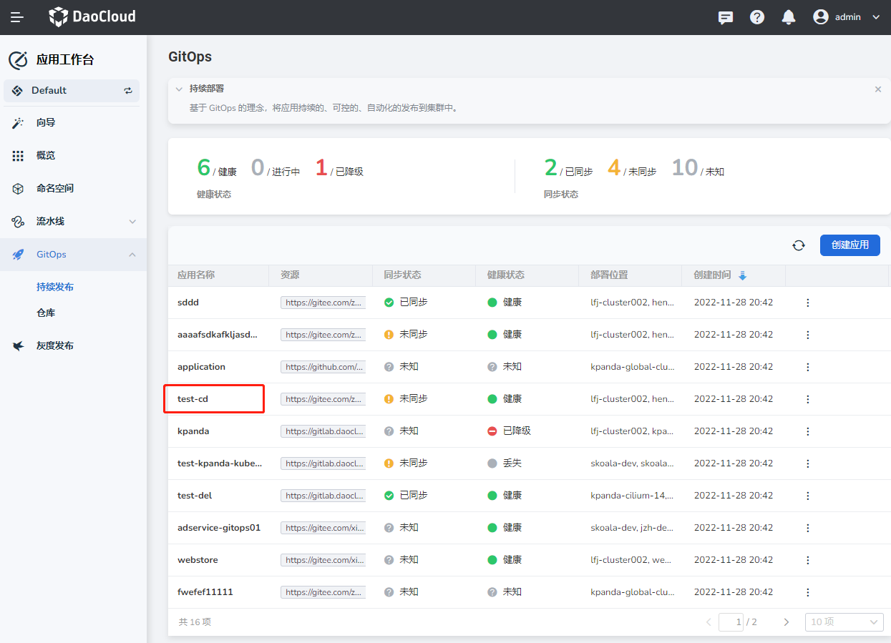
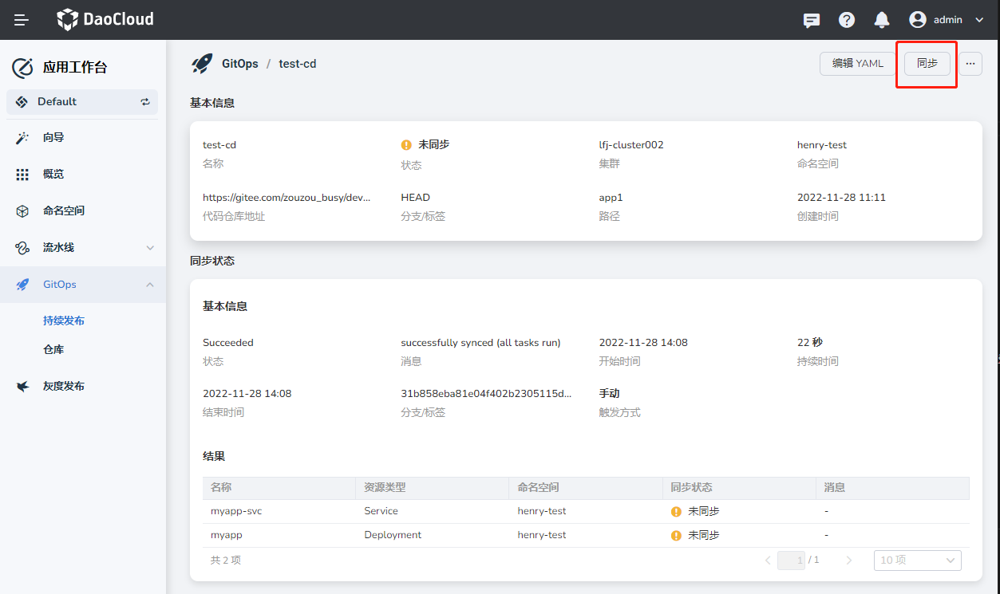
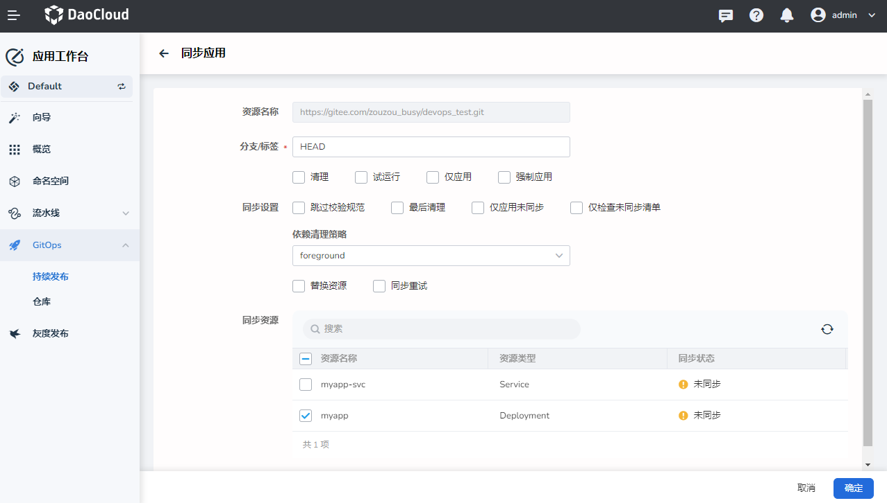

# Manually Synchronize Application

This page demonstrates how to manually sync a continuously deployed application.

1. On the __Workbench__ -> __Continuous Deployments__ page, click the name of an application whose synchronization status is __Unknown__ .

    

1. On the application details page, click the __Sync__ button to enter the synchronization page:

    

1. On the __Sync App__ page, configure the following parameters:

    - Resource name: read-only status, does not support secondary editing
    - Branch/Tag: Set the branch for synchronization. If the synchronization method is automatic synchronization, an error will be reported synchronously after the change
        - PRUNE: After checking, if some resources are deleted in the manifest file, the related resources will also be cleaned up during synchronization, otherwise the related resources will be skipped and cleaned up
        - DRY RUN: Simulates the synchronization process
        - APPLY ONLY: After checking, resources will be deployed through kubectl apply
        - FORCE: After checking, if a conflict is encountered when deploying a resource, the resource will be deleted and recreated immediately
    - Sync Settings: The parameters of the synchronization settings are the same as those at the time of creation. For specific parameter descriptions, please refer to creating an application

    In the Sync Resources area, select at least one application to be synchronized. For example, some resources have already been synchronized, and only unsynchronized resources need to be synchronized.

    

1. Click __OK__ , wait for the successful synchronization, and then check the synchronization result.
