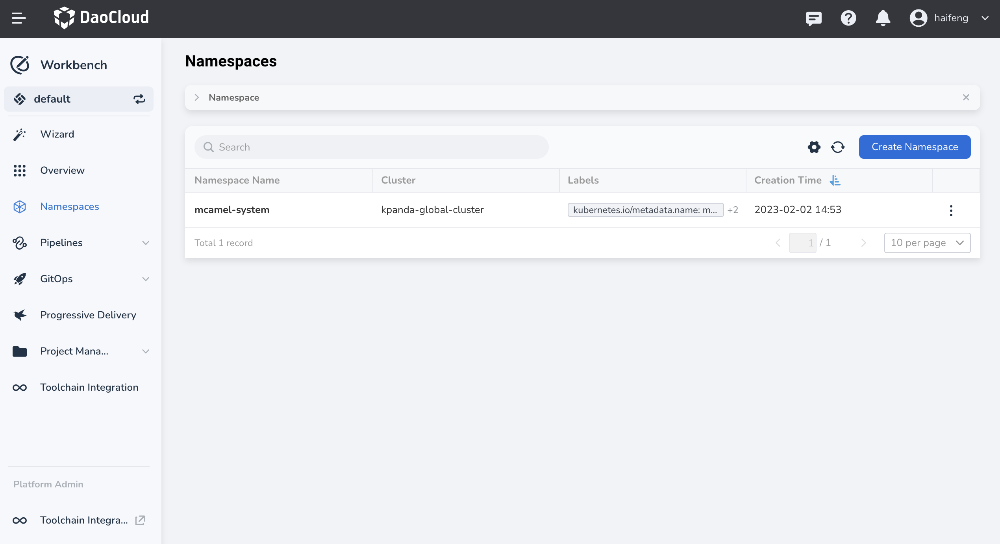
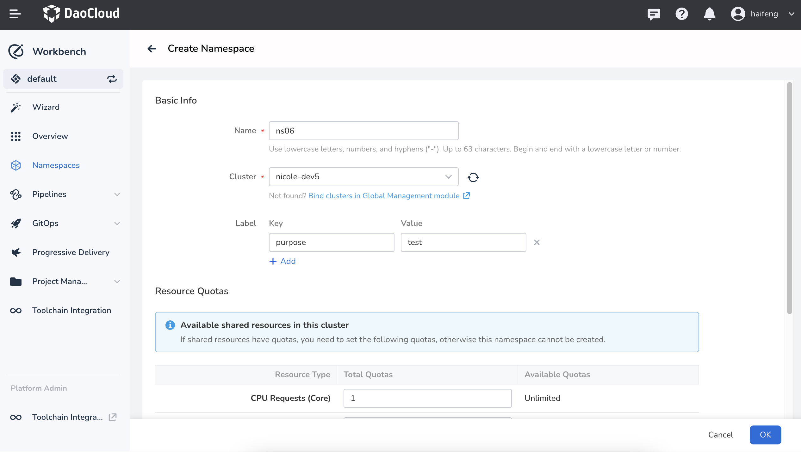
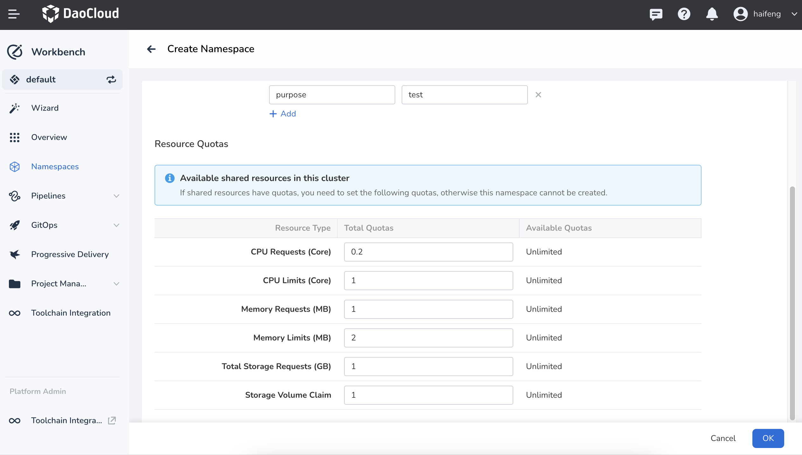
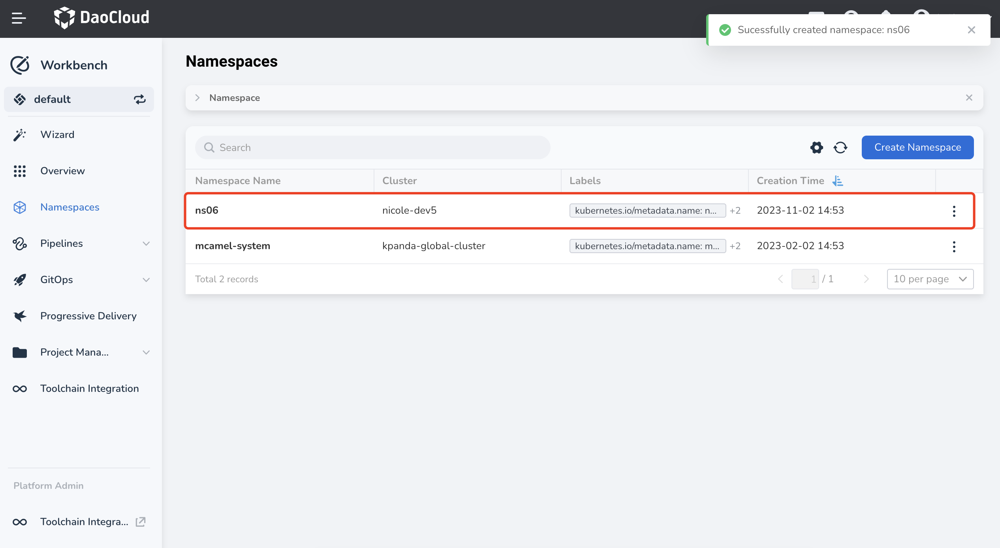
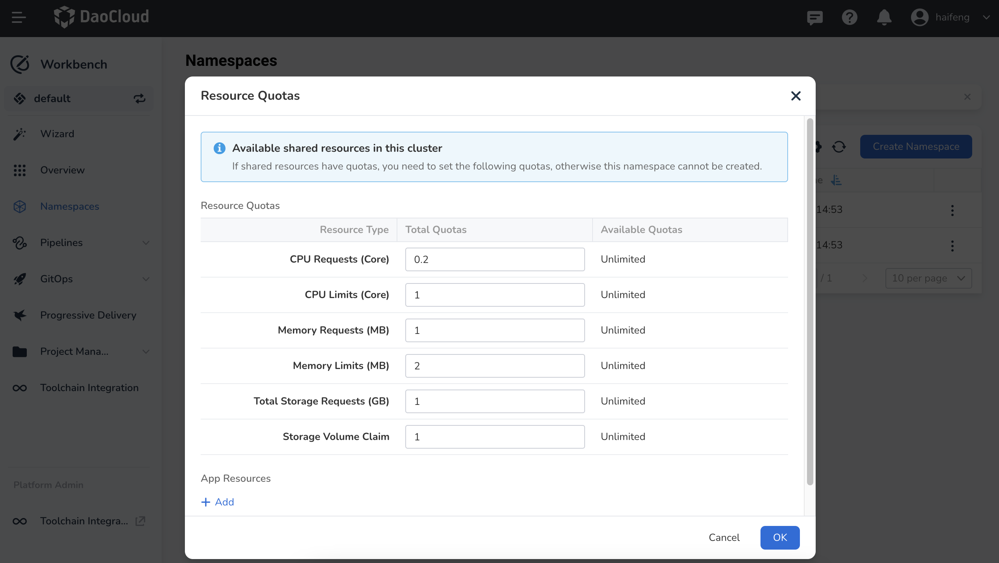

# Namespace Management

A namespace is an abstraction used in Kubernetes to isolate resources.

## Prerequisites

- The current workspace already has cluster resources. Refer to [Binding Resources](../../../ghippo/user-guide/workspace/quota.md) for more information.
- The current user is authorized with the `Workspace Admin` role. Refer to [Workspace Best Practices](../../../ghippo/user-guide/workspace/ws-best-practice.md) for details.

## Create a Namespace

!!! note

    Only `Workspace Admin` has the privilege to create namespaces and set namespace quotas. Other roles do not support this operation.

1. Click `Namespaces` in the left navigation pane of your Workbench, then click `Create` in the upper right corner.

    

2. On the `Create Namespace` page, configure the basic information for the namespace.

    

    - Name: Set the name of the namespace.
    - Cluster: Select a cluster from all the clusters bound under the current workspace.
    - Label: Set labels for the namespace.

3. After configuring the basic information, you also need to set resource quotas for the namespace.

    !!! note

        - If any resource quotas are set for the current cluster in the workspace, you must set these quotas for the namespace when creating it.
        - The resource quotas for the namespace cannot exceed the resource usage limits set for the current cluster in the workspace.
        - Leaving the request or limit fields empty means no quota is set for the current namespace.

    The currently supported resource quotas in the workspace include CPU requests, CPU limits, memory requests, memory limits, total storage requests, and storage volume claims. The limit values for CPU and memory resources must be greater than the request values.

    

4. Click `OK` to complete the resource creation. A message will appear indicating the successful creation, and you will be returned to the namespace list page.

    

5. Click the `︙` on the right side of the list to perform operations such as `Resource Quotas`, `Update Label`, and `Delete` from the pop-up menu.

    !!! warning

        Deleting a namespace will delete all the resources under that namespace. Please proceed with caution.

## Namespace Quotas

In addition to CPU requests, CPU limits, memory requests, memory limits, total storage requests, and storage volume claims resource quotas required when creating a namespace, other resource quotas can also be set in the namespace quota management. For example, resources such as container groups, stateless loads, stateful loads, ordinary tasks, and scheduled tasks under the namespace.

1. On the namespace list page, select a namespace and click `Resource Quotas`.

    

2. In the popped-up `Resource Quotas` dialog box, you can see the current resource quota information for the namespace. Click `Add` under `Apply Resources`, select a resource, and set the quota. Refer to [Kubernetes Resource Quotas](https://kubernetes.io/docs/concepts/policy/resource-quotas/) for details.

    

3. Click `OK` to complete the quota settings.
