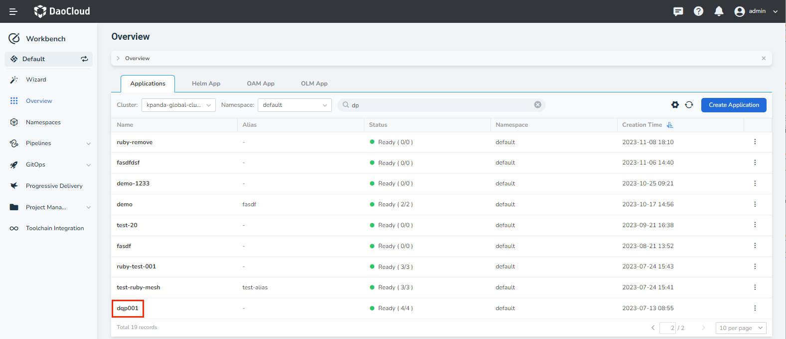
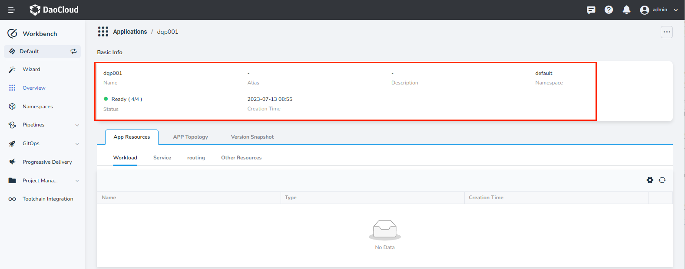
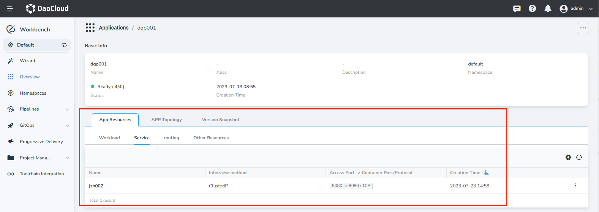
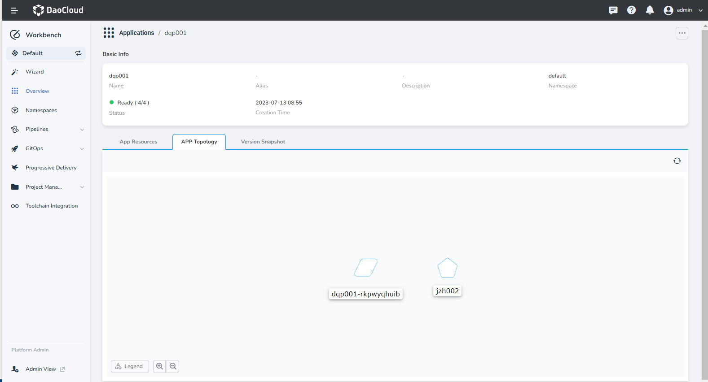
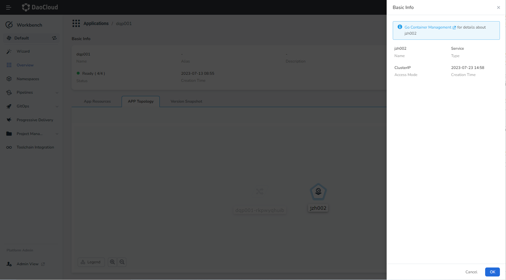
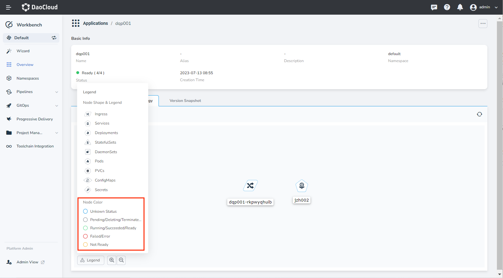
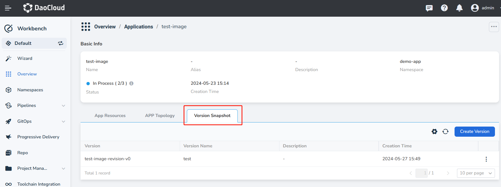
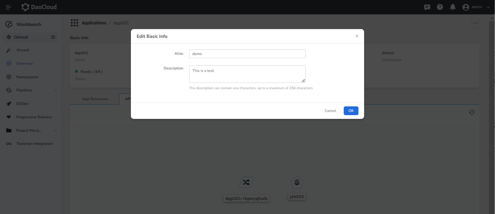
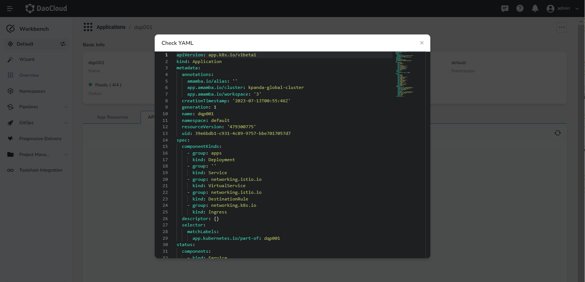

# Manage Native Applications

After [creating a native application](native-app.md), you can view the application details or update the application configuration as needed.

1. Go to the __Workbench__ -> __Overview__ page, click the __Applications__ tab, and then click the name of the native application.

    

- Here you can view basic information like the application name, alias, description, status, creation time, and more.

    

- Click the __App Resources__ tab to view the Kubernetes resources associated with the native application, such as workloads, services, routes, etc. You also have the ability to edit and delete various resources.

    

- Click the __APP Topology__ tab to visually see the resources including workloads, containers, storage, configurations, and secrets.

    

    - View basic resource information and navigate to the __Container Management__ module to see more resource details:

        

    - Nodes in the visual topology are color-coded to indicate the health status of resources that support it:

        

- Click the __Version Snapshot__ tab to view version, version name, description, and creation time. 

        

## Editing basic information of a native application

1. Click the name of the native application, and then click the __ⵈ__ in the upper-right corner of the page, and select __Edit Basic Info__.

2. Set an alias or provide additional description as needed.

    

## Viewing YAML of a native application

1. Click the name of the native application, then click the __ⵈ__ in the upper-right corner of the page, and select __Check YAML__.

2. View the manifest file of the native application.

    
