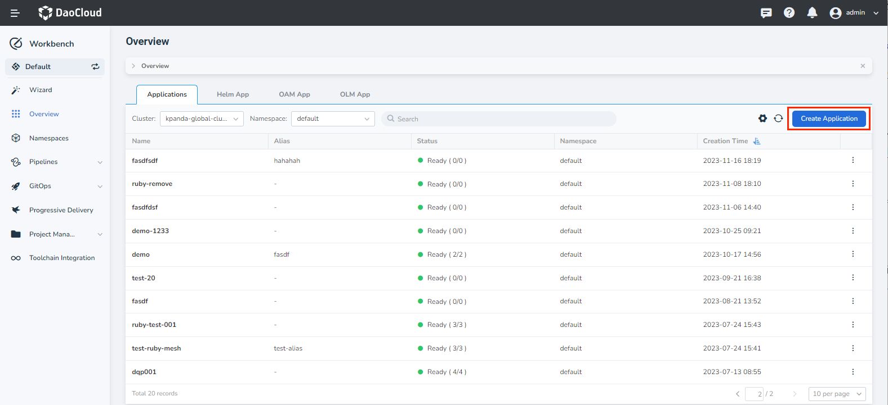
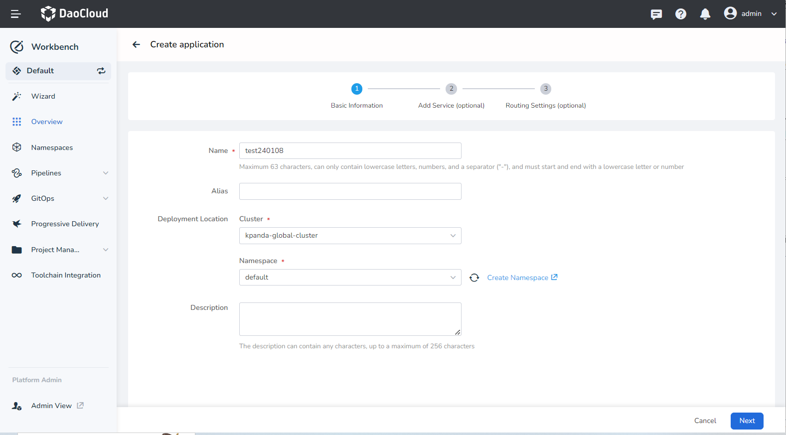
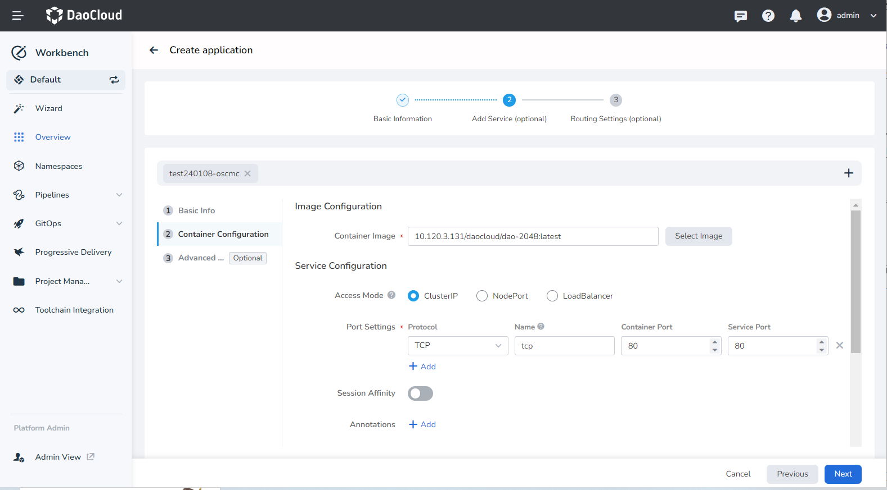
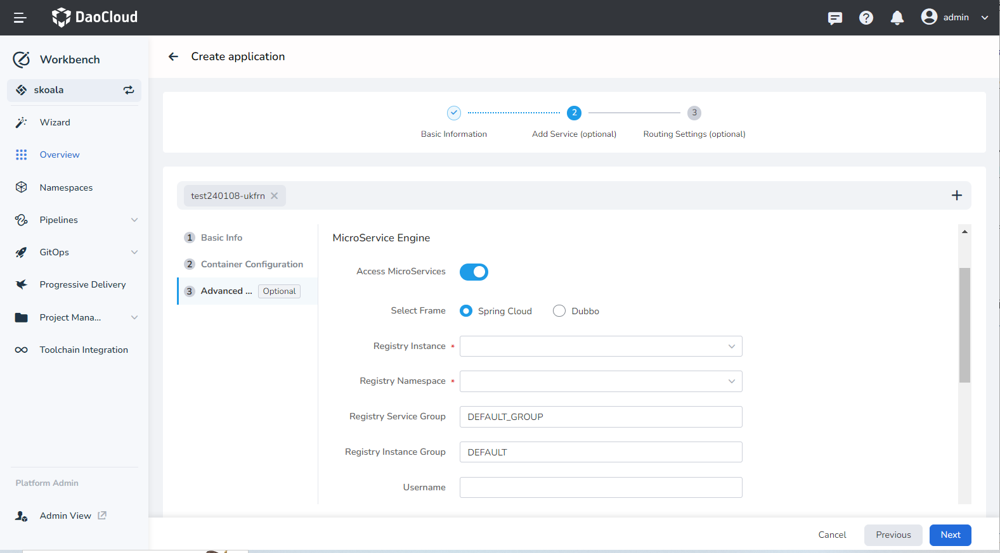
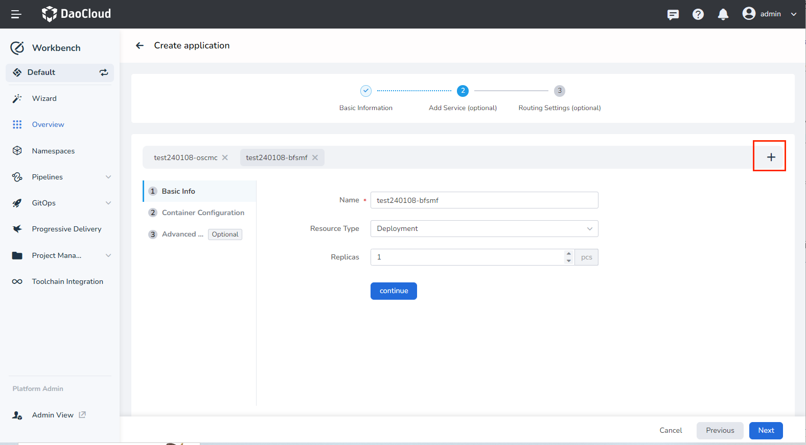
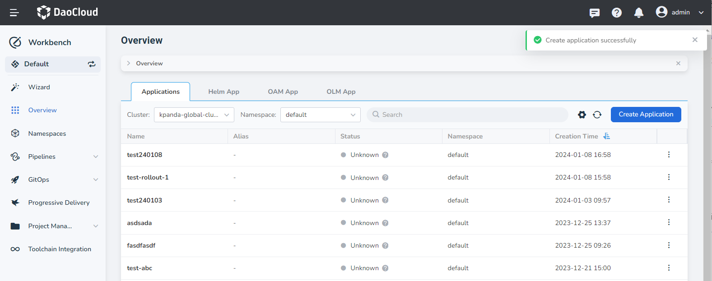
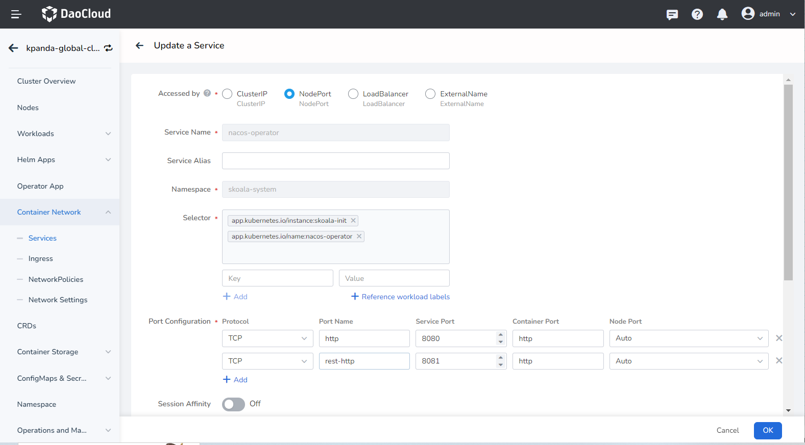
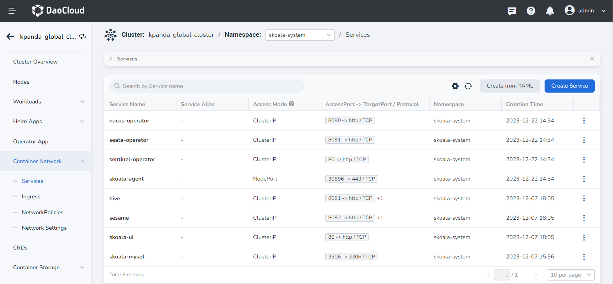
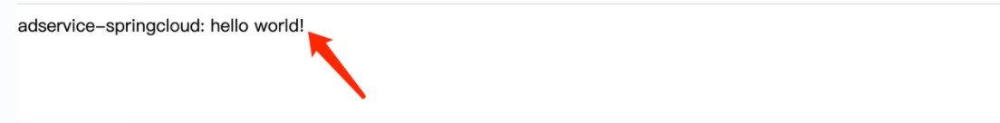
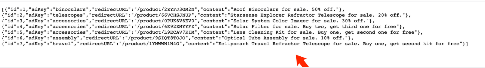

# Deploy Traditional Microservices with Native Applications

Native applications are designed to provide customers with applications composed of multiple Kubernetes resources and offer a unified view. This article explains how to deploy traditional microservices applications through native applications. The two example microservices used in this article are named __adservice__ and __dataservice__ .

## Prerequisites

- A managed Nacos instance has already been created in the current workspace. Refer to [Hosted Registry](../../../skoala/trad-ms/hosted/index.md).
- Prepare the Docker images of the traditional microservices that need to be deployed, such as __adservice__ and __dataservice__ .
- Modify the code of the traditional microservices to integrate the Nacos registry SDK.
- If you want to use Sentinel for traffic management of traditional microservices, integrate the Sentinel client into the code.

## Create a native application

1. In the __Workbench__ -> __Overview__ page, click the __Application__ tab, and then click __Create Application__ in the upper-right corner.

    

2. Fill in the basic information according to the instructions below and click __Next__ .

    - Name: The name of the native application.
    - Alias: The alias of the native application.
    - Deployment Location: Select which cluster and namespace to deploy the native application to.

    

3. Follow the instructions below to add traditional microservices.

    When adding microservices, __Basic Information__ and __Container Configuration__ are required, while __Advanced Configuration__ is optional.

    - Basic Information: Set the name, resource type, and number of instances for the microservice.
    - Container Configuration:

        - Image Configuration: Specify the image address of the microservice.
        - Service Configuration: The port configuration depends on the service code. For the demonstration application __adservice__ , fill in the following information:

        

    - Advanced Configuration:

        - Access Microservices: Integrate the traditional microservice being added with the [Microservice Engine](../../../skoala/intro/index.md) module of DCE 5.0.
        - Select Framework: The framework used by the microservice, such as __Spring Cloud__ or __Dubbo__ .
        - Registry Instance: Select which registry the microservice will be connected to. The available options come from the managed Nacos registry instances created under the current workspace through the Microservice Engine module.
        - Registry Namespace: The Nacos namespace for the microservice application.
        - Registry Service Group: The service group of the microservice application, equivalent to the "Group" concept in Nacos.
        - Username/Password: If the registry instance requires authentication, provide the username and password.
        - Enable Microservice Governance: The selected registry instance should have the [Sentinel or Mesh governance capabilities](../../../skoala/trad-ms/hosted/plugins/plugin-center.md) enabled.

        

    !!! note 
    
        To add more microservices, click the __➕__ on the right side of the screen.

        

4. Configure the routing as needed and click __OK__ in the lower-right corner.

    

## View microservices under native applications

1. After the application is successfully created, click the application name to view the workloads with the label __Traditional Microservice__ under the current application.

    > Clicking on the black link that appears will redirect you to the service details page of the Microservice Engine.

2. Alternatively, you can go to the __Microservice Engine__ module and view the services added under the corresponding workspace and registry.

## Simulate service invocation

1. First, change the access type of the __adservice__ service to __NodePort__ in the __Container Management__ .

    

2. On the service details page, click the external access address for the service port __8081__ .

    

3. A new browser tab will open with the following page, indicating a successful deployment of __adservice__ .

    

4. Append __/ad/all__ to the URL and access it. If you see the following page, it means that the __dataservice__ call was successful.

    
