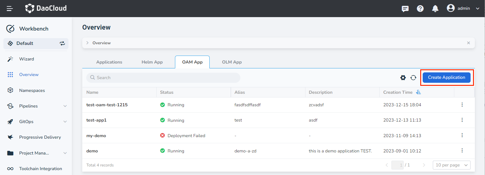
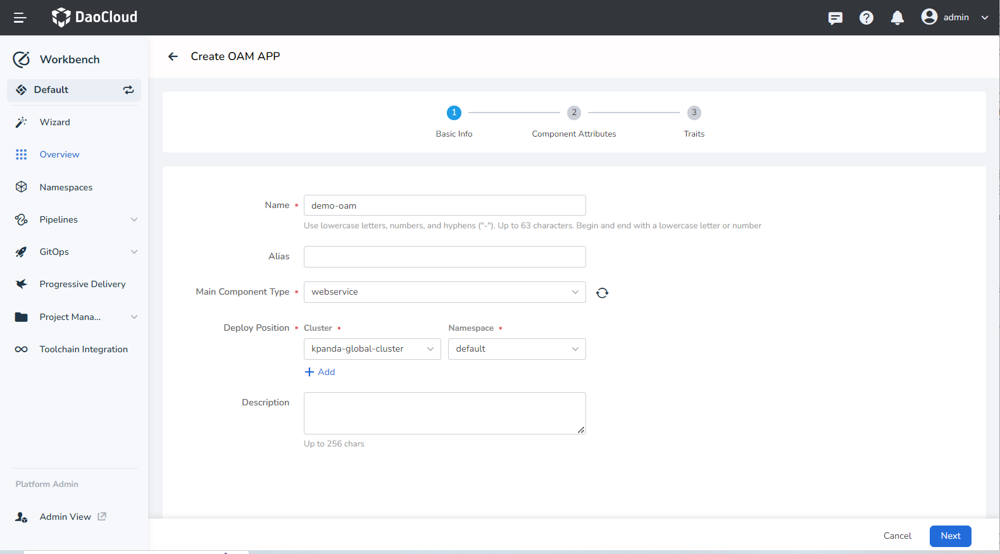
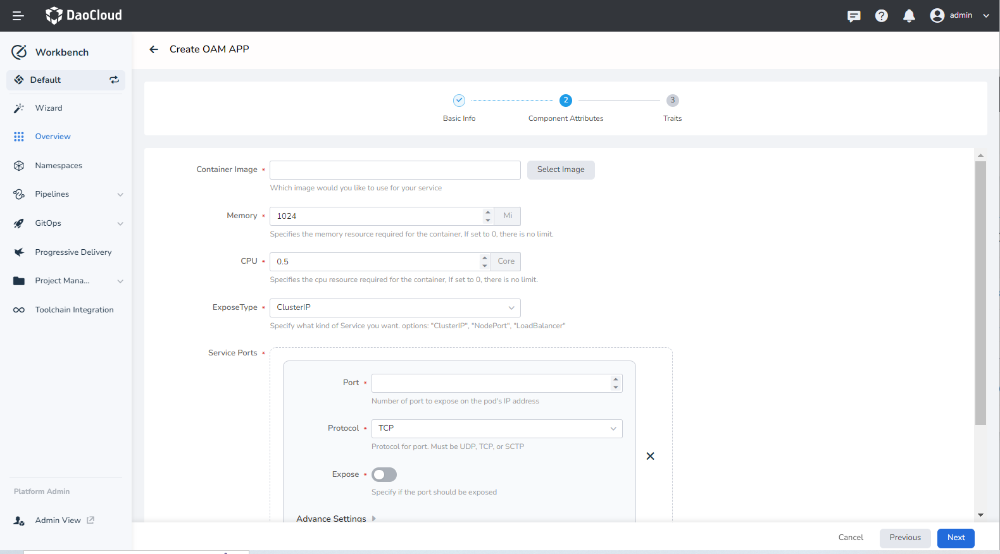
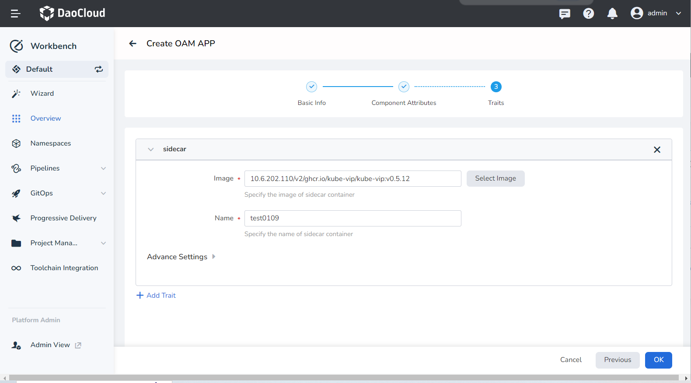
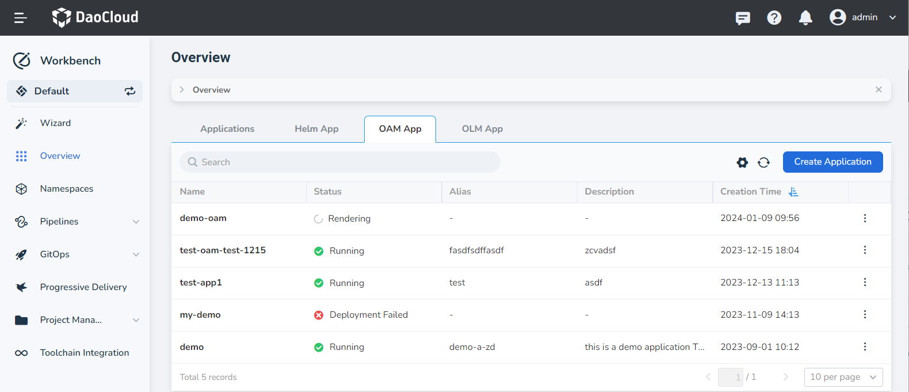
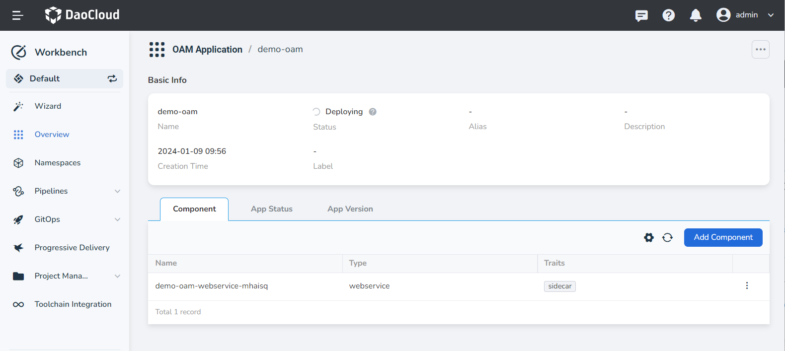

# Create OAM Application

The Open Application Model (OAM) application feature, powered by the open-source software KubeVela, offers a top-tier abstraction for application delivery. It brings together Kubernetes resources to facilitate a standard and efficient application delivery process in a hybrid environment.

For an introduction to OAM concepts, please refer to the [Introduction to OAM](concept.md) or the [KubeVela Official Documentation](http://kubevela.net/docs/v1.2/).

## Prerequisites

- Make sure to [Create a Workspace](../../../ghippo/user-guide/workspace/workspace.md) and [Create a User](../../../ghippo/user-guide/access-control/user.md/).
- Add the user to the workspace and assign 'Workspace Editor' or higher permissions.
- Both the [vela-core](../../pluggable-components.md#deploying-the-vela-core-component) and [argo-cd](../../pluggable-components.md#deploying-the-argo-cd-component) components have been installed.

## Procedure

1. Navigate to the __Workbench__ > __Overview__ page, select the __OAM App__ tab and click __Create Application__.

    

2. Provide the basic information as per the guidelines below and click __Next__:

    - Name/Alias: Enter the name or alias of the OAM application.
    - Main Component Type: Different component types necessitate different configurations. For a detailed understanding of various component types, please refer to the [Built-in Component List](https://kubevela.io/en/docs/end-user/components/references).
        - cron-task: This defines a task that runs a code or script periodically.
        - task: This defines a task that executes a code or script only once.
        - daemon: This defines a service that runs on each node within Kubernetes.
        - k8s-object: Each item in the list signifies a complete Kubernetes resource structure.
        - webservice: This defines a long-lasting, scalable, containerized service that exposes an endpoint to accept external traffic from clients.
    - Deployment Position: Select the cluster and namespace where the application will be deployed. This supports multiple cluster environments.

    

3. Configure parameters for the chosen components as per the [Built-in Component List](https://kubevela.io/en/docs/end-user/components/references).

    

4. Configure traits for the selected components as per the [Built-in Trait List](https://kubevela.io/en/docs/end-user/traits/references).

    

5. Click __OK__ to finalize the creation. Upon successful creation, you will be redirected to the OAM application list page.

    

6. Click the application name to access the OAM application details page. Here, you can view the basic information of the OAM application, component, app status, and conduct operations such as adding components and traits.

    
