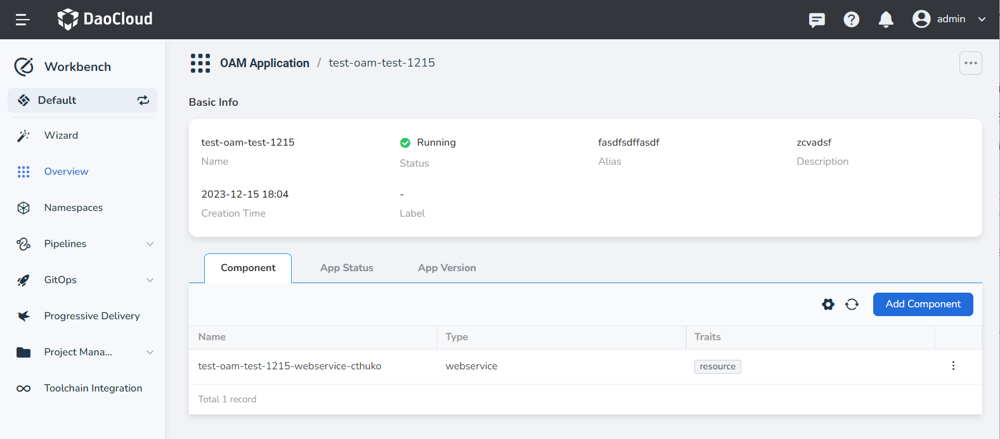
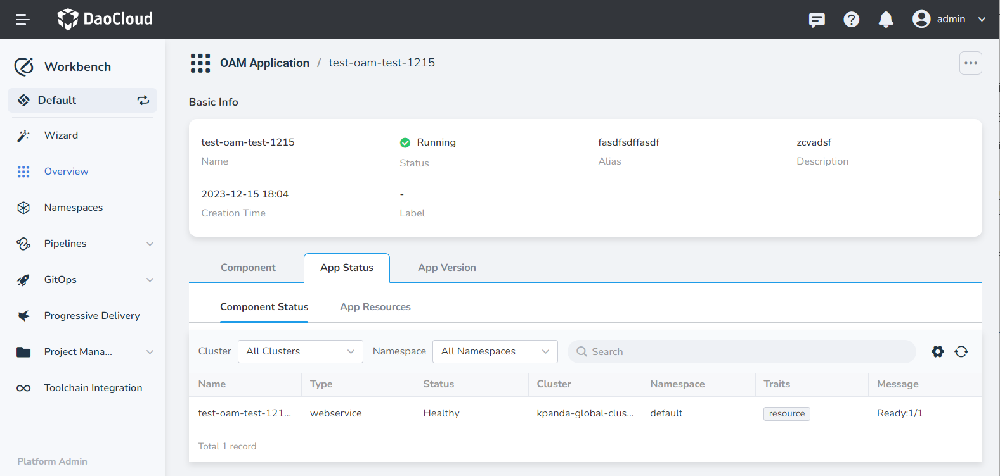
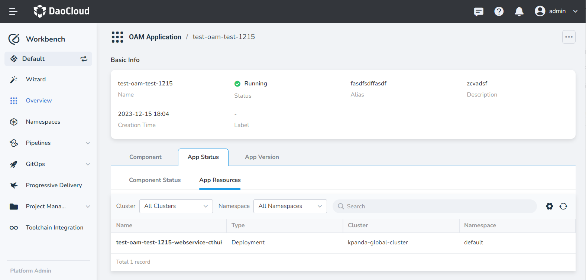
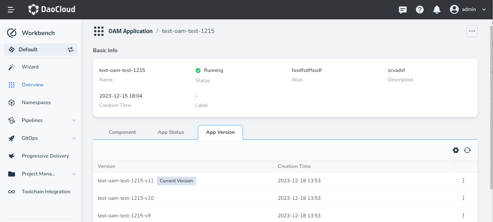
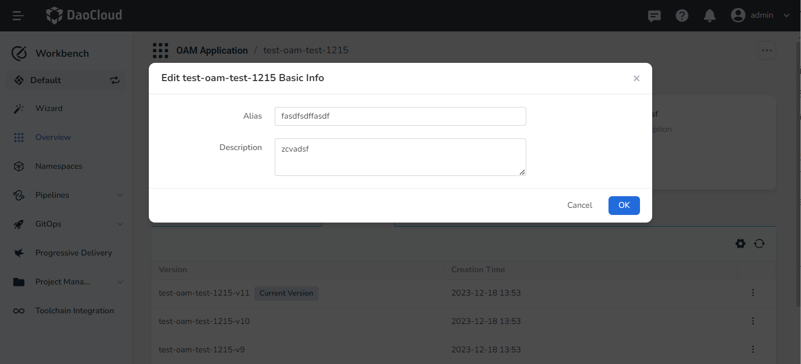
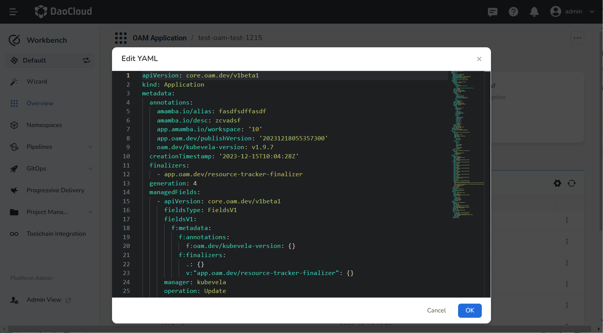
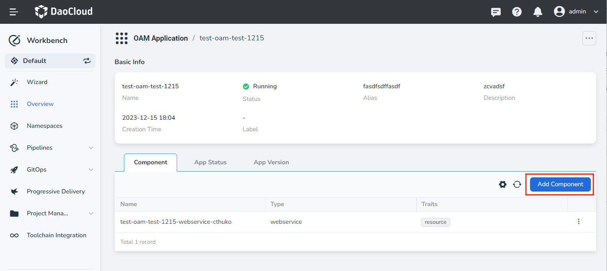
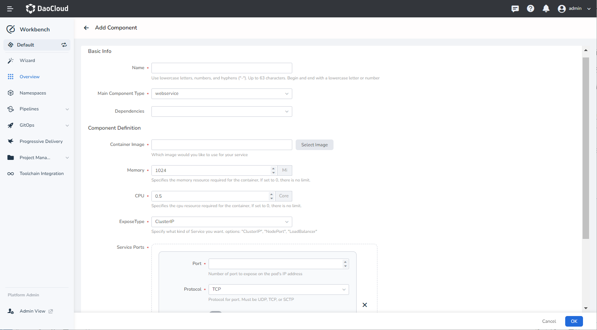
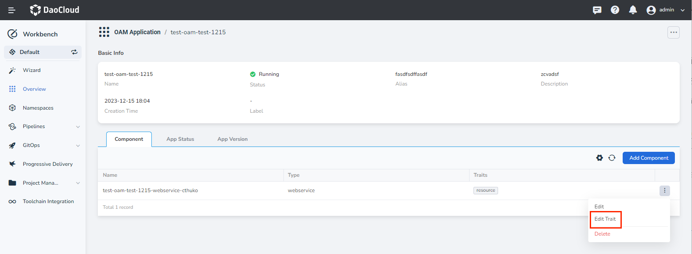
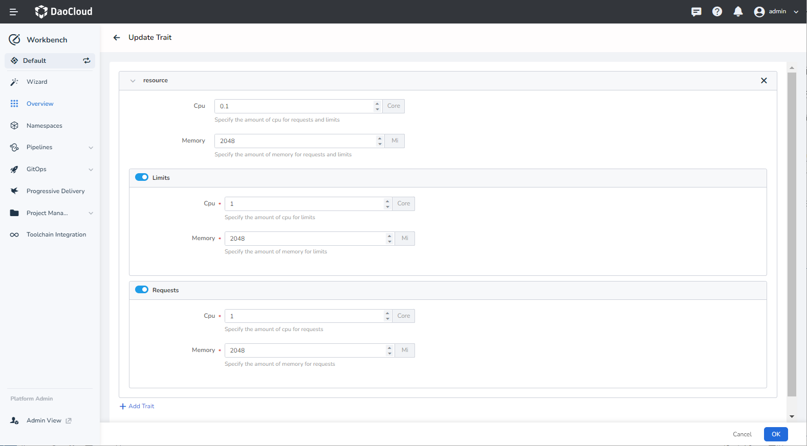

# Manage OAM Application

After [Creating an OAM application](create.md), you can view the application details and update its components or traits.

## View Application Details

1. In the __Workbench__ -> __Overview__ page, go to the __OAM Application__ tab to view the list of OAM applications.
2. Click the application name to view the application details, including fields such as name, status, alias, description, and creation time.
3. On the application details page, click the __Component__ tab to view the number, types, and traits of the components defined in the current application.

    

4. On the application details page, click the __App Status__ tab to view the component status and application resources.

    - Component Status: Displays the health status of each component in the current application. If there are unhealthy components, investigate and address the operational issues promptly.

        

    - App Resources: Provides information about the Kubernetes resources deployed in the current application.

        

5. Click __App Version__ to view the version information of the application. Any changes made to the application will automatically generate a version for record keeping. When necessary, you can roll back to a previous version.

    

## Edit Basic Information of an OAM Application

1. Click the OAM application name, then click the __ⵈ__ icon in the top right corner of the page and select __Edit Basic Info__ .
2. Set the alias as desired or provide additional description information.

    

## Edit YAML File of an OAM Application

1. Click the OAM application name, then click the __ⵈ__ icon in the top right corner of the page and select __Edit YAML__ .
2. Edit the YAML file of the OAM application as necessary.

    

## Add Components

1. Click the OAM application name, go to the __Component__ tab, and click __Add Component__ on the right side.

    

2. Select the desired component type and fill in the corresponding component parameters based on the [Built-in Component List](https://kubevela.io/docs/end-user/components/references).

    

### Add/Update Traits

1. Click the OAM application name, go to the __Component__ tab, and click the __ⵗ__ icon on the right side of the component to select __Edit Trait__ .

    

2. Update the trait properties based on the [Built-in Trait List](https://kubevela.io/en/docs/end-user/traits/references).

    

## Application Version Rollback

1. Click the __Application Version__ tab, select a version (other than the current one) and click the __ⵗ__ on the right, then select __Rollback__.

    

2. Click the __OK__ button. After the rollback is successful, you will be redirected to the list and receive a notification.

    
