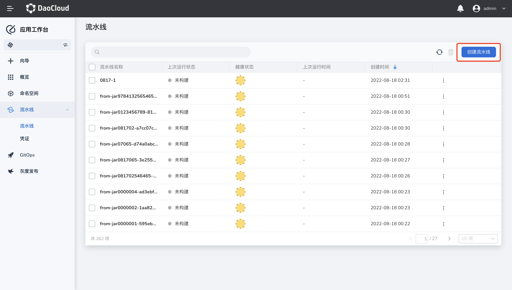
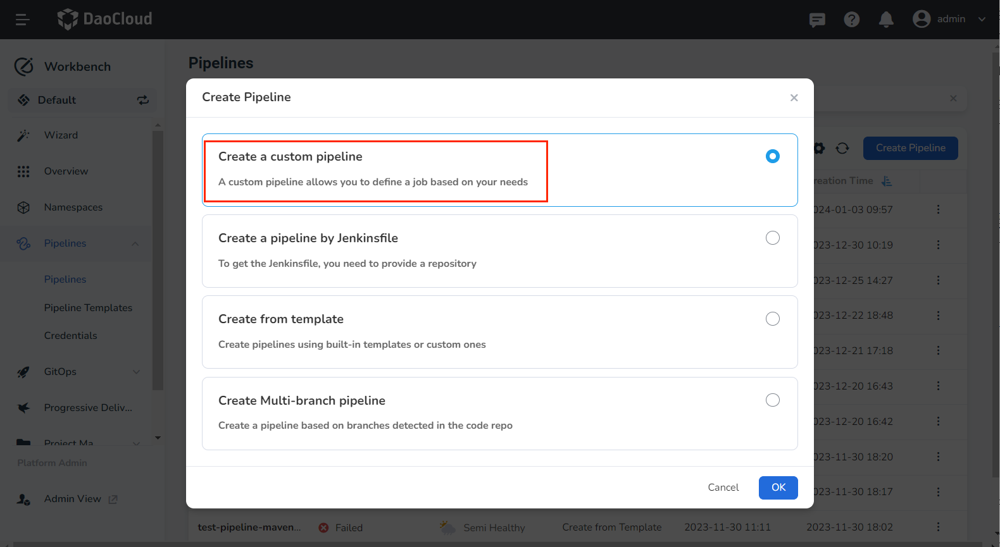
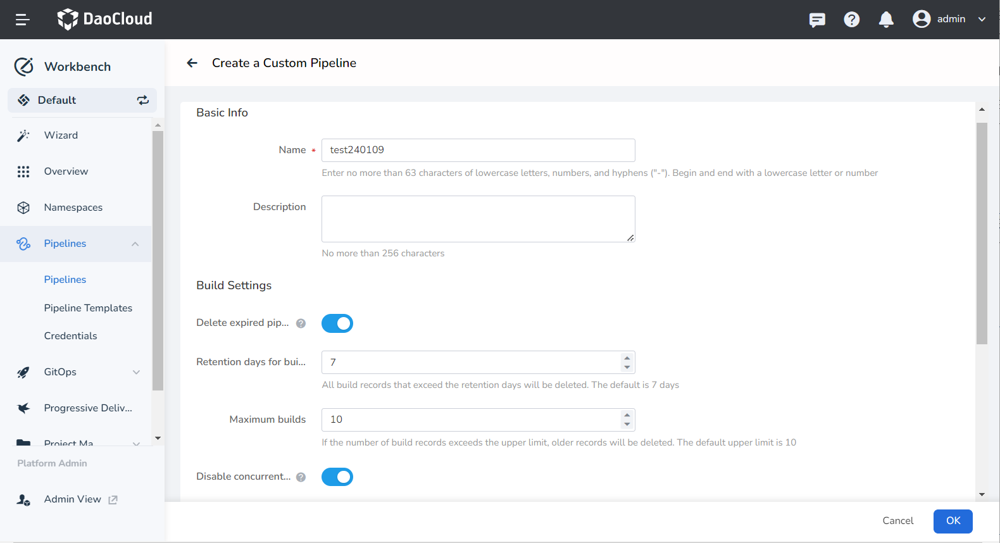
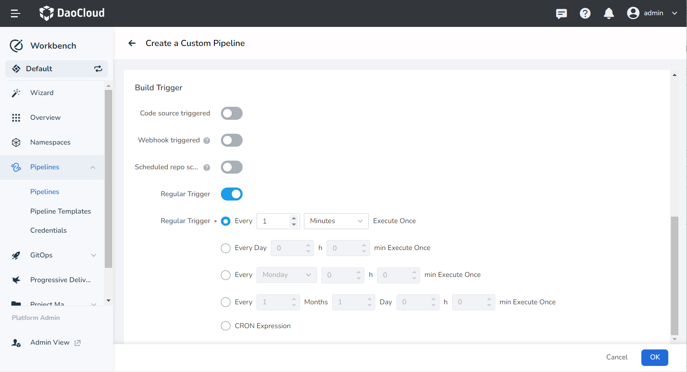
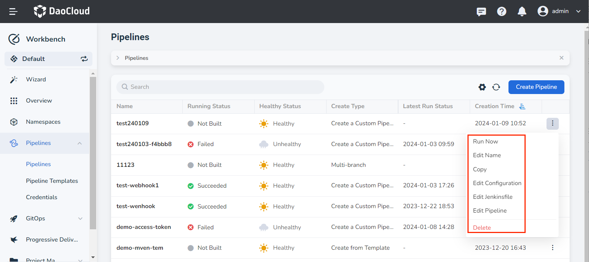

# Create a Custom Pipeline

The Workbench pipeline supports custom creation, allowing you to visually arrange the pipeline using the created pipeline.

## prerequisites

- [Create a Workspace](../../../../ghippo/user-guide/workspace/workspace.md) and [Create a User](../../../../ghippo/user-guide/access-control/user.md).
- Add the user to the workspace and assign them the __workspace editor__ role or higher.

## Procedure

Follow these steps to create a custom pipeline:

1. Click __Create Pipeline__ on the pipeline list page.

    

2. In the pop-up dialog box, select __Create a Custom Pipeline__ and click __OK__.

    

3. Fill in the __Basic Info__, __Build Settings__, and __Build Parameters__ sections as per the instructions below:

    - Name: Enter a unique name for the pipeline under the same workspace.
    - Delete expired pipelines: Enable this to delete previous build records and save disk space used by Jenkins.

        - Retention days for builds: Specify the number of days to retain build records (default is 7 days). Build records older than the specified number of days will be deleted.
        - Maximum builds: Specify the maximum number of build records to keep (default is 10). When the number of records exceeds this limit, the oldest records are deleted first.
        - Both the __Retention days__ and __Maximum builds__ rules apply concurrently. Records will be deleted if either condition is met.

    - Disable concurrent builds: Enable this to ensure that only one pipeline build task can be executed at a time.
    - Build Parameters: Pass in one or more build parameters when initiating the pipeline run. Five default parameter types are provided: __Boolean__, __String__, __Multiline String__, __Options__, __Password__, and __Upload files__.
    - After adding build parameters, you need to provide a corresponding value for each build parameter when running the pipeline.

    

4. Fill in the trigger parameters as per the instructions below:

    - Code source triggered: Enable this to allow the system to periodically scan the specific branch in the repository used to build the pipeline, according to the __Regular Repo Scan__. The pipeline will be re-run if an update is detected.
    - Scheduled repo scanning: Enter a CRON expression to define the time interval for scanning repositories. **After entering the expression, the meaning of the current expression will be displayed at the bottom**. For detailed expression syntax rules, refer to [Cron Schedule Syntax](https://kubernetes.io/docs/concepts/workloads/controllers/cron-jobs/#cron-schedule-syntax).
    - Regular trigger: This triggers the build pipeline at specified intervals, regardless of whether the code repository has been updated.

    

5. Complete the creation. After confirming that all parameters are correctly entered, click the __OK__ button to finish creating the custom pipeline. You will then be automatically redirected to the pipeline list. Click __┇__ to the right of the list to perform various actions.

    

!!! warning

    - After creating a custom pipeline, you need to manually define the pipeline stages (i.e., edit the pipeline) before you can run the pipeline. If you define the process and run the pipeline directly, a __build failed__ error will occur.
    - If you [create a pipeline based on a template](template.md) or [create a pipeline based on a Jenkinsfile](jenkins.md), you can run it directly without manually editing the pipeline.

Next step: [Edit Pipeline](../edit.md){ .md-button .md-button--primary }
