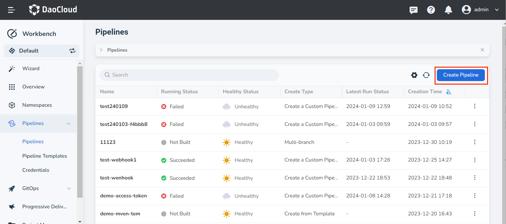
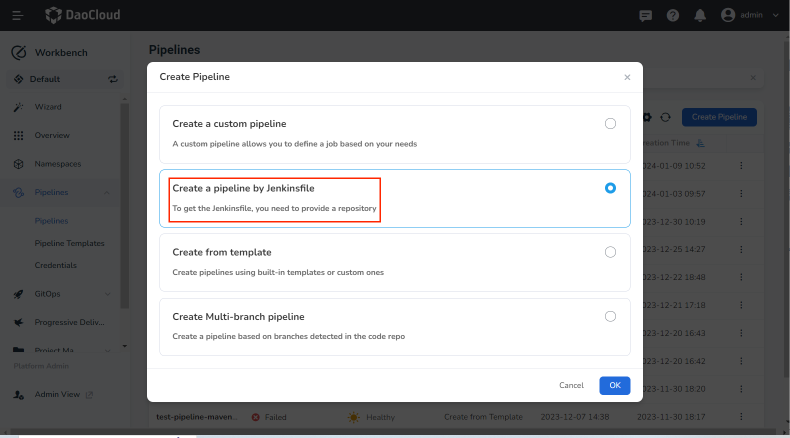
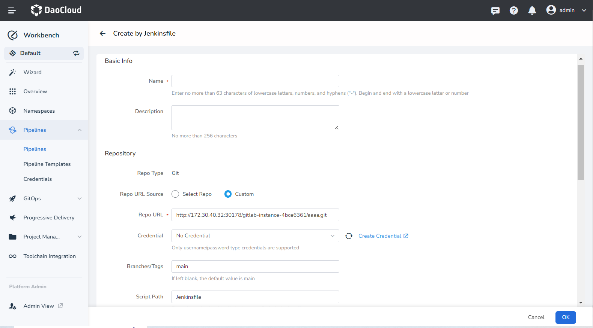
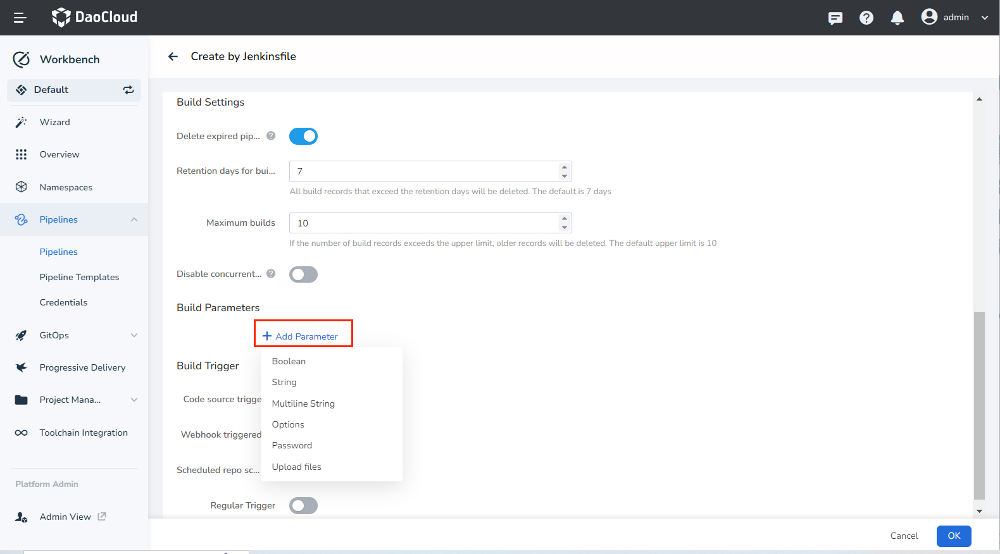
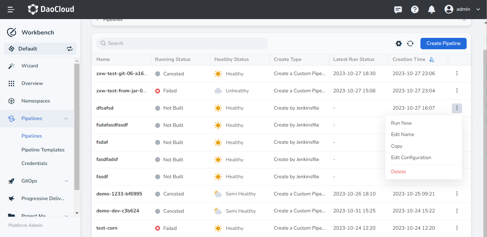

# Create a Pipeline by Jenkinsfile

Workbench Pipelines allows you to create pipelines by Jenkinsfile stored in a repository.

## Prerequisites

- [Creating a Workspace](../../../../ghippo/user-guide/workspace/workspace.md), [Creating a User](../../../../ghippo/user-guide/access-control/user.md).
- Add the user to the workspace with __workspace editor__ privileges or higher.
- Have a code repository that contains a Jenkinsfile.
- If using a private repository, you'll need to [create repository access credentials](../credential.md) beforehand.

## Steps

1. Click __Create Pipeline__ on the pipeline list page.

    

2. Choose __Create a pipeline by Jenkinsfile__ and click __OK__ .

    

3. Fill in the basic information and repository details as per the instructions below.

    - Name: the name of the pipeline. The pipeline name must be unique within the same workspace.
    - Repo URL: Provide the URL of the remote code repository.
    - Credential: For private repositories, you need to [create repository access credentials](../credential.md) in advance and select the credential here.
    - Branches: The branch of the code that the pipeline will be built from, by default the master branch is selected.
    - Script Path: The absolute path of the Jenkinsfile within the code repository.

    

4. Input the build settings and build parameters as per the instructions below.

    - Delete expired pipelines: Remove previous build records to conserve Jenkins disk space.

        - Retention days for builds: Define how many days of build records are to be kept. The default value is 7 days, meaning that build records older than seven days will be removed.
        - Maximum builds: Set a maximum limit for the number of build records to be kept. The default value is 10. When there are more than 10 records, the oldest ones get deleted first.
        - Both __Retention days__ and __Maximum builds__ rules apply simultaneously. Records are deleted as soon as either condition is met.

    - Disable concurrent builds: When this option is enabled, only one pipeline build task can be executed at a time.
    - Build Parameters: Input one or more build parameters when initiating the pipeline. Five default parameter types are provided: __Boolean__, __String__, __Multiline String__, __Options__, __Password__, and __Upload files__.
    - After adding build parameters, you'll need to provide the corresponding value for each parameter when running the pipeline.

    

5. Set up the build trigger as per the instructions below.

    - Code source triggered: When this option is enabled, the system will periodically scan the specific branch in the code repository used for the pipeline build according to the __Regular Repo Scan__ , and rerun the pipeline if there are any updates.
    - Scheduled repository scanning: Input a CRON expression to define the time intervals for scanning the repository. **After entering the expression, its meaning will be displayed at the bottom**. For detailed syntax rules of the expression, refer to [Cron Schedule Syntax](https://kubernetes.io/docs/concepts/workloads/controllers/cron-jobs/#cron-schedule-syntax).
    - Scheduled trigger: This will trigger the pipeline build at the specified time, regardless of whether the code repository has been updated or not.

    

6. Complete the creation. After ensuring all parameters are filled in, click the __OK__ button to finalize the creation of the custom pipeline. You'll be automatically redirected to the pipeline list. Click __┇__ to the right of the list to perform various actions.

    
