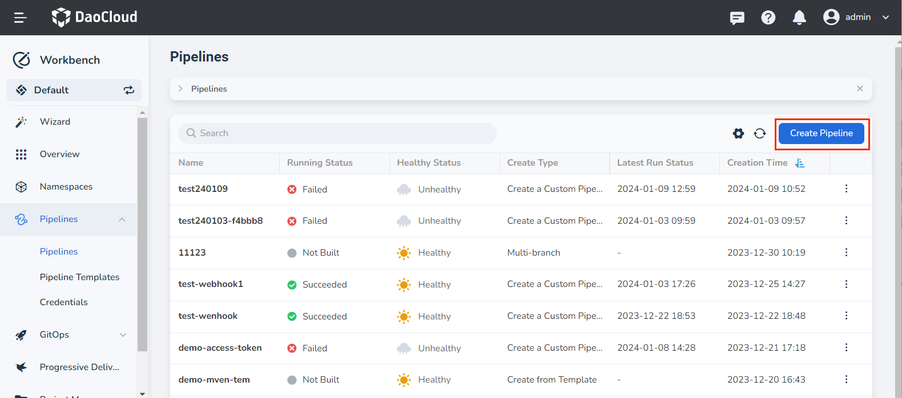
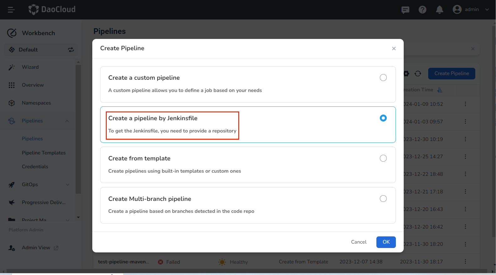
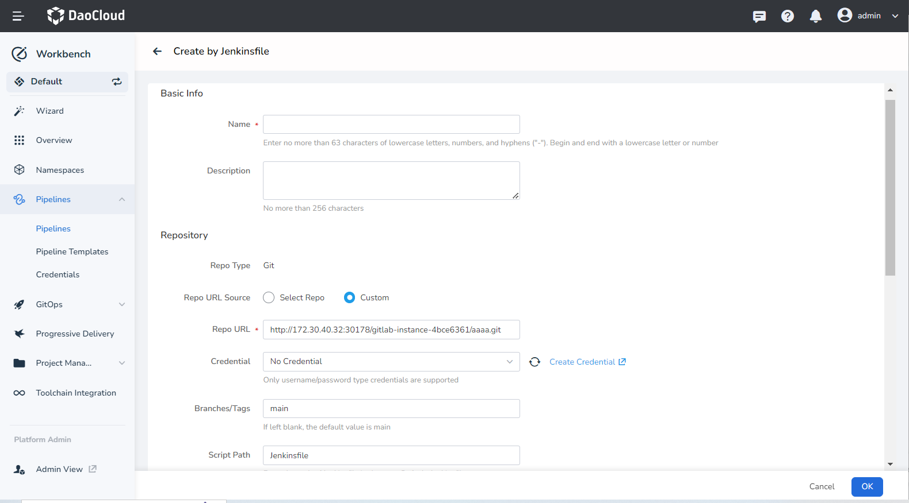
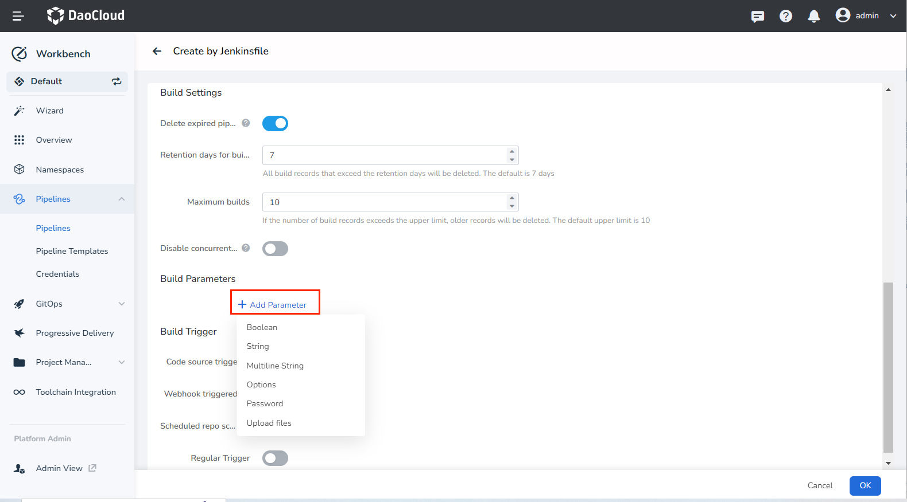
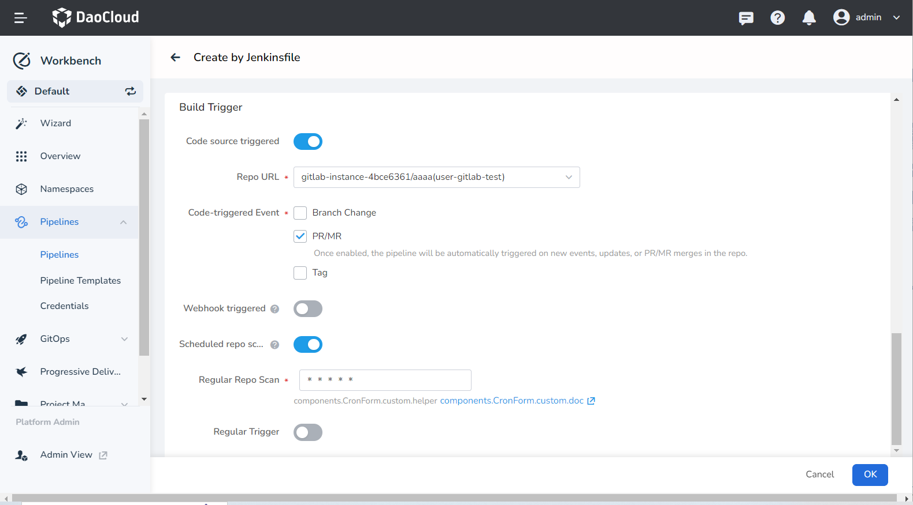
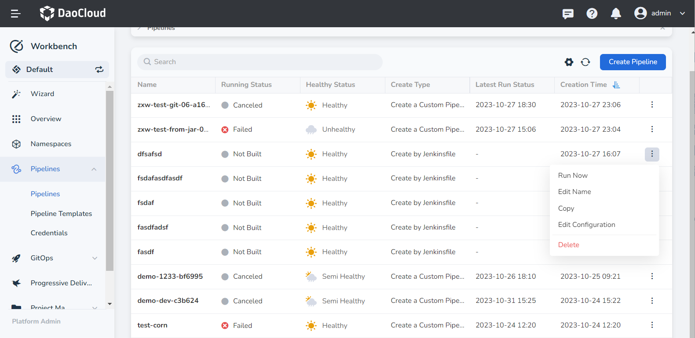

# Create a Pipeline by Jenkinsfile

Workbench pipelines support creating pipelines using a Jenkinsfile in a code repository.

__Prerequisites__

- [Create a Workspace](../../../../ghippo/user-guide/workspace/workspace.md), [Create a User](../../../../ghippo/user-guide/access-control/user.md).
- Add the user to the workspace and assign the __workspace editor__ role or higher.
- Provide a code repository, and the source code in the repository has a Jenkinsfile text file.
- If it is a private repository, you need to [create repository access credentials](../credential.md) in advance.

__The steps are as follows:__

1. On the pipeline list page, click __Create Pipeline__.

    

2. Select __Create a pipeline by Jenkinsfile__ and click __OK__.

    

3. Fill in the parameters.

    - Basic Information
        - Name: the name of the pipeline. The pipeline name must be unique within the same workspace
        - Group: you can create and manage groups by yourself
    - Code Repository
        - Code Repository Address: provide the address of the remote code repository
        - Credentials: for a private repository, you need to [create repository access credentials](../credential.md) in advance and select the credential here
        - Branch: the branch of the code that the pipeline will be built from, by default the master branch
        - Script Path: the absolute path of the Jenkinsfile in the code repository

    

    - Build Settings
        - Delete expired pipeline records: deletes previous build records to save the disk space used by Jenkins.

            - Build record retention period: the maximum number of days to keep build records. The default value is 7 days, meaning that build records older than seven days will be deleted.
            - Maximum number of build records: the maximum number of build records to keep. The default value is 10, meaning that at most 10 records are kept. When there are more than 10 records, the oldest ones are deleted first.
            - The __Retention period__ and __Maximum number__ rules take effect at the same time. Records start to be deleted as soon as either one is met.

        - Disable concurrent builds: when this option is enabled, only one pipeline build task can be executed at a time.
    
    
    
    - Build Parameters: pass in one or more build parameters when starting to run the pipeline. Five parameter types are provided by default:
      __Boolean__, __String__, __Multiline String__, __Options__, __Password__, __Upload File__
    - Build Trigger:

        - Code source trigger: when this option is enabled, the system will periodically scan the specific branch used for the pipeline build in the code repository according to the __Regular Repository Scan__. If there are updates, the pipeline will be rerun.
        - Webhook trigger: copy the default Webhook address and let an external system trigger the run of the current pipeline through the Webhook
        - Scheduled repository scan: enter a CRON expression to define the time period for scanning the repository. __After entering the expression, the meaning of the current expression will be prompted below__. For detailed syntax rules of the expression, refer to [Cron Schedule Syntax](https://kubernetes.io/docs/concepts/workloads/controllers/cron-jobs/#cron-schedule-syntax).
        - Scheduled trigger: triggers the pipeline build at a scheduled time. Regardless of whether the code repository has been updated, the pipeline will be rerun at the specified time.

    

4. Complete the creation. After confirming that all parameters have been entered, click the __OK__ button to complete the creation of the custom pipeline. You will be automatically returned to the pipeline list. Click __┇__ on the right of the list to perform various actions.

    
