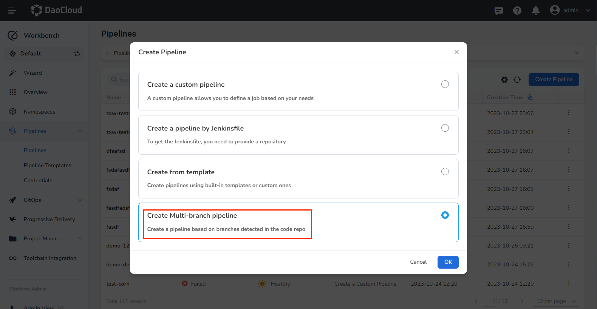
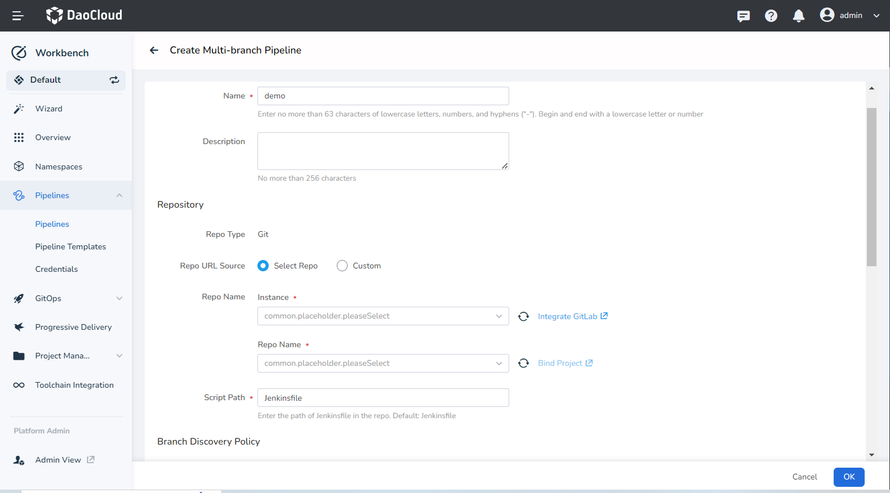
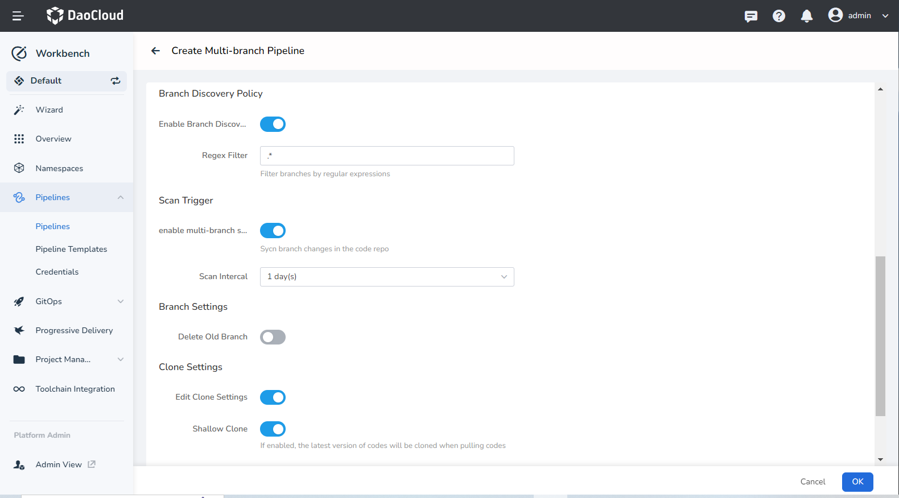
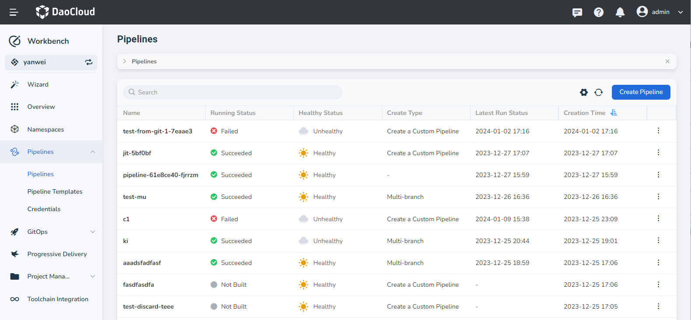
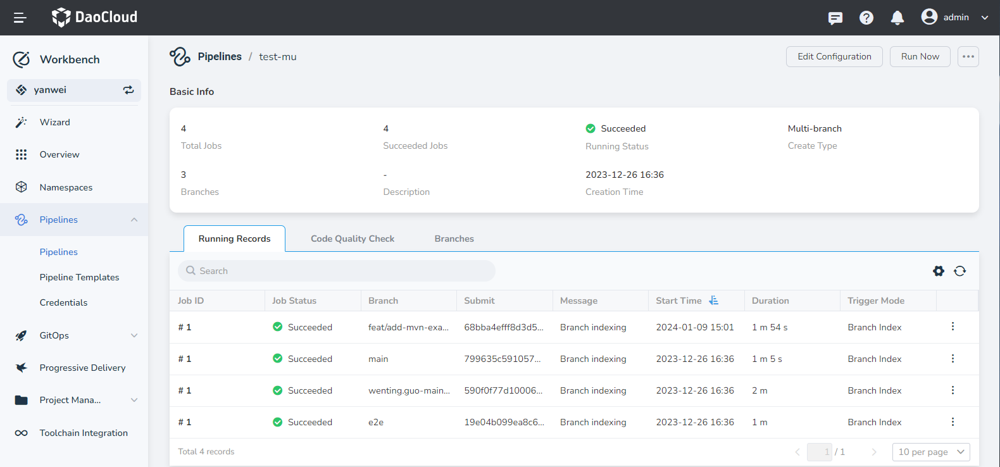
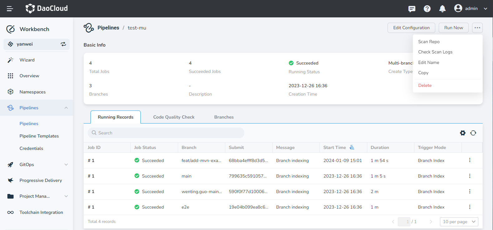
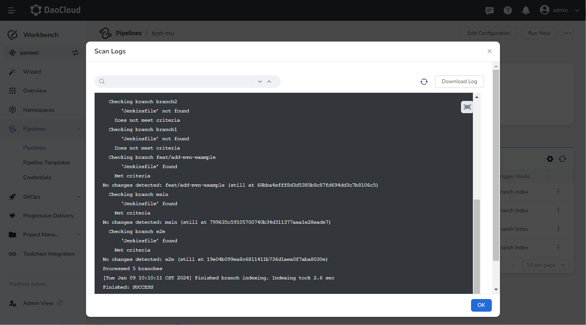
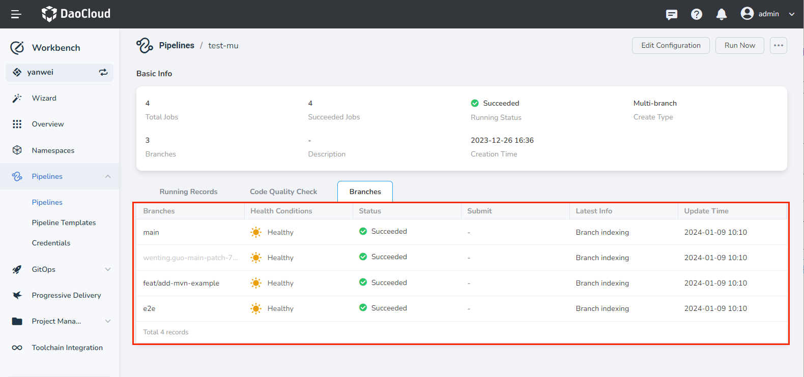

# Creating a Multi-branch Pipeline

Workbench supports the creation of multi-branch pipelines based on code repositories.

## Prerequisites

- [Create a Workspace](../../../../ghippo/user-guide/workspace/workspace.md) and [Create a User](../../../../ghippo/user-guide/access-control/user.md).
- Add the user to the workspace with __workspace editor__ privileges or higher.
- Have a code repository with multiple branches, each containing a Jenkinsfile.
- If using a private repository, you'll need to [create credentials](../credential.md) beforehand.

## Steps

1. Click __Create Pipeline__ on the pipeline list page.

2. Select __Create multi-branch pipeline__ and click __OK__ .

    

3. Fill in the basic information and repository details as per the instructions below.

    - Name: the name of the pipeline. The pipeline name must be unique within the same workspace.
    - Description: A user-defined description of the current pipeline.
    - Repo URL: Provide the URL of the remote code repository.
    - Credential: For private repositories, you need to [create repository access credentials](../credential.md) beforehand and select them here.
    - Script Path: The absolute path of the Jenkinsfile within the code repository.

    

4. Set up the branch discovery policy, scan trigger, branch settings, and clone settings as per the instructions below.

    - Enable Branch Discovery: the default value is __.*__ , and branches are filtered using regular expressions.
    - Enable Multi-branch Scan: When this option is enabled, any branch changes in the code repository will be synchronized.
    - Scan Interval: The code repository is scanned at preset intervals to check for updates.
    - Delete Old Branch: When enabled, old branches and pipelines are deleted as per the policy.
    - Branch Alive Days: Defines the number of days to keep the old branch and its pipeline, after which they are deleted.
    - Max Branches: Sets the number of old branches and pipelines to be retained.
    - Shallow Clone: When enabled, only the latest version of the code repository is pulled. Set the clone depth (default is 1) to speed up the pull process.
    - Clone Timeout: The maximum wait time when pulling code.

    

5. Complete the creation. After ensuring all parameters are filled in, click the __OK__ button to finalize the creation of the multi-branch pipeline. You'll be automatically redirected to the pipeline list.

    

6. After creation, the pipelines corresponding to the branches that meet the conditions will be automatically triggered.

    

## Additional Operations

### Scan Repository

The __Scan Repo__ function is used to manually trigger the discovery of new branches in the code repository.

### View Scan Log

Displays the log of the branches found during the latest scan of the code repository.

### View Branches

Displays the branch information obtained according to the branch discovery policy. A branch in the __disabled__ state signifies that the latest scan results do not conform to the branch discovery strategy.

