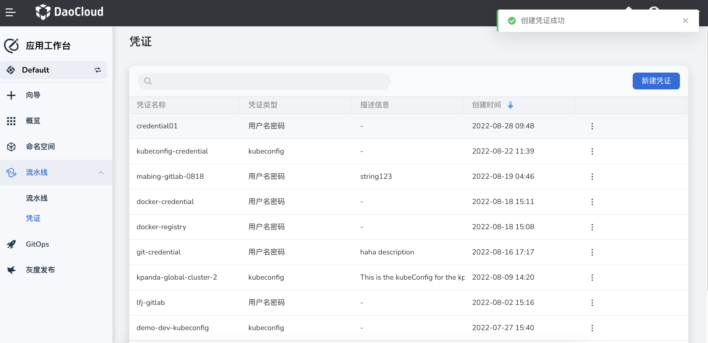

# Credential Management

Credentials can store sensitive information such as usernames, passwords, access tokens (Secret text),
Kubeconfig, etc., making the stored data more secure, flexible, and preventing exposure in images.
When running pipelines, there is often a need to interact with third-party websites or applications,
such as Git repositories and image registries. During this process, corresponding credentials need
to be provided. Therefore, users are required to configure credentials for pipelines. Once configured,
these credentials can be used to interact with third-party websites or applications.

Currently, you can create the following three types of credentials in the Workbench:

- **Username and Password**: This type is used to store authentication information for
  username and password. If the third-party website or application supports authentication
  through username/password, you can choose this type. Examples include GitHub, GitLab,
  and Docker Hub accounts.

- **Access Token**: This type is used to store tokens like API tokens
  (e.g., GitHub personal access token).

- **Kubeconfig**: This type is used to configure cross-cluster authentication.

The specific steps to create and manage credentials are as follows:

1. On the left navigation bar, click __Pipelines__ -> __Credentials__ to go to
   the Credentials list. Click __Create Credential__ in the top right corner.

    

2. In the __Create Credential__ page, configure the relevant parameters and click __OK__ .

    

    - Fill in the __Name__ and set the ID that can be used in pipelines,
      for example, __dockerhub-id__ . Note: Once set, it cannot be changed.
    - In the __Type__ field, select the type of credential you want to add.
    - Fill in the corresponding fields based on the credential type:

        - Username and Password: Specify the __Username__ and __Password__ for the credential in the respective fields.
        - Access Token (Secret text): Copy the encrypted text into the __Token__ field.
        - Kubeconfig: Copy the cluster certificate into the __Kubeconfig__ field.

3. Upon successful creation, a screen prompt will appear, and the newly created credential
   will be placed at the top by default.

    

4. Click the __┇__ on the right side of the list to choose options such as editing or
   deleting from the pop-up menu.

    !!! warning

        If you delete a credential that is currently being used by a pipeline,
        it may affect the pipeline's access. Please proceed with caution.
