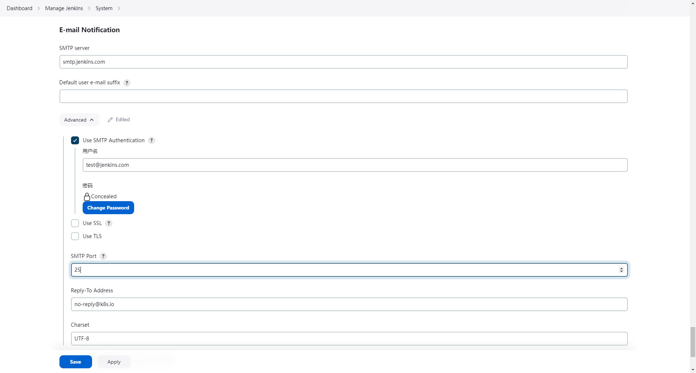
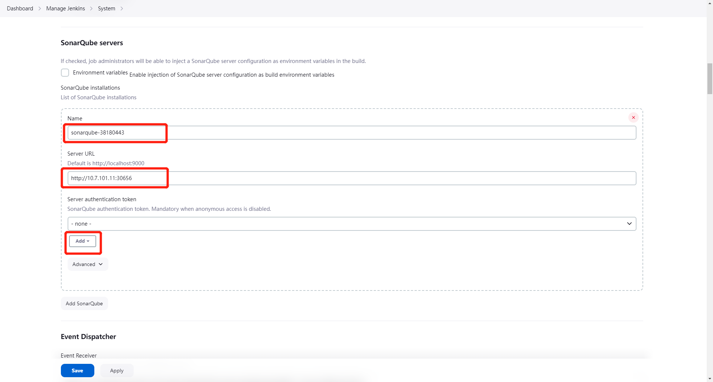
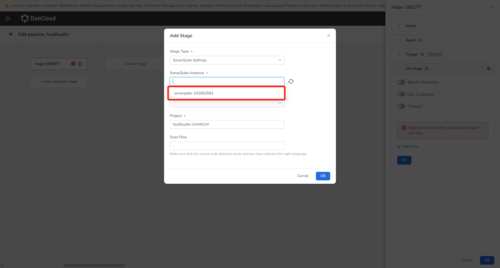

# Installing Jenkins

## Prerequisites

- Before installing Jenkins, make sure there is a default storage class in the cluster where Jenkins will be installed.
- Please ensure that it is installed in the __amamba-system__ namespace.
- If installing on a global service cluster, make sure to have an instance of __amamba-jenkins__ in the __Container Management__ -> __Helm Applications__, under the __amamba-system__ namespace.

## Getting Started with Installation

1. Go to the __Container Management__ module and find the cluster where you want to install Jenkins in the __Cluster List__. Click the name of that cluster.

    !!! note

        Select the cluster for Jenkins based on your actual situation. Currently, it is not recommended to deploy it on the global service cluster as executing pipelines in Jenkins with high concurrency can consume a significant amount of resources and may cause the global service cluster to become unresponsive.

    

2. In the left navigation bar, select __Helm Applications__ -> __Helm Templates__, and find and click __Jenkins__.

    

3. In the __Version Selection__, choose the desired version of Jenkins to install, and click __Install__.

    

4. On the installation page, fill in the required installation parameters, and finally click the __OK__ button at the bottom right.

    

    Here are some important parameters' explanation. Updates them according to your actual business needs.

    | Parameter  | Description     |
    | ---------- | --------------- |
    | ContainerRuntime  | Select a runtime like podman or docker   |
    | AdminUser  | Username for Jenkins   |
    | AdminPassword     | Password for Jenkins   |
    | Deploy.JenkinsHost      | Host address to Jenkins web service. If using Node Port, the access address will be: http://{cluster address:port} |
    | JavaOpts   | Specify JVM startup parameters for running Jenkins      |
    | ServiceType | Default is ClusterIP, supports ClusterIP, NodePort, LoadBalancer |
    | ServicePort | Service access port    |
    | NodePort   | Required if ServiceType=NodePort, range: 30000-32767    |
    | resources.requests      | Resource requests for Jenkins |
    | resources.limits  | Resource limits for Jenkins   |
    | image.registry    | Jenkins image registry   |
    | eventProxy.enabled      | EventProxy is a sidecar to provide a reliable connection to Amamba APIServer, enables it especially when Jenkins was deployed to a cluster which does not in the same zone with global-cluster.  |
    | eventProxy.image.registry            | Registry for image eventProxy.  Required if  enabled=true       |
    | eventProxy.configMap.eventProxy.host  | Host to webhook address. Uses the portal address if Jenkins was deployed to a Worker cluster.  Required if enabled=true |
    | eventProxy.configMap.eventProxy.proto | Protocol to webhook address, `http` by default.  Required if enabled=true      |
    | eventProxy.configMap.eventProxy.webhookUrl | Path to webhook address, `/apis/internel.amamba.io/devops/pipeline/v1alpha1/webhooks/jenkins` by default.  |
    | eventProxy.configMap.eventProxy.token | Token to access DCE, refer [Global Access Key Document](../../../ghippo/user-guide/personal-center/accesstoken.md) for token acquisition Required if enabled=true |

5. Go to Helm Applications to check the deployment result.

    

## Integrating Jenkins

Note: Currently, only integration with Jenkins installed via the DCE 5.0 platform is supported.

1. Log in to DCE 5.0 with a user who has the role of an Workbench Administrator and go to the Workbench.

    

2. On the left navigation bar under Platform Management, click __Toolchain Integration__ and then click the __Integrate__ button in the upper right corner.

    

3. Select the toolchain type as __Jenkins__, fill in the integration name, Jenkins address, username, and password.
   If the Jenkins address is using the HTTPS protocol, provide the certificate. By default, the account/password for Jenkins deployed through Helm is __admin/Admin01__.

    

4. After the integration is complete, a record will be successfully generated on the __Toolchain List__ page.

5. Now you can proceed to create pipelines in the workspace. [Create a pipeline](create/custom.md).

## Integration Considerations

If Jenkins was integrated without Cluster and Namespace given, it will cause the Application Workbench to be unable to update the configuration of the Jenkins instance, leading to the following two issues:

- In the pipeline __Notification__ step, when configuring the mail server address in Global Management -> Platform Settings -> Email Server Settings, the configuration cannot be updated in Jenkins.
- In the pipeline __SonarQube Configuration__ step, after integrating the SonarQube instance into the toolchain and binding it to the current workspace, using that instance will not work.

To address these issues, you need to go to the Jenkins backend for relevant configurations.

### Configuring Email Notifications in the Jenkins Backend for the Notification Step

1. Go to the Jenkins backend, click on Manage Jenkins -> Configure System, and then scroll down to the __Email Notification__ section.

2. Fill in the relevant parameters. The parameter descriptions are as follows:

   - SMTP Server: The address of the SMTP server that provides email services.
   - Use SMTP Authentication: Choose according to your requirements. It is recommended to enable SMTP authentication.
   - Username: The name of the SMTP user.
   - Password: The password of the SMTP user.
   - SMTP Port: The port used to send emails. If left blank, the default protocol port will be used.

    !!! note

        To configure the sender's email address, click on the top-right user icon -> Settings, and then scroll down to __Email Address__.

    

### Configuring SonarQube Server Address in the Jenkins Backend for the SonarQube Configuration Step

1. Go to the Jenkins backend, click on Manage Jenkins -> Configure System, and then scroll down to __SonarQube servers__. Click on __Add SonarQube__.

2. Fill in the relevant parameters. The parameter descriptions are as follows:

    - Name: Assign a name to the SonarQube server configuration. The value will be required in the SonarQube Configuration step of the Application Workbench pipeline.
    - Server URL: The URL of the SonarQube server.
    - Server authentication token: The authentication token for the SonarQube server. You can generate a token in the SonarQube console.

    

    !!! note

        If a SornarQube instance was already integrated and the Jenkins instance was updated with a new one, in this case, you should make sure the name was set exactly same with the SonarQube name. Which should be noted that Name is not the name entered during integration, instead, it is obtained in the SonarQube configuration step of the pipeline.

    