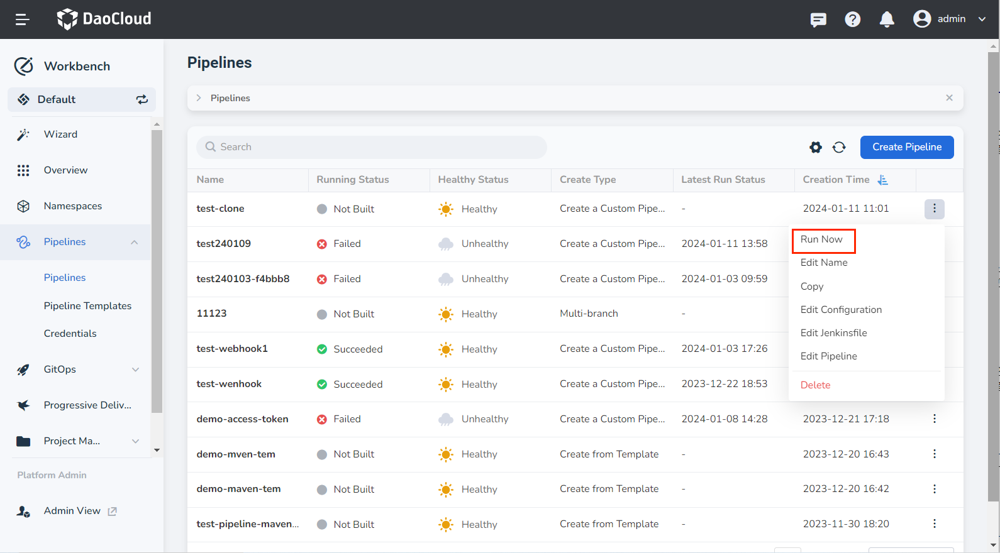
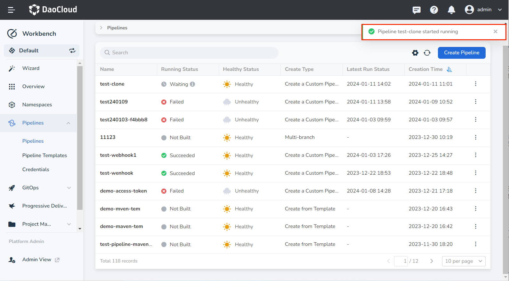
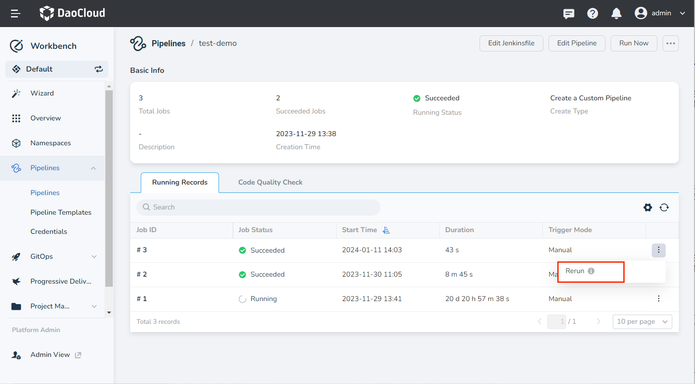
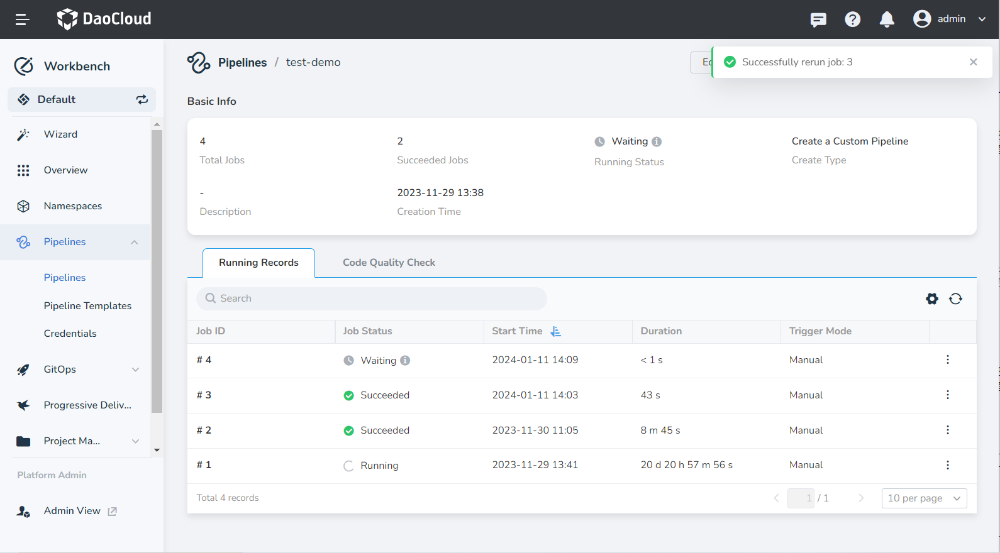
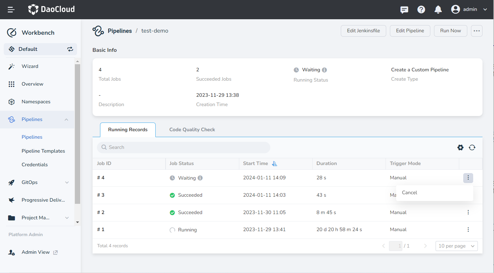
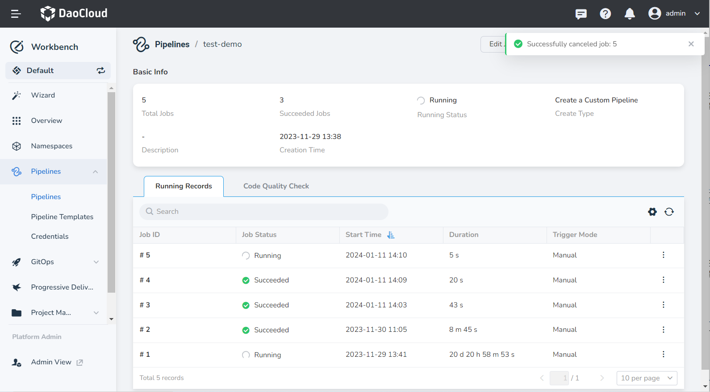

# Manual Trigger Pipelines

This page describes manual pipeline execution on the GUI, including immediate running, rerun, and cancel running.

## Run the pipeline immediately

1. Select a pipeline on the pipeline list page, click __┇__ , and click __Run Now__ in the pop-up menu.

   

2. Depending on whether the pipeline is configured with __Build Parameters__ , the following two situations will occur after running:

   - If __Build Parameters__ is configured, a dialog box will appear and display relevant content for parameter configuration.

   - If no __Build Parameters__ is configured, the pipeline executes immediately.

3. The pipeline starts running.

   

## Rerun a pipeline

On the pipeline details page, you can __Rerun__ a pipeline that has been executed before based on the job ID in the pipeline running records.

1. In the pipeline list, click the name of a certain pipeline to enter the pipeline details page.

2. In the __Running Records__ area, find the __Job ID__ that needs to be rerun.

3. Click __┇__ on the right, and click __Rerun__ in the pop-up menu.

   

4. The pipeline reruns successfully.

   

## Cancel running the pipeline

On the pipeline details page, according to the __Job ID__ in the pipeline running record, you can __Cancel__ the executing pipeline.

1. In the pipeline list, click the name of a certain pipeline to enter the pipeline details page.

2. In the __Running Records__ area, find the __Job ID__ that needs to be canceled.

3. Click __┇__ on the right, and click __Cancel__ in the pop-up menu (applicable to pipelines whose status is __Running__ ).

   

4. The pipeline is canceled successfully.

   
