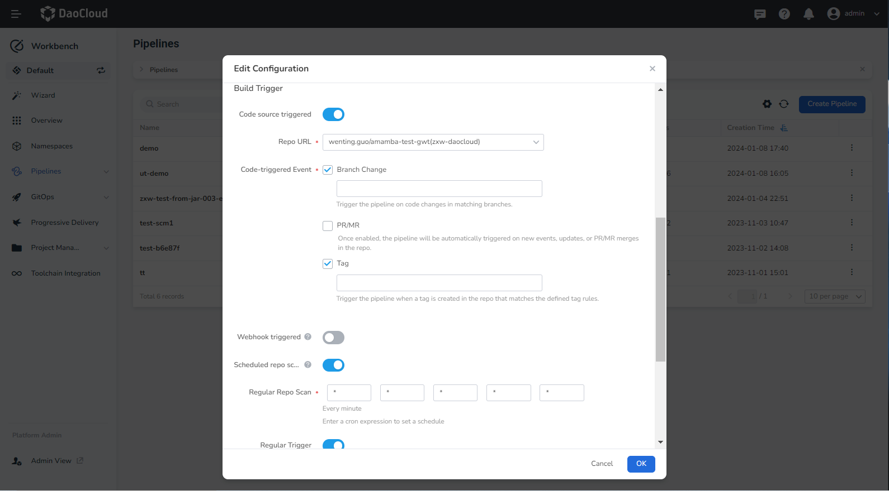

# Auto Trigger Pipelines

You can configure triggers for your pipelines to automatically trigger them periodically. Click __Edit Configuration__ when editing a pipeline to set up a build trigger.

__Currently, the following types of triggers are supported:__

- Code source trigger
- Webhook trigger
- Regular repository scan
- Scheduled trigger

| Trigger Type   | Description                                                         |
| ------------ | ------------------------------------------------------------ |
| Code Source Trigger | Choose the code repository integrated with your toolchain and configure corresponding trigger events. The pipeline will be triggered based on these events. Once configured, Workbench will automatically configure the Webhook address into the integrated code repository. |
|Webhook Trigger|When the Webhook trigger is enabled, you will receive a Webhook address that you can use to trigger the pipeline through other systems.|
| Regular Repository Scan | Checks the code repository for changes at a specified time. For example, entering __H/15 * * * *__ means that the system will automatically check the code repository every 15 minutes for new changes. If there are new changes, the pipeline will be executed. |
| Scheduled Trigger   | Triggers the pipeline at a specified time. After enabling the scheduled trigger, you can directly select preset rules or choose to customize CRON expressions and enter custom trigger rules. |

## Trigger Types

### Code Source Trigger

Choose the code repository integrated with your toolchain (currently only integrated code repositories are supported), and configure corresponding trigger events. The pipeline will be triggered based on these events. Once configured, Workbench will automatically configure the Webhook address into the integrated code repository.

#### Prerequisites

- Integrate GitLab code repository into the current workspace

#### Trigger events

__Branch Change__

The pipeline is automatically triggered when the branch in the code repository matches the set branch and there are code changes in the current branch. Regular expressions are supported.

__PR/MR__

When enabled, the pipeline is automatically triggered when a new PR/MR is created, updated, or merged in the code repository.

__Tag__

When a Tag is created in the code repository, the pipeline is automatically triggered if it matches the set Tag rules. Regular expressions are supported.

### Webhook Trigger

When the Webhook trigger is enabled, you will receive a Webhook address that you can use to trigger the pipeline through other systems.

For example, below are the steps to trigger a pipeline using a Gitlab repository's Webhook.

1. Go to Gitlab, select and enter a repository detail.

2. Click __Settings__ -> __Webhooks__ .

3. In the __URL__ area, enter the address generated by enabling the Webhook. In the __Trigger__ area, select the trigger events based on actual conditions.

    

4. Click __Add webhook__. A record will be generated in the __Project Hooks__ area.

    

5. Click __Test__ to check if the trigger is successful.

### Regular Repository Scan

The system checks the code repository for changes at a specified time. For example, entering __H/15 * * * *__ means that the system will automatically check the code repository every 15 minutes for new changes. If there are new changes, the pipeline will be executed.

Refer to the Trigger Rules Syntax section for a guide on trigger syntax.

!!! note

    - For pipelines created __by Jenkinsfile__ , the system will automatically check the code repository at the specified time after enabling this feature.
    - For pipelines created through __custom creation__ or __template__, after enabling this feature, you need to define the __git clone__ step in the pipeline. Jenkins will check the filled git repository address. Please note that if the pipeline is triggered automatically after its first successful creation and enabling __Regular Repository Scan__, and the Jenkinsfile is empty at this time, the pipeline will fail to run. If we set the git clone step again without running the pipeline, the system will default to the failure of the pipeline and will not poll the repository. Therefore, we recommend that the Jenkinsfile should have data before enabling this feature.

### Scheduled Trigger

Triggers the pipeline at a specified time. After enabling the scheduled trigger, you can directly select preset rules or choose to customize CRON expressions and enter custom trigger rules.

Refer to the trigger rules section for a guide on trigger syntax.

## Trigger rules

Trigger rule syntax follows that of CRON (with a slight difference). Specifically, each line consists of 5 tab- or space-separated fields: __MINUTE HOUR DOM MONTH DOW__

| Field   | Description | Value Range                           |
| ------ | ---- | ----------------------------------- |
| MINUTE | Minute | 0 ~ 59                              |
| HOUR   | Hour | 0 ~ 23                              |
| DOM    | Day of Month   | 1 ~ 31                              |
| MONTH  | Month   | 1 ~ 12                              |
| DOW    | Day of Week | 1 ~ 6 represent Monday to Saturday, 0 and 7 represent Sunday |

To specify multiple values for a field, you can use the following operators in order of priority:

| Operator       | Description                                          |
| ------------ | --------------------------------------------- |
| *            | Represents all values within the value range                    |
| M-N          | Represents all values within a specified range                    |
| M-N/X or */X | Triggers every X within a specified range or within the entire valid range |
| A,B,...,Z    | Represents multiple values                                |

In order for regularly scheduled tasks to create an even load on the system, the symbol H (for "hash") should be used whenever possible.
For example, using __0 0 * * *__ for a dozen daily jobs will result in a large spike at midnight, possibly straining resources.
In contrast, using __H H * * *__ will still run each job once a day, but not all at once, which makes better use of limited resources.

H can be used with ranges. For example, __H H(0-7) * * *__ means some time between 00:00 and 7:59.

Due to the different number of days in different months, when a short period such as __/3__ or __H/3__ appears in __DOM__ , it will not be triggered at the end of most months.
For example, __*/3__ will trigger the task on the 1st, 4th, ..., 31st of each month. If there are 30 days in the next month, the last time the task is triggered is the 28th day.

Also, `@yearly`, `@annually`, `@monthly`, `@weekly`, `@daily`, `@midnight`, and `@hourly` are convenient aliases.
These use hashes for automatic matching. For example, `@hourly` is the same as __H * * * *__ and can represent any time within an hour.
`@midnight` represents a period of time between 0:00 and 2:59 every day.

**Examples**

| Rule                | Description                                                         |
| ------------------- | ----------------------------------------------------- |
| H/15 * * * *        | Triggers every 15 minutes, for example, at 07, 22, 37, and 52 minutes past every hour |
| H(0-29)/10 * * * *  | Triggers every 10 minutes in the first half of every hour, for example, at 04, 14, and 24 minutes past every hour |
| 45 9-16/2 * * 1-5   | Triggers at 45 minutes past every 2 hours from 9:45 AM to 3:45 PM on every weekday |
| H H(8-15)/2 * * 1-5 | Triggers at some point every 2 hours between 8 AM and 4 PM on every weekday, for example, at 9:38, 11:38, 13:38, and 15:38 |
| H H 1,15 1-11       | Triggers once a day on the 1st and 15th of each month, except for December |
