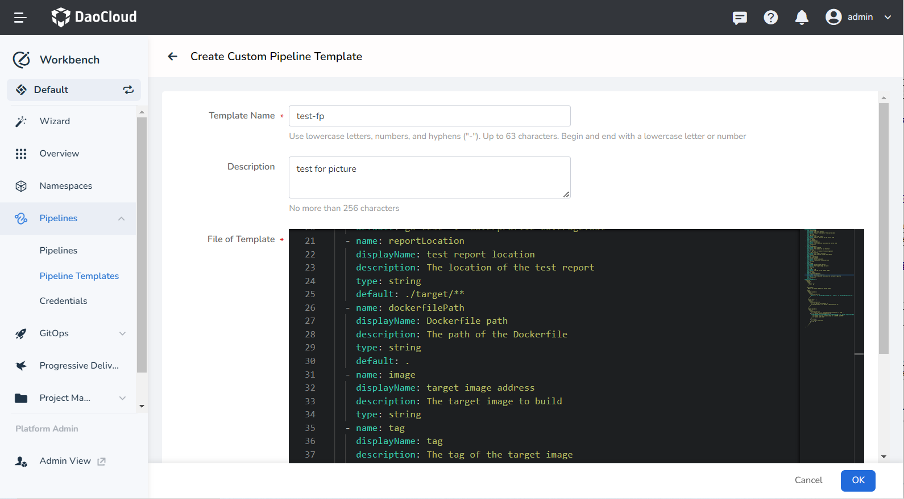
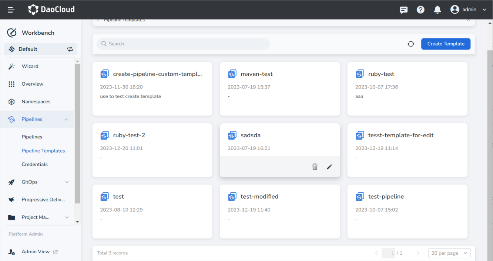

# Create a Custom Pipeline Template

Workbench supports custom pipeline templates. Users can create pipeline templates based on real business cases, and then quickly create pipelines that meet the requirements based on the custom templates.

## Prerequisites

- [Create Workspace](../../../../ghippo/user-guide/workspace/workspace.md) and [Create User](../../../../ghippo/user-guide/access-control/user.md).
- Add the user to the workspace with __workspace editor__ or higher privileges.
- Configure the [pipeline template file] (info.md).

### Steps

1. On the __Pipeline Templates__ page, click __Create Template__

    

2. Fill in the basic information with reference to the instructions below, and click __OK__ .

    - Template Name: fill in the name of the pipeline template.
    - Description: The description information of the current pipeline supports Chinese.
    - File of Template: Refer to [Pipeline Template File](info.md) to fill in or paste the parameters prepared in advance.

    

3. Return to the pipeline template list page, click the template card to delete or modify the template.

    
