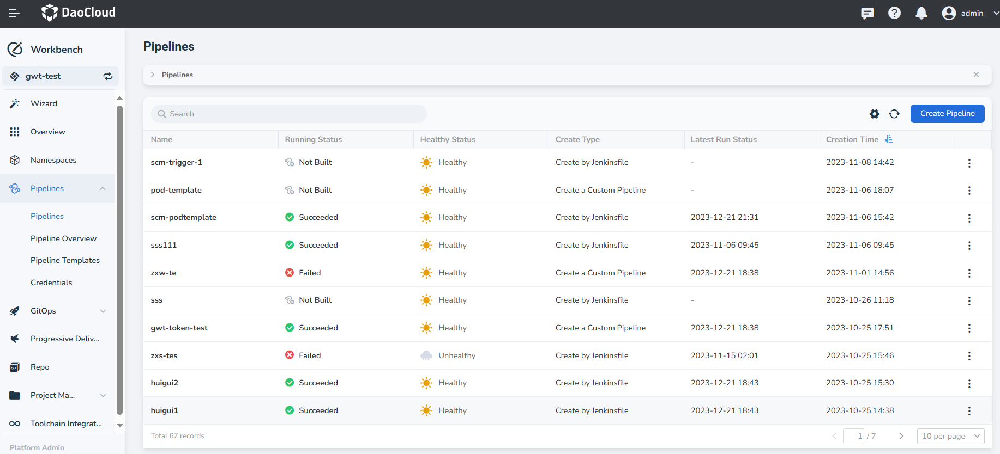
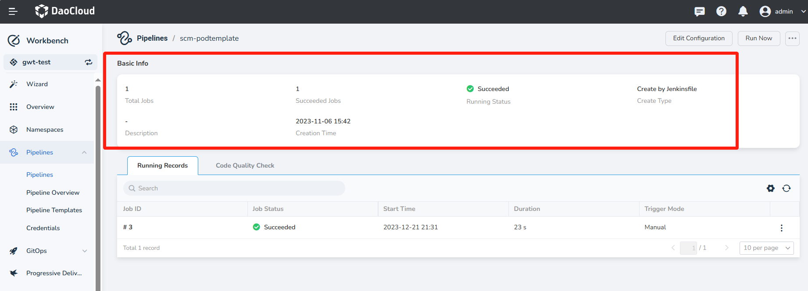
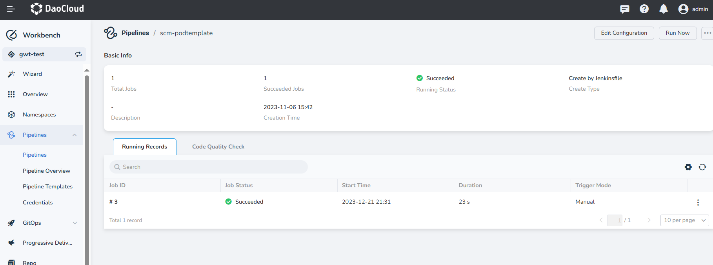

# View Pipeline Details

After creating a pipeline, you can view the details of the pipeline as needed or update the configuration. 
The pipeline details page includes the pipeline's run history and code quality scans.

On the __Workbench__ -> __Pipeline__ page, select a specific pipeline and click on the pipeline's name.

Upon entering the pipeline details page, you can view the basic information of the current pipeline.

- Total Jobs: Total number of times the pipeline has run
- Succeeded Jobs: Number of successful runs of the pipeline
- Running Status: Status of the latest run record of the pipeline
- Create Type: Method used to create the pipeline, including custom creation, multi-branch creation, 
  template creation, and creation based on a Jenkinsfile in the code repository
- Description: Specific description of the pipeline
- Creation Time: Time when the pipeline was created

View the list of running records which display the records of the current pipeline runs. It supports searching 
by ID and also allows for canceling and rerunning operations.

View the results of the code quality scan for the pipeline. To view the results, make sure to meet the following requirements:

- Ensure that the current workspace has integrated or bound a SonarQube instance
- The current pipeline has defined SonarQube configuration steps
- The pipeline has been successfully executed

After meeting the above requirements, you can view the scan results on the details page. Clicking on "View More" 
can redirect you to the SonarQube backend to view more detailed results, as shown in the following image:

<!-- Add image later -->
