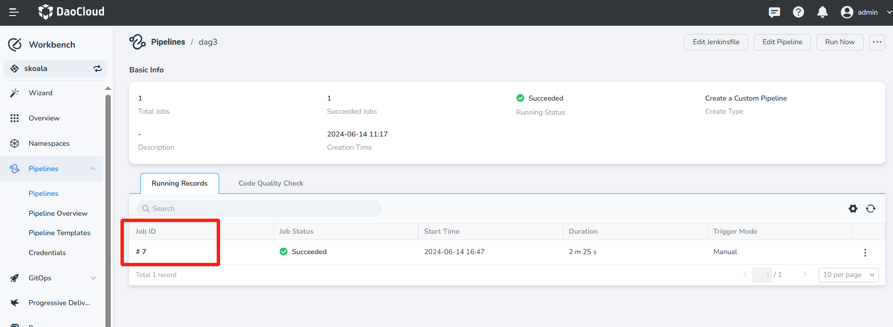
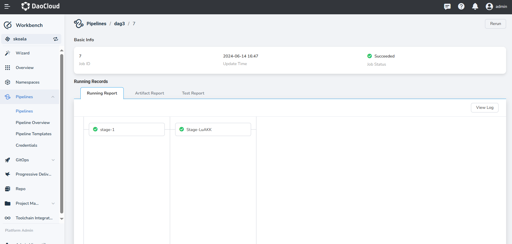
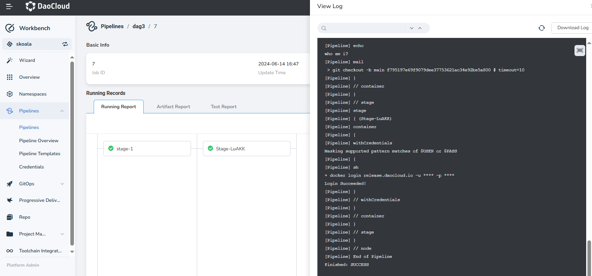
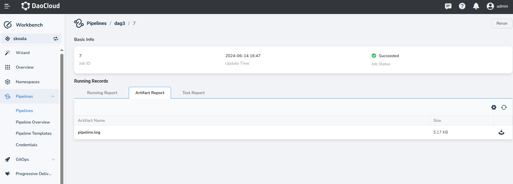

# View Pipeline Run Records

After creating and running a pipeline, you can view the details of its run records.

On the __Workbench__ -> __Pipeline__ -> enter the pipeline details page, select a specific pipeline run record, 
and click on the execution ID.

Upon entering the pipeline run record details page, you can view the basic information of the current pipeline run.

- Job ID: The ID of the current pipeline run record, consistent with the number of times the pipeline was executed.
- Duration: The time when the current pipeline run occurred.
- Job Status: The current status of the pipeline run, with the following main statuses:

| Status    | Description                                         |
| --------- | --------------------------------------------------- |
| Succeeded| Successfully executed all stages of the current pipeline |
| Failed    | Failed to run a stage in the pipeline                 |
| In Progress | Pipeline is currently running                        |
| In Queue  | Pipeline task has been dispatched and is waiting for container allocation to execute the pipeline task |
| Terminated| Manually terminated the current pipeline run          |

View the running report of the current pipeline record. Click on a specific step in the pipeline to view 
the execution log and runtime of that step, and also view all logs.

View the artifact report of the current pipeline record. When the pipeline defines a __Saving Artifact__ step 
and executes this step, the artifacts defined in the pipeline will be cached and available for download by users. 
The pipeline logs are typically saved as artifacts, as shown in the following image:

View the test report of the current pipeline record. If the pipeline fetches remote code and defines a __Collect Test Report__ step, executing this step will allow you to view the test report information on the current interface, as shown in the following image:

<!-- Add image later -->
