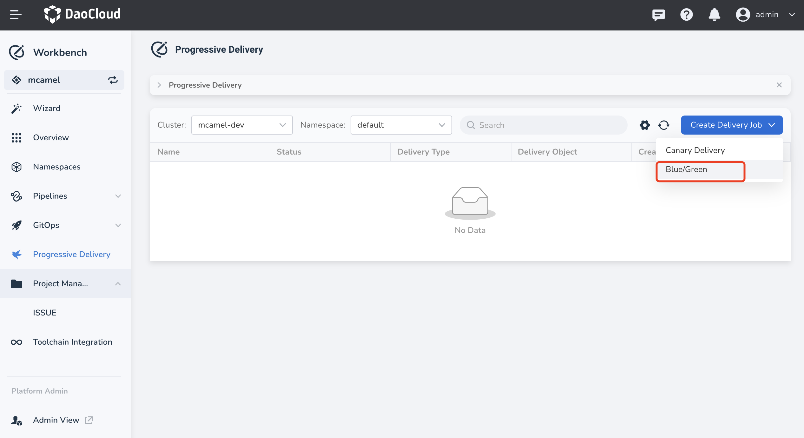
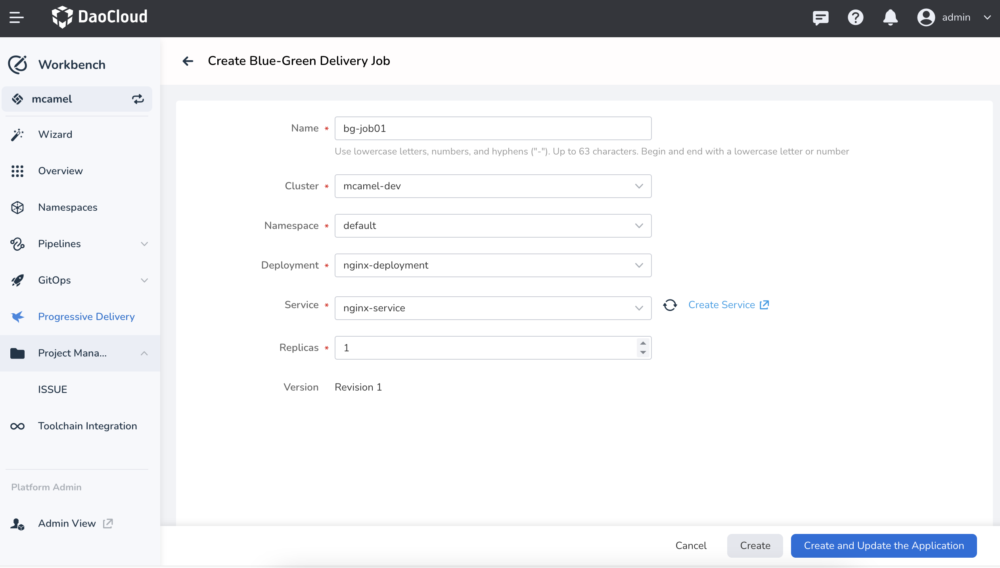

# Create Blue-Green Release Job

Blue-green deployment gradually migrates user traffic from the old version to the new version
through traffic control. At the same time, the old version remains online and standby. If any
exception occurs during this period, the traffic can be immediately switched back to the old
version, achieving a quick rollback.

## Prerequisites

- Create a [workspace](../../../ghippo/user-guide/workspace/workspace.md) and a
  [user](../../../ghippo/user-guide/access-control/user.md). The user needs to
  join the workspace and have the __Workspace Editor__ role.

- The cluster where the release object is located has installed the Argo Rollout component.
  For specific installation methods, refer to [Manage Helm Apps](../../../kpanda/user-guide/helm/helm-app.md).

## Steps

1. Go to the __Workbench__ module, click __Progressive Delivery__ in the left navigation bar,
   and then click __Create Delivery Job__ -> __Blue/Green__ in the upper right corner of the page.

    

2. Fill in the basic information according to the following requirements, and then click __Create__.

    - Name: Fill in the name of the release job. It can have a maximum length of 63 characters,
      and can only contain lowercase letters, numbers, and separators ("-"), and must start and
      end with a lowercase letter or number.
    - Cluster: Select the cluster where the release object is located. Make sure that Istio
      and Argo Rollout have been deployed in this cluster.
    - Namespace: Select the namespace where the release object is located.
    - Stateless workload: Select the specific release object.
    - Service: Select the service of the release object, which must be associated with the
      release object.

    

3. The system automatically redirects to the job list page for gradual release, showing a prompt
   of __Creation Successful__ and generating a record in the list.

    
