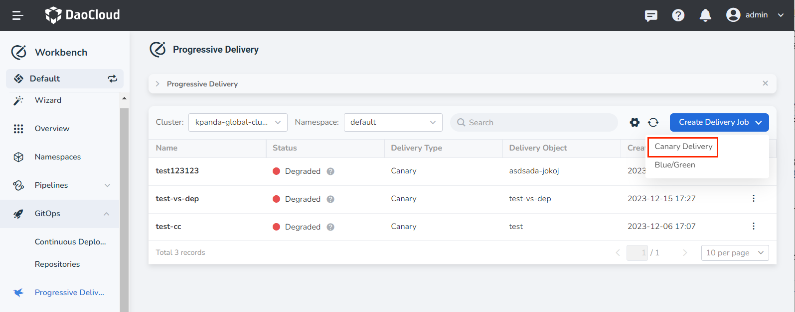
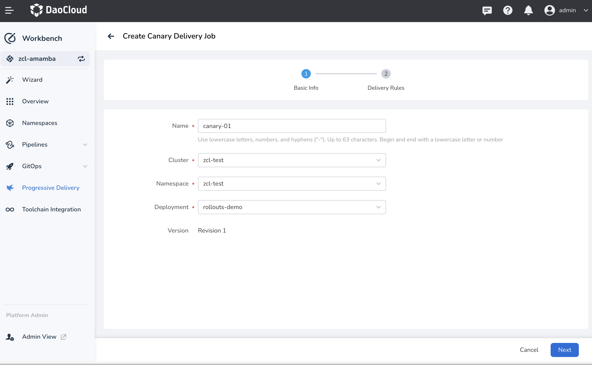
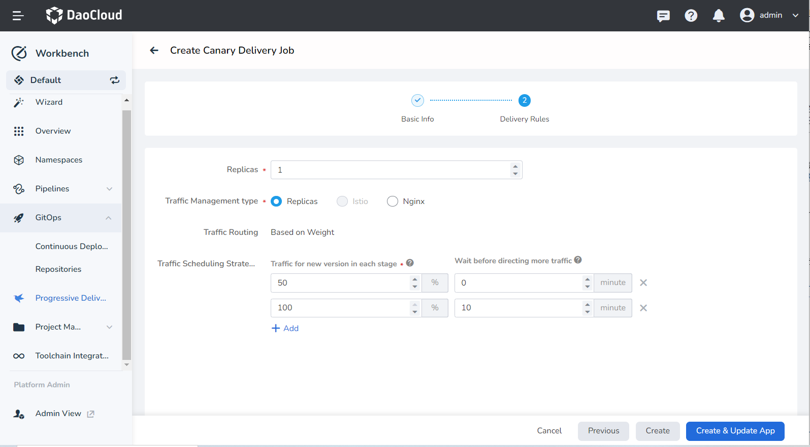
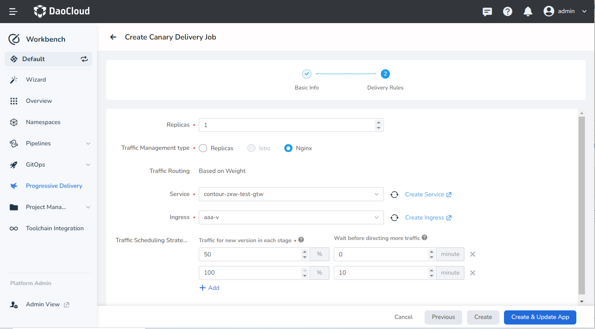
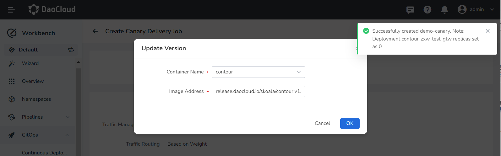
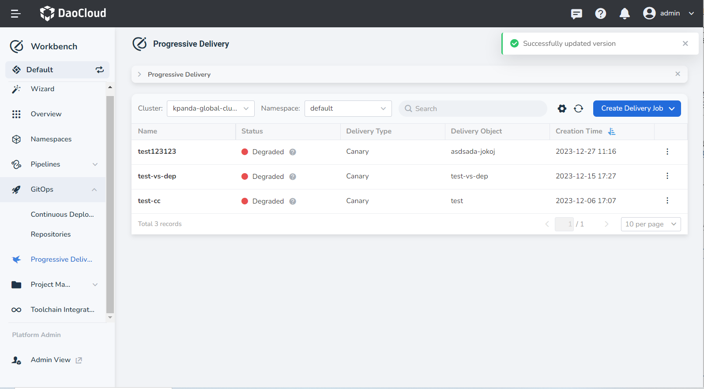

# Create a Canary Delivery Job

Workbench provides powerful canary delivery capabilities based on the open-source project [Argo Rollout](https://argoproj.github.io/argo-rollouts/). Canary delivery allows the deployment of new application versions without affecting the old versions. According to predefined rules, traffic is progressively switched to the new version. Once the new version runs without issues, all traffic is automatically migrated from the old version to the new version.

## Prerequisites

1. Create a [workspace](../../../ghippo/user-guide/workspace/workspace.md) and a [user](../../../ghippo/user-guide/access-control/user.md), the user needs to join the workspace and have the __Workspace Editor__ role.

- Create an application and enable __Canary Delivery__, refer to [Building Microservices Apps from Git Repo](../wizard/create-app-git.md), [Deploy Java Applications Based on Jar Packages](../wizard/jar-java-app.md).

- The cluster where the release object is located has installed the Istio and Argo Rollout components.

## Install Istio

You can use the following two installation schemes to install Istio in the cluster according to different business scenario requirements.

- Refer to the [Istio Official Installation Guide](https://istio.io/latest/zh/docs/setup/install/)

- [Create a Dedicated Mesh Through the Platform's Service Mesh Module](https://docs.daocloud.io/mspider/user-guide/service-mesh/#_1)

## Steps

1. Enter the __Workbench__ module, click __Progressive Delivery__ in the left navigation bar, then click __Canary Delivery__ -> __Canary Delivery Job__ in the upper right corner of the page.

    

2. Fill in the basic information according to the following requirements, then click __Next__.

    - Name: Fill in the name of the release task. Up to 63 characters, can only contain lower-case letters, numbers, and separators ("-"), and must start and end with a lower-case letter or number.
    - Cluster: Select the cluster where the release object is located. Ensure that Istio and Argo Rollout have been deployed in this cluster.
    - Namespace: Select the namespace where the release object is located, and the workload that has been deployed in this namespace and has the service mesh enabled.
    - Deployment: Select the specific release object.

     

3. Configure the release rules according to the following instructions.
    - Instance Quantity: The number of application replicas during the canary delivery job.
    - Traffic Management Type: Supports replica count, Istio, Nginx.

    === "Based on Replica Count"

        - Traffic Routing: Only supports canary delivery based on weight.

        - Traffic Scheduling Strategy:

            - Current Stage Release Traffic Ratio: The traffic ratio increased for the canary version in each traffic cycle.
            - Wait Time After Reaching Traffic Ratio: The traffic increase cycle for the canary version, i.e., how long to wait before automatically entering the next canary traffic ratio.

                > If set to 0 or left blank, the release task will pause indefinitely when it reaches this step.

            

    === "Based on Istio"

        - Traffic Scheduling Type: Based on Istio, it supports canary delivery based on weight and request characteristics, currently only supports canary delivery based on weight.

        - Traffic Scheduling Strategy:

            - Current Stage Release Traffic Ratio: The traffic ratio increased for the canary version in each traffic cycle.
            - Wait Time After Reaching Traffic Ratio: The traffic increase cycle for the canary version, i.e., how long to wait before automatically entering the next canary traffic ratio.

                > If set to 0 or left blank, the release task will pause indefinitely when it reaches this step.
        - Monitoring Analysis: If enabled, the capabilities of Prometheus can be utilized for monitoring. According to the predefined monitoring indicators and collection intervals, automatic monitoring analysis is performed throughout the release process. If the defined rules are not met, it will automatically roll back to the old version, and the canary delivery fails.
            

    === "Based on Nginx"

        - Traffic Routing: Based on Nginx, only supports canary delivery based on weight.

        - Service: Select the Service object associated with the current release object

        - Ingress: Select the Ingress object associated with the current release object, used to configure the traffic scheduling strategy.

        - Traffic Scheduling Strategy:

            - Traffic for new version in each stage: The traffic ratio increased for the canary version in each traffic cycle.
            - Wait before directing more traffic: The traffic increase cycle for the canary version, i.e., how long to wait before automatically entering the next canary traffic ratio.

                > If set to 0 or left blank, the release task will pause indefinitely when it reaches this step.

            

4. Click __Create & Update App__ at the bottom of the page, then set the image address of the canary version in the pop-up box and click __OK__.

    At this time, the number of replicas of the original workload will be set to 0.

    

5. The system automatically returns to the canary delivery job list page, prompting __Successfully updated version__.

    
