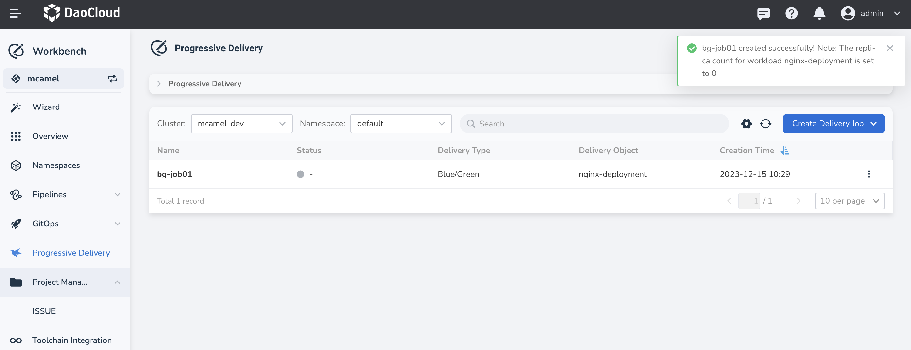
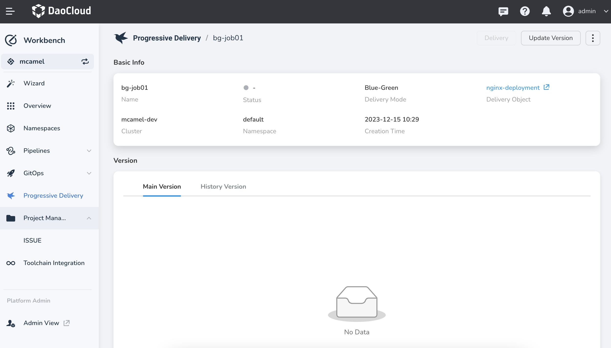
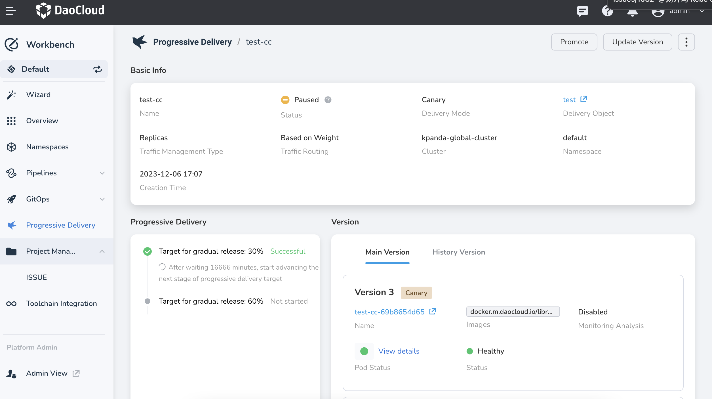

# View Blue-Green Release Job

This article mainly introduces how to view a blue-green release job and related operations.

## View Job Details

1. Go to the __Workbench__ module, click __Progressive Delivery__ in the left navigation bar, and click on the name of the target job.

    

2. View the details of the blue-green release job.

    - __Basic Information__ section: View the name, status, release type, release object (click to jump to the container management to view more detailed information about the release object), and other information of the job.
    - __Version Information__ section:
        - Main Versions: Display the blue/green version information, with the "Active" and "Stable"
          labels indicating the current version that is receiving traffic.
        - Historical Versions: Display the historical version records.

    

## Update Version

1. Click on the name of the target job, and then click __Update Version__ in the upper right corner.
2. Set the image for the canary release.

    

3. After the application is successfully updated, there will be two versions in the main versions, and the status of the blue-green release job will be "Paused".

    

## Release/Terminate Release

For a blue-green release job with the status "Paused", you can perform the operations of Release and Terminate Release.

- Release: After clicking, the new version will be used to receive traffic, and the old version will be deleted.
- Terminate Release: After clicking, the current blue-green release job will be terminated, and the new version will be deleted.

## Rollback

You can view the historical versions that have been released and rollback to a previous version with one click.

1. On the __Progressive Delivery__ details page, click on the __History Versions__ tab.
2. Select the target version and click __ ...__ and __Rollback__ .

    

3. After the rollback is successful, a new blue-green release process will be triggered,
   and the status of the blue-green release job will be "Paused".
