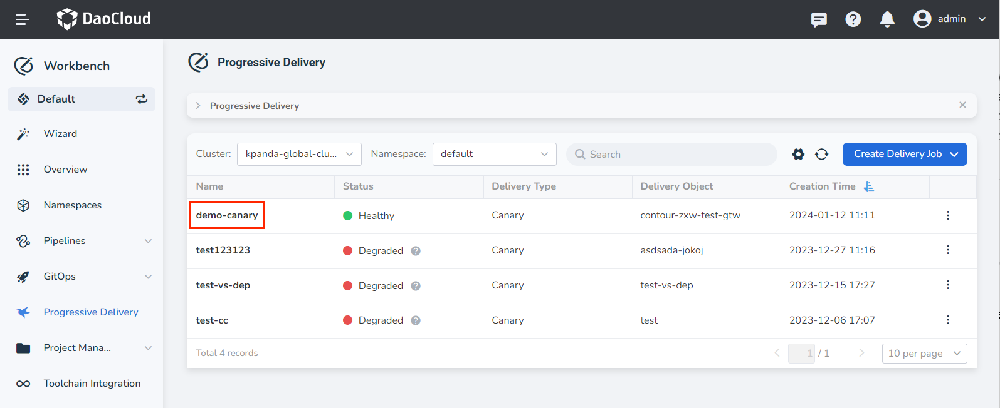
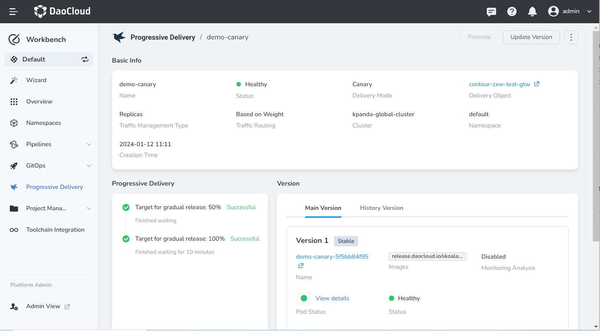
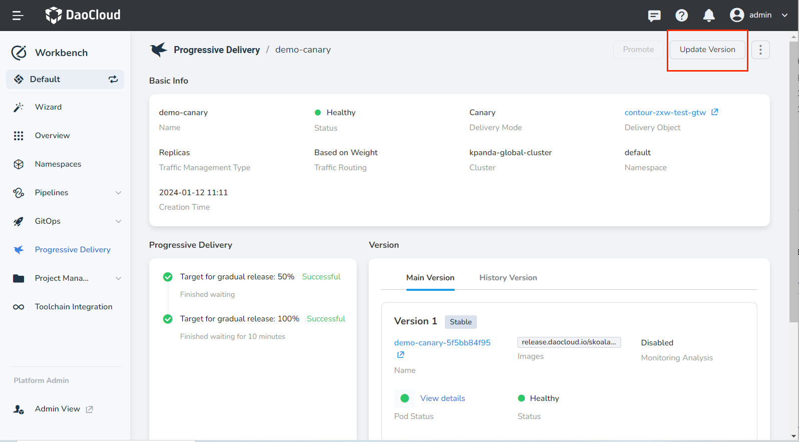
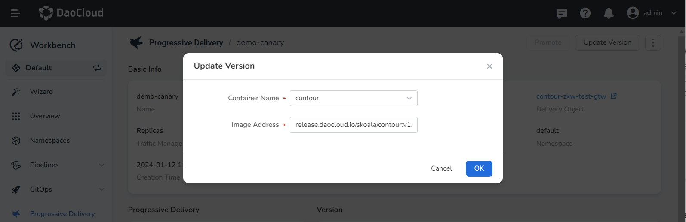
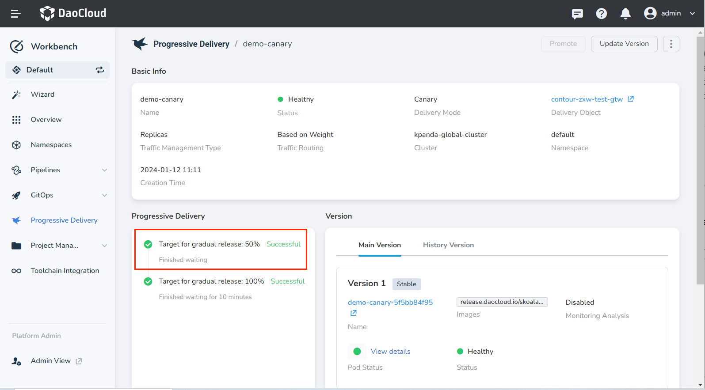
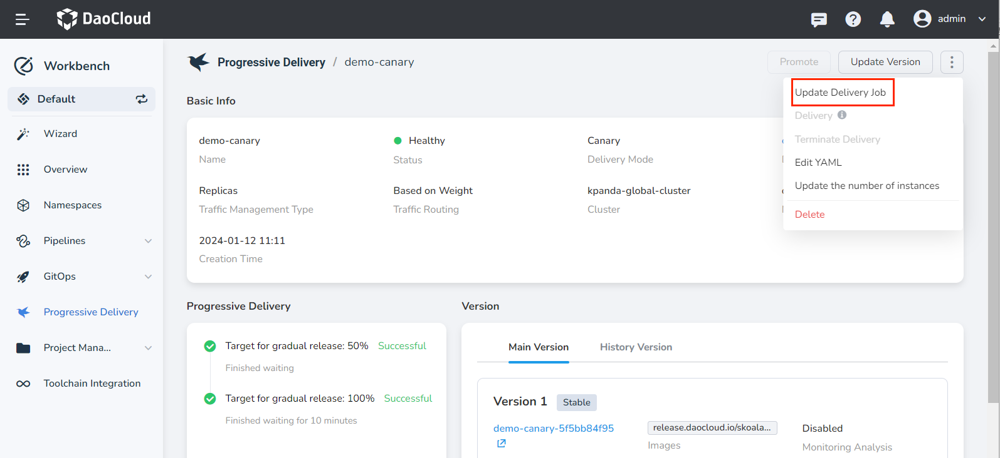
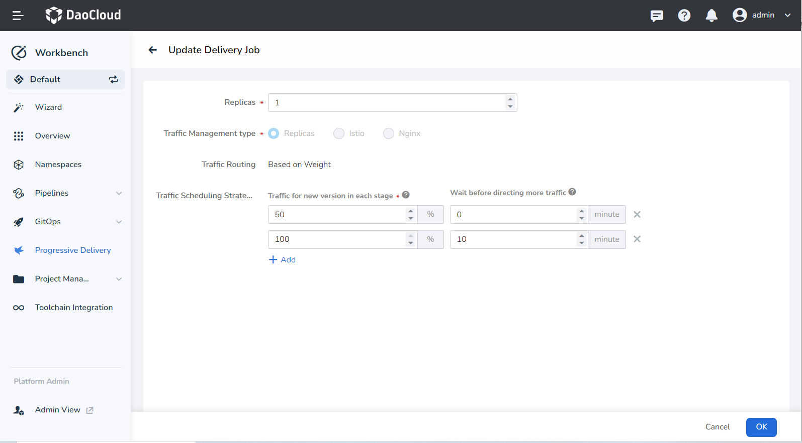
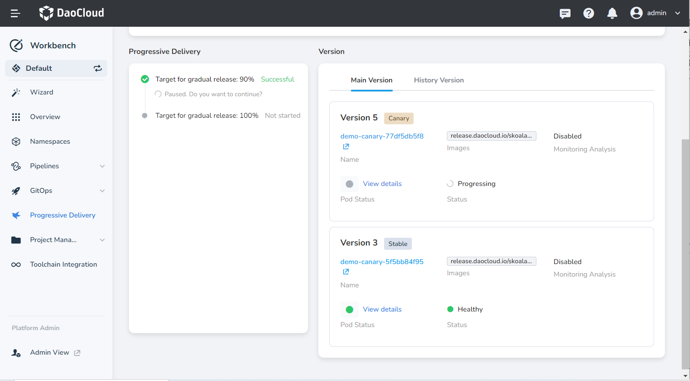
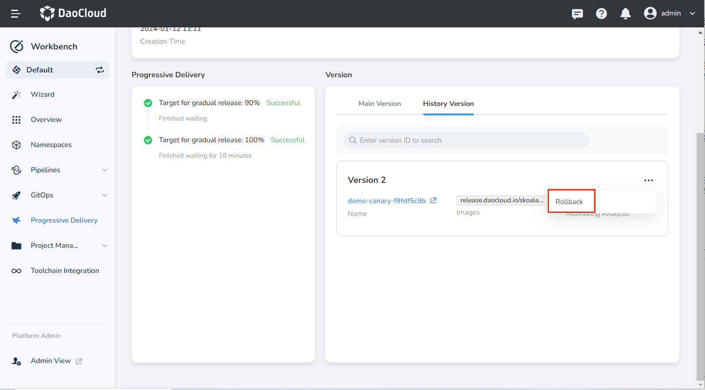

# View a Canary Delivery Job

After creating a canary delivery job and associating it with a workload, modifying the workload's image, resource configuration, startup parameters, etc. so that the pod restarts will automatically trigger the canary delivery job to update the version and perform traffic scheduling according to the defined delivery rules.

This article mainly introduces the related operations involved in viewing a canary delivery job, such as viewing task details, updating versions, updating delivery jobs, rolling back versions, etc.

## Viewing details

1. Enter the __Workbench__ module, click __Progressive Delivery__ in the left navigation bar, click the name of the target task.

    

2. View the details page of the canary delivery job.

    - __Basic Information__: View the name, status, delivery mode, delivery object, etc. of the job.

    - __Progressive Delivery__: Visually displays the execution progress of the canary delivery job, and you can intuitively understand which step the task is currently executing and how the execution status is.

    - __Version__:

        - Main Version: Displays the current version and canary version information.
        - Historical Version: Displays the historical version records.

          

## Updating versions

After the delivery object updates the version, it will automatically trigger the canary delivery job.

1. Click the name of the target task, then click __Update Version__ in the upper right corner.

    

2. Set the image for the canary delivery.

    

3. After the application update is successful, a new canary delivery process will be triggered.

    

## Updating delivery jobs

By updating delivery jobs, you can modify the traffic scheduling strategy of the canary delivery process.

1. On the __Canary Delivery Job__ details page, click __ⵗ__ in the upper right corner of the page and select __Update Delivery Job__.

    

2. Adjust the delivery rules and click __OK__.

    

## Rollback

Supports viewing previously released historical versions, and you can rollback to a previous version with one click.

1. On the __Canary Delivery Job__ details page, click the __Historical Version__ tab.

    

2. Select the target version, click __Rollback__.

    

3. After the rollback is successful, a new canary delivery process will be triggered.

    

## Other operation instructions

| Operation | Description |
| --- | --- |
| Continue Delivery | For canary delivery jobs that are in progress or paused, continue delivery can promote the canary delivery process to the next stage of delivery. |
| Delivery | For canary delivery jobs that are in progress or paused, delivery can promote the canary delivery process to complete the delivery directly, updating the canary version to the stable version. |
| Terminate Delivery | For canary delivery jobs that are in progress or paused, terminate delivery will pause all current steps and roll back to the stable version. |
