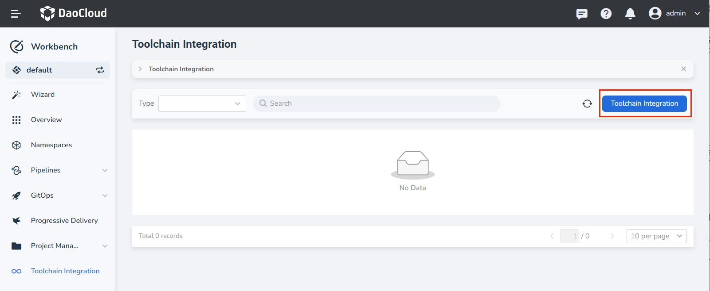
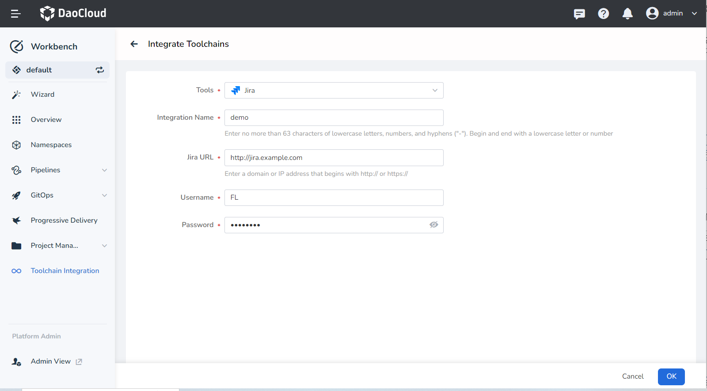
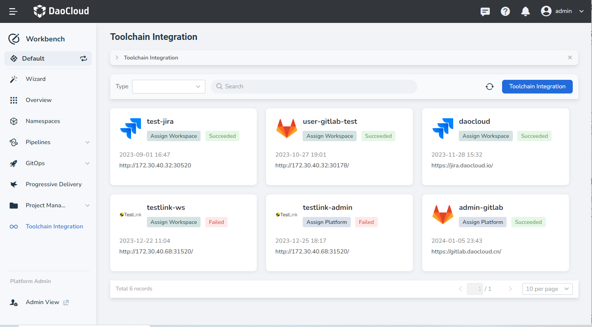

# Integrate Toolchain

DevOps toolchain is a set of tools that enables DevOps teams to collaborate and address key DevOps fundamentals throughout the product lifecycle.

Workbench supports tool chain integration from two perspectives: workspace integration and administrator integration. Instances integrated by administrators can be assigned to workspaces for use in workspaces.

## Support for integrated toolchains

| Toolchain Name | Description | Remarks |
| ---------- | -------------------------------------- -------------------- | ----------------------------- ----------------- |
| GitLab | Can be used in Pipeline after integrating GitLab repository | - |
| Jira | Support Jira->Issue tracking by integrating Jira in Workbench. | - |
| Jenkins | After integrating Jenkins, all workspaces will gain pipeline capability for building. | Only administrator integration is supported, and Jenkins can only be integrated once for all platforms |

## Steps

1. Enter the __Toolchain Integration__ page and click the __Toolchain Integration__ button.

    

2. Refer to the following instructions to configure related parameters:

    - Tools: Select a toolchain type to integrate.
    - Integration Name: the name of the integration tool, which cannot be repeated.
    - Jira URL: The address where the toolchain can be accessed, the domain name or IP address starting with http://, https://.
    - Username and password: the user and password that can log in to the toolchain,

    

3. Click __OK__ , the integration is successful and return to the toolchain list page.

    
