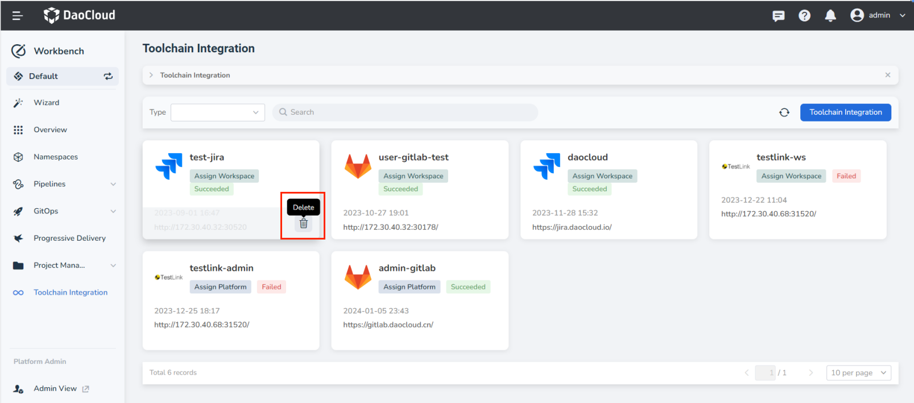
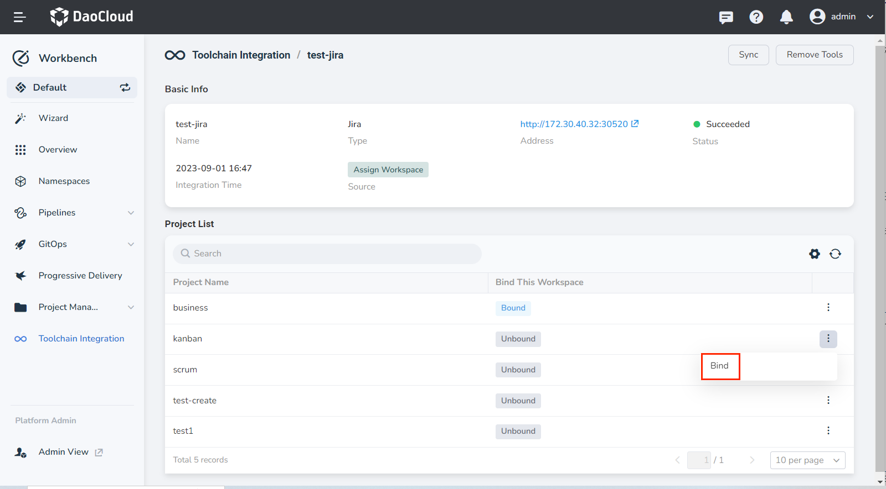
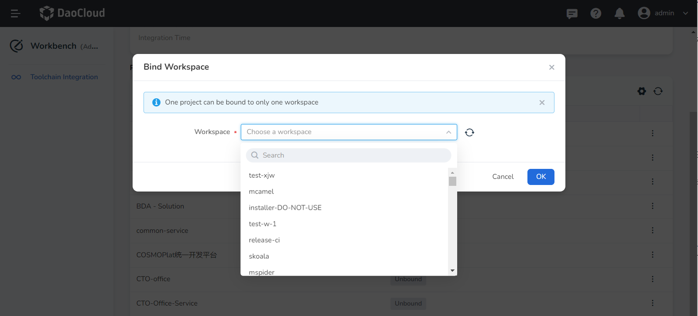

# Manage Toolchain Instances

Manage the integrated tool chain, which is divided into two types: the tool chain integrated by the workspace, and the tool chain integrated by the administrator

## Remove tools

### Workspace

For toolchain instances of __Assign Workspace__ , the __Delete__ operation is supported:

The __Delete__ operation is not supported for __Assign Platform__ toolchain instances:

### Admin

After deleting, the instances assigned to the workspace will also be deleted automatically.

## Assign items

### Workspace

For the toolchain instance of __Assign Workspace__, it is supported to __Bind__ the projects under the instance to the current workspace.

In addition, bound projects support unbinding.

For the toolchain instance of __Assign Platform__ , only viewing is supported, and __Bind__ operation is not supported.

### Admin

Supports assigning projects to the workspace. After the assignment is successful, an instance will be generated under the workspace, and the project can be used by the workspace.

